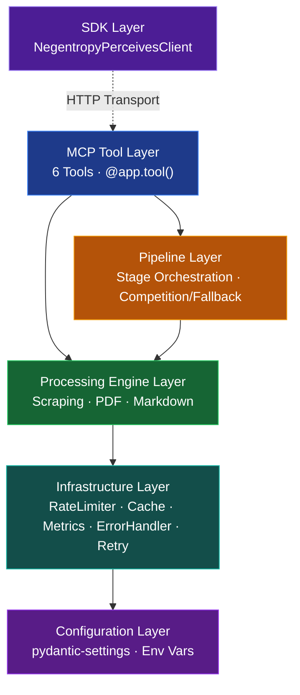

[English](./README.md) | [简体中文](./docs/zh-CN/README.md)

<h1 align="center">Negentropy Perceives</h1>

<p align="center">
  <strong>The Perception Engine for AI Agents · Enterprise-Grade MCP Server</strong><br/><br/>
  Distilling web pages and PDFs into clean Markdown nectar, ready to be fed directly to your LLM.
</p>

<p align="center">
  <a href="#quick-start"></a>
  <a href="https://github.com/ThreeFish-AI/negentropy-perceives/blob/master/LICENSE"></a>
  <a href="https://pypi.org/project/negentropy-perceives/"></a>
  <a href="https://github.com/ThreeFish-AI/negentropy-perceives/stargazers"></a>
  
</p>

<p align="center">
  <b>6 MCP Tools</b> · <b>Pipeline Orchestration</b> · <b>5-Engine PDF Decoding</b> · <b>LLM Smart Evaluation</b>
</p>

---

## ✨ Why Negentropy Perceives?

In the vast ecosystem of AI agent projects, the "dirty work" of information perception often degenerates into fragile, unmaintainable chaos over time. Grounded in our core engineering philosophy of **Orthogonal Decomposition and Entropy Reduction (Negentropy)**, we completely quarantine the mess of low-level network communications and format deconstruction. We only inject pure, undisputed certainty into your sandbox:

- 🕵️ **Web Page to Markdown**: Facing heavily-rendered SPAs and fortified anti-scraping defenses? The engine comes armed with a built-in 5-tier penetration mechanism (ranging from hyper-concurrency to headless stealth browser rotation). "What You See Is What You Get" — tearing through waterfall setups is a walk in the park.
- 📑 **PDF to Markdown**: Stop compromising over misaligned tables and mangled characters. Powered by our proprietary "Engine Arena" mechanism, engaging `Smart` mode summons an LLM as the ultimate referee. It coordinates 7 specialized engines (including Docling, PyMuPDF, etc.) performing concurrent deconstruction to precisely extract LaTeX formulas, gnarly table matrices, and deep layout structures.
- 🦾 **Heavy-Duty Infrastructure**: Abandon toy-grade SDK wrappers. Our core is hardwired with resilient exponential backoffs, multi-layered rate-limiting circuit breakers, and aggressive memory caching mechanisms. Riding on full-duplex `asyncio`, it maxes out the absolute throughput limit of a single node.
- 🔌 **Native MCP Integration**: We firmly embrace the pristine Model Context Protocol specification. Leveraging standard HTTP / STDIO / SSE transports, it abandons redundant glue code for seamless, zero-friction injection into Claude Desktop or Cursor environments.

---

## Quick Start

### 1. Millisecond Loading

```bash
# We recommend using uv (Python 3.13+ required)
uv add negentropy-perceives
```

### 2. Ignite the Engine

```bash
uv run negentropy-perceives  # Defaults to listening on localhost:2992, HTTP mode
```

> 💡 **Advanced Arsenal**: Upon first launch, Negentropy Perceives will auto-generate its configuration at `~/.negentropy/perceives.config.yaml`. Hidden inside are the switches for high-tier warfare.

### 3. Witness True Perception

```python
import asyncio
from negentropy.perceives.sdk import NegentropyPerceivesClient

async def perceive_world():
    async with NegentropyPerceivesClient() as client:
        result = await client.parse_webpage_to_markdown(
            url="https://en.wikipedia.org/wiki/Entropy",
        )
        print("====== Pure Nectar Extracted ======")
        print(result.markdown_content[:250], "......\n")
        print(f"📊 Pure words retrieved from the noise: {result.word_count}")

asyncio.run(perceive_world())
```

### 4. Connect the MCP Client

Add the following to your `claude_desktop_config.json` in Claude Desktop:

```json
{
  "mcpServers": {
    "negentropy-perceives": {
      "type": "http",
      "url": "http://localhost:2992/mcp"
    }
  }
}
```

> Supports three transport modes: STDIO (local dev), HTTP (production-recommended), and SSE (compatibility mode). See the [User Guide](./docs/user-guide.md#mcp-server-配置) for the comprehensive configuration.

---

## Core Capabilities

### Toolkit Overview

<center>

| Tool                         | Function                                                | Use Case                               |
| :--------------------------- | :------------------------------------------------------ | :------------------------------------- |
| `discover_links`             | Discover webpage links, supports domain filtering       | Site map discovery, link audits        |
| `inspect_page`               | Inspect page metadata (status code, content type, etc.) | Target page pre-flight check           |
| `parse_webpage_to_markdown`  | Webpage to Markdown                                     | Granular single-page extraction        |
| `parse_webpages_to_markdown` | Batch Webpages to Markdown                              | Knowledge base building, site archives |
| `parse_pdf_to_markdown`      | PDF to Markdown                                         | Academic papers, financial reports     |
| `parse_pdfs_to_markdown`     | Batch PDFs to Markdown                                  | Mass document digitization             |

</center>

> [!WARNING]
>
> Please adhere to the targeted website's Terms of Service (TOS) and sensibly restrict request frequencies. This tool is intended exclusively for legal and compliant data acquisition.

### Web Scraping Strategies

<center>

| Method               | Description                                    |
| :------------------- | :--------------------------------------------- |
| `auto`               | Smart selection (Recommended)                  |
| `simple`             | Standard HTTP request, ideal for static pages  |
| `selenium`           | Browser rendering, seamlessly executes JS      |
| `stealth_selenium`   | Covert Selenium, shatters anti-scraping blocks |
| `stealth_playwright` | Stealth Playwright, lightweight anti-detection |

</center>

### PDF Engines

<center>

| Engine  | Specialty                               | GPU Acceleration |
| :------ | :-------------------------------------- | :--------------- |
| Docling | AI layout analysis, table recognition   | CUDA / MPS / XPU |
| MinerU  | Deep learning structure analysis, LaTeX | CUDA / MLX       |
| Marker  | Academic documents, Nougat model        | CUDA             |
| PyMuPDF | Lightning-fast text extraction          | —                |
| PyPDF   | Absolute baseline fallback              | —                |

</center>

> In `auto` mode, the system cascades through a graceful degradation chain: Docling → MinerU → Marker → PyMuPDF → PyPDF. Activating `smart` mode enlists an LLM to orchestrate a competitive parallel run across engines, ultimately fusing the optimum output.

---

## Architectural Landscape



A 5-tier orthogonal architecture: SDK → MCP Tools → Pipeline Orchestration → Processing Engines → Infrastructure, with the Configuration Layer interweaving through everything. Featuring a 10-Stage PDF Pipeline and a 12-Stage WebPage Pipeline that strictly enforce both fallback and competitive execution models.

---

## Documentation Navigator

<center>

| Document                                   | Content                                                                   | Who is it for             |
| :----------------------------------------- | :------------------------------------------------------------------------ | :------------------------ |
| [User Guide](./docs/user-guide.md)         | Deep dive into 6 tools, MCP Server setup, SDK interfaces, advanced tweaks | All Users                 |
| [Architecture Design](./docs/framework.md) | 5-tier architecture, Pipeline orchestration, engine fallbacks, Smart Mode | Architects / Contributors |
| [Developer Guide](./docs/development.md)   | Environment setup, test framework, CI/CD, PR guidelines                   | Developers                |
| [Changelog](CHANGELOG.md)                  | Release history and change logs                                           | Everyone                  |

</center>

---

## Community & Contributions

Beyond the World Wide Web and massive unstructured texts lies an abyss of noise. Only through relentless code evolution can we forge ahead steadily. If you hold the inspiration to pull chaos back into order, please do not hesitate to share:

1. Before striking your keyboard, flip through the [Developer Guide](./docs/development.md) along the way.
2. Hurl your paradigm-shifting ideas at our [Issues](https://github.com/ThreeFish-AI/negentropy-perceives/issues) or directly submit a [Pull Request](https://github.com/ThreeFish-AI/negentropy-perceives/pulls) armed with game-changing power.

---

<p align="center">
  <a href="LICENSE">MIT</a> License, © 2026 <a href="https://github.com/ThreeFish-AI">ThreeFish-AI</a>
</p>
