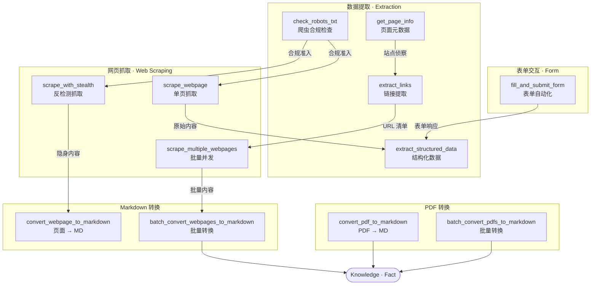

**Negentropy Perceives is a commercial-grade MCP Server built on FastMCP, offering robust capabilities to read, extract, and localize (into Markdown) content from web pages and PDFs with both text and images. It is purpose-built for long-term deployment in enterprise environments.**

## 🐍 Python SDK 快速上手

### 安装

```bash
# 安装（需要 Python >=3.13）
uv add negentropy-perceives
```

### Web Page 转 Markdown

自动识别正文区域并转换为标准 Markdown，适用于内容本地化与知识库归档：

```python
import asyncio
from negentropy.perceives.sdk import NegentropyPerceivesClient

async with NegentropyPerceivesClient() as client:
    markdown = await client.convert_webpage_to_markdown(
        url="https://example.com/blog/post-1",
        extract_main_content=True,   # 过滤导航栏、页脚等噪声区域
        embed_images=False,          # True 则将图片内联为 base64 data URI
    )

asyncio.run(main())
```

### PDF 转 Markdown

`call_tool` 泛型接口可调用全部 14 个 MCP 工具，此处以 PDF 转换为例：

```python
async with NegentropyPerceivesClient() as client:
    result = await client.call_tool(
        "convert_pdf_to_markdown",
        {
            "pdf_source": "https://example.com/report.pdf",
            "method": "auto",         # auto / pymupdf / pypdf / docling / smart
            "page_range": "1-10",
            "output_format": "markdown",
        },
    )
```

### CSS 选择器精准提取

通过 `extract_config` 声明字段与 CSS 选择器的映射，对目标页面进行结构化提取：

```python
async def main() -> None:
    async with NegentropyPerceivesClient() as client:
        result = await client.scrape_webpage(
            url="https://example.com/products/123",
            extract_config={
                "title":  {"selector": "h1.product-title", "attr": "text", "multiple": False},
                "price":  {"selector": ".price",           "attr": "text", "multiple": False},
                "images": {"selector": ".gallery img",     "attr": "src",  "multiple": True},
            },
        )
        print(result)
```

> 完整 API 参考与高级用法（批量并发、反检测抓取、表单自动化等）详见[用户指南](https://github.com/ThreeFish-AI/negentropy-perceives/blob/master/docs/user-guide.md)。

## 🛠️ MCP Server

```bash
# 启动 MCP Server 模式，默认端口 8081
uv run negentropy-perceives
```

Negentropy Perceives 提供了 14 个专业的 MCP 工具，按功能分为四大类别：

### Web Page

| 工具名称                               | 功能描述           | 主要参数                                                                                            |
| -------------------------------------- | ------------------ | --------------------------------------------------------------------------------------------------- |
| **scrape_webpage**                     | 单页面抓取         | `url`, `method`(自动选择), `extract_config`(选择器配置), `wait_for_element`(CSS 选择器)             |
| **scrape_multiple_webpages**           | 批量页面抓取       | `urls`(列表), `method`(统一方法), `extract_config`(全局配置)                                        |
| **scrape_with_stealth**                | 反检测抓取         | `url`, `method`(selenium/playwright), `scroll_page`(滚动加载), `wait_for_element`                   |
| **fill_and_submit_form**               | 表单自动化         | `url`, `form_data`(选择器:值), `submit`(是否提交), `submit_button_selector`                         |
| **extract_links**                      | 专业链接提取       | `url`, `filter_domains`(域名过滤), `exclude_domains`(排除域名), `internal_only`(仅内部)             |
| **extract_structured_data**            | 结构化数据提取     | `url`, `data_type`(all/contact/social/content/products/addresses)                                   |
| **get_page_info**                      | 页面信息获取       | `url`(目标 URL) - 返回标题、状态码、元数据                                                          |
| **check_robots_txt**                   | 爬虫规则检查       | `url`(域名 URL) - 检查 robots.txt 规则                                                              |
| **convert_webpage_to_markdown**        | 页面转 Markdown    | `url`, `method`, `extract_main_content`(提取主内容), `embed_images`(嵌入图片), `formatting_options` |
| **batch_convert_webpages_to_markdown** | 批量 Markdown 转换 | `urls`(列表), `method`, `extract_main_content`, `embed_images`, `embed_options`                     |

### PDF Document

| 工具名称                           | 功能描述        | 主要参数                                                                            |
| ---------------------------------- | --------------- | ----------------------------------------------------------------------------------- |
| **convert_pdf_to_markdown**        | PDF 转 Markdown | `pdf_source`(URL/路径), `method`(auto/pymupdf/pypdf), `page_range`, `output_format` |
| **batch_convert_pdfs_to_markdown** | 批量 PDF 转换   | `pdf_sources`(列表), `method`, `page_range`, `output_format`, `include_metadata`    |

**PDF 深度提取**

- **图像提取**：从 PDF 页面提取图像元素，支持本地存储或 base64 嵌入
- **表格识别**：智能识别各种格式表格，转换为标准 Markdown 表格
- **数学公式提取**：识别 LaTeX 格式数学公式，保持原始格式完整性
- **结构化输出**：自动生成包含提取资源的结构化 Markdown 文档

**Markdown 高级转换**

- **智能内容提取**：自动识别主要内容区域
- **高级格式化**：表格对齐、代码语言检测、智能排版
- **图片嵌入**：支持 data URI 形式嵌入远程图片
- **批量处理**：并发处理多个 URL 或 PDF 文档

### Service Management

| 工具名称               | 功能描述     | 主要参数                                  |
| ---------------------- | ------------ | ----------------------------------------- |
| **get_server_metrics** | 性能指标监控 | 无参数 - 返回请求统计、性能指标、缓存情况 |
| **clear_cache**        | 缓存管理     | 无参数 - 清空所有缓存数据                 |

**企业级特性**

- **错误处理**: 完善的错误分类和处理
- **性能监控**: 详细的请求指标和统计
- **速率限制**: 防止服务器过载
- **代理支持**: 支持 HTTP 代理配置
- **随机 UA**: 防检测的用户代理轮换
- **智能重试**: 指数退避重试机制
- **结果缓存**: 内存缓存提升性能

## 🔗 工具协同

14 个 MCP 工具通过组合编排形成端到端的数据流水线（基础设施层详见[架构设计](docs/framework.md)）：



**典型生产协同场景**：

- **合规优先抓取**：`check_robots_txt` → `scrape_webpage` → `extract_structured_data`——先检查爬虫权限，再抓取并提取结构化数据
- **反检测内容本地化**：`check_robots_txt` → `scrape_with_stealth` → `convert_webpage_to_markdown`——对反爬站点隐身采集后转为 Markdown
- **深度站点探索**：`get_page_info` → `extract_links` → `scrape_multiple_webpages` → `batch_convert_webpages_to_markdown`——从侦察到批量采集再到知识归档的完整链路
- **表单数据采集**：`fill_and_submit_form` → `extract_structured_data`——自动填写表单后提取响应中的结构化信息

## 🎯 Quick Navigation

- [用户指南](https://github.com/ThreeFish-AI/negentropy-perceives/blob/master/docs/user-guide.md)
- [架构设计](https://github.com/ThreeFish-AI/negentropy-perceives/blob/master/docs/framework.md)
- [开发指南](https://github.com/ThreeFish-AI/negentropy-perceives/blob/master/docs/development.md)
- [测试指南](https://github.com/ThreeFish-AI/negentropy-perceives/blob/master/docs/testing.md)
- [配置系统](https://github.com/ThreeFish-AI/negentropy-perceives/blob/master/docs/configuration.md)
- [常用指令](https://github.com/ThreeFish-AI/negentropy-perceives/blob/master/docs/commands.md)
- [版本里程](https://github.com/ThreeFish-AI/negentropy-perceives/blob/master/CHANGELOG.md)

## 🤝 Contribution

欢迎提交 [Issue](https://github.com/ThreeFish-AI/negentropy-perceives/issues) 和 [Pull Request](https://github.com/ThreeFish-AI/negentropy-perceives/pulls) 来改进这个项目。

## 📄 License

MIT License - 详见 [LICENSE](LICENSE) 文件

---

**注意**: 请负责任地使用此工具，遵守网站的使用条款和 robots.txt 规则，尊重网站的知识产权。
