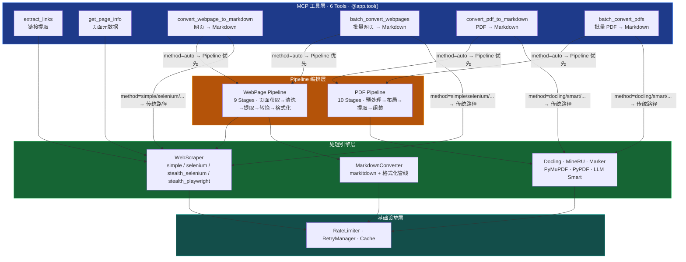

<h1 align="center">Negentropy Perceives</h1>

<p align="center">
  <strong>商业级 MCP Server</strong> — 给 AI Agent 装上一双能看懂网页和 PDF 的眼睛。
</p>

<p align="center">
  <a href="#快速开始"></a>
  <a href="https://github.com/ThreeFish-AI/negentropy-perceives/blob/master/LICENSE"></a>
  <a href="https://pypi.org/project/negentropy-perceives/"></a>
  <a href="https://github.com/ThreeFish-AI/negentropy-perceives/stargazers"></a>
</p>

<p align="center">
  <b>6 个专业工具</b> · <b>5 引擎 PDF 处理</b> · <b>Pipeline 编排</b> · <b>LLM 智能编排</b>
</p>

<br />

## ✨ 为什么选择 Negentropy Perceives？

| 🧠 Smart 模式                                                                                                                                           | 🕵️ 多策略抓取                                                                                                                                          | ⚡ 五引擎降级                                                                                                                                              |
| :------------------------------------------------------------------------------------------------------------------------------------------------------ | :----------------------------------------------------------------------------------------------------------------------------------------------------- | :--------------------------------------------------------------------------------------------------------------------------------------------------------- |
| **LLM 编排多引擎并行处理**<br/>自动分析文档特征 → 并行调度 Docling / PyMuPDF → 择优融合最佳输出。学术论文、财报、技术手册，一个 `method="smart"` 搞定。 | **5 种抓取策略灵活切换**<br/>simple / selenium / stealth_selenium / stealth_playwright / auto 智能选择。内置随机 UA 轮换与浏览器隐身能力，从容应对动态页面。 | **Docling → MineRU → Marker → PyMuPDF → PyPDF**<br/>自动降级链确保零宕机。未安装的引擎自动跳过，最小依赖集即可运行。GPU 加速（CUDA / MPS / XPU）可选开启。 |

<details>
<summary>📖 更多企业级特性</summary>

- 🔀 **Pipeline 编排框架**: Stage 化处理管线，竞争/降级双模式，PDF 10 Stages + WebPage 9 Stages
- 🚀 **并发批处理**: `batch_convert_webpages_to_markdown` / `batch_convert_pdfs_to_markdown` 支持 asyncio 并发
- 🖼️ **深度内容提取**: 表格识别、LaTeX 公式保持、图像 base64 嵌入
- 🔄 **弹性保障**: 指数退避重试、频率限速、内存缓存三层防护
- ⚙️ **YAML 四层配置**: 内置默认 → 用户 YAML → 环境变量 → `-c` 显式（最高），优先级清晰
- 🎯 **Python SDK**: `NegentropyPerceivesClient` 一行连接，类型化便捷方法开箱即用
- 📡 **三种传输模式**: STDIO / HTTP / SSE，Claude Desktop 一键接入

</details>

## 🚀 快速开始

### 安装

```bash
uv add negentropy-perceives
```

> 需要 [uv](https://docs.astral.sh/uv/) 包管理器和 **Python >= 3.13**。

### Hello World

```python
from negentropy.perceives.sdk import NegentropyPerceivesClient

async with NegentropyPerceivesClient() as client:
    result = await client.convert_webpage_to_markdown(
        url="https://example.com"
    )
```

### 启动 MCP Server

```bash
negentropy-perceives   # 默认 HTTP 模式（localhost:8081/mcp），可通过环境变量切换 STDIO / SSE
```

<details>
<summary>⌨️ 更多示例：PDF 转换 · 链接提取 · 批量转换</summary>

#### PDF 转 Markdown

```python
async with NegentropyPerceivesClient() as client:
    result = await client.call_tool("convert_pdf_to_markdown", {
        "pdf_source": "report.pdf",
        "method": "auto",           # auto / pymupdf / pypdf / docling / mineru / marker / smart
        "page_range": [0, 9],       # 可选：[start, end]，从 0 开始
        "extract_tables": True,
        "extract_formulas": True,
    })
```

#### 链接提取

```python
async with NegentropyPerceivesClient() as client:
    result = await client.call_tool("extract_links", {
        "url": "https://docs.example.com",
        "internal_only": True,       # 仅提取站内链接
    })
    # result 包含链接列表和内外链统计
```

#### 批量网页转 Markdown

```python
async with NegentropyPerceivesClient() as client:
    result = await client.call_tool("batch_convert_webpages_to_markdown", {
        "urls": [
            "https://blog.example.com/post1",
            "https://blog.example.com/post2",
        ],
        "method": "auto",
        "extract_main_content": True,
    })
```

完整 API 参考与高级用法详见 [用户指南](docs/user-guide.md)。

</details>

## 🛠️ 工具全景（6 个专业 MCP 工具）

### 🔍 数据提取（2 工具）

| 工具           | 一句话   | 核心能力                                |
| :------------- | :------- | :-------------------------------------- |
| `extract_links` | 链接提取 | 域名过滤、内外链分类、白/黑名单过滤     |
| `get_page_info` | 页面侦察 | 标题、状态码、描述、Content-Type 一键获取 |

### 🌐 Markdown 转换（2 工具）

| 工具                                 | 一句话      | 核心能力                                              |
| :----------------------------------- | :---------- | :---------------------------------------------------- |
| `convert_webpage_to_markdown`        | **页面 → MD** | 5 种抓取策略 + 主内容提取 + 格式化选项 + 图片嵌入 + Pipeline 编排 |
| `batch_convert_webpages_to_markdown` | 批量转 MD   | 多 URL 并发转换 + 统计摘要                            |

### 📄 PDF 处理（2 工具）

| 工具                             | 一句话       | 核心能力                                                    |
| :------------------------------- | :----------- | :---------------------------------------------------------- |
| `convert_pdf_to_markdown`        | **PDF → MD** | 7 种提取方法 + 图像/表格/公式提取 + Smart 模式 + Pipeline 编排 |
| `batch_convert_pdfs_to_markdown` | 批量 PDF     | 多文档并发 + 统计摘要（URL/本地路径混用）                   |

<details>
<summary>🔧 PDF 引擎降级链详情</summary>

```
Docling (MIT, GPU 加速，最佳整体质量)
  └─→ MinerU (Apache 2.0, 最佳 LaTeX 公式)
       └─→ Marker (GPL-3.0, 最高准确率)
            └─→ PyMuPDF (快速纯文本)
                 └─→ PyPDF (基础兜底)
```

各引擎均为**可选依赖** — 未安装时自动跳过，确保最小依赖集下仍可运行。

**Smart 模式** (`method="smart"`): LLM 三阶段编排 — 分析文档特征 → 并行调度多引擎 → 择优融合输出。需安装 `litellm` 并配置 API Key。

</details>

### 🔄 传输模式

| 模式         | 适用场景                     |   推荐度   |
| :----------- | :--------------------------- | :--------: |
| **HTTP** (默认) | 生产环境、远程访问、多客户端 | ⭐⭐⭐⭐⭐ |
| **STDIO**    | 本地开发、Claude Desktop     |   ⭐⭐⭐   |
| **SSE**      | 遗留系统兼容                 |    ⭐⭐    |

> 详细配置（host / port / CORS / 认证）参见 [用户指南 > MCP Server 配置](docs/user-guide.md#mcp-server-配置)。

## 🏗️ 架构一览



**典型工具协同场景**：

| 场景           | 工具链路                                                                                     |
| :------------- | :------------------------------------------------------------------------------------------- |
| 网站内容归档   | `get_page_info` → `extract_links` → `batch_convert_webpages_to_markdown`                    |
| 学术论文处理   | `convert_pdf_to_markdown`（method=smart）→ Knowledge Base                                   |
| 快速文档提取   | `extract_links`（内链列表）→ `batch_convert_webpages_to_markdown`（并发转换）              |
| 多格式批量处理 | `batch_convert_pdfs_to_markdown` + `batch_convert_webpages_to_markdown` 并行              |

> 完整架构设计（5 层分解、模块依赖、数据流）详见 [架构设计](docs/framework.md)。

## 🎯 典型场景

<details>
<summary>📰 网站内容归档</summary>

提取站内所有链接 → 并发转换为 Markdown 归档：

```python
async with NegentropyPerceivesClient() as client:
    # 1. 获取站内所有链接
    links_result = await client.call_tool("extract_links", {
        "url": "https://docs.example.com",
        "internal_only": True,
    })

    urls = [link["url"] for link in links_result["links"]]

    # 2. 批量转换为 Markdown
    await client.call_tool("batch_convert_webpages_to_markdown", {
        "urls": urls,
        "extract_main_content": True,
    })
```

</details>

<details>
<summary>🎓 学术论文智能处理</summary>

利用 Smart 模式自动处理含公式、表格、代码、图像的复杂学术 PDF：

```python
async with NegentropyPerceivesClient() as client:
    result = await client.call_tool("convert_pdf_to_markdown", {
        "pdf_source": "arxiv_paper.pdf",
        "method": "smart",              # LLM 编排多引擎，择优融合
        "extract_formulas": True,
        "extract_tables": True,
    })
    # 返回包含 LaTeX 公式、Markdown 表格、代码块的高质量输出
```

</details>

<details>
<summary>📄 批量 PDF 处理</summary>

混合 URL 和本地路径，并发批量转换：

```python
async with NegentropyPerceivesClient() as client:
    result = await client.call_tool("batch_convert_pdfs_to_markdown", {
        "pdf_sources": [
            "https://example.com/report2024.pdf",
            "/local/archive/manual.pdf",
            "https://arxiv.org/pdf/2401.00001",
        ],
        "method": "auto",
        "extract_images": True,
        "extract_tables": True,
        "extract_formulas": True,
    })
    # 返回每个文档的转换结果和统计摘要
```

</details>

## 📚 文档导航

| 文档                                                             | 目标读者        | 内容概要                           |
| :--------------------------------------------------------------- | :-------------- | :--------------------------------- |
| [用户指南](docs/user-guide.md)                                   | 所有用户        | Quick Start、6 工具详解、API 参考、FAQ |
| [架构设计](docs/framework.md)                                    | 架构师 / 贡献者 | 5 层架构、Pipeline 框架、引擎设计  |
| [开发指南](docs/development.md)                                  | 开发者 / QA     | 环境搭建、测试体系、编码规范、发布流程 |
| [用户指南 > MCP Server 配置](docs/user-guide.md#mcp-server-配置) | 运维 / 开发者   | YAML 四层配置、环境变量速查        |
| [版本里程](CHANGELOG.md)                                         | 所有用户        | 版本历史与变更记录                 |

## 🤝 参与贡献

欢迎通过 [Issue](https://github.com/ThreeFish-AI/negentropy-perceives/issues) 反馈问题，或提交 [Pull Request](https://github.com/ThreeFish-AI/negentropy-perceives/pulls) 改进项目。

贡献前请阅读 [开发指南](docs/development.md) 了解代码规范与提交流程。

## 📄 许可证

[MIT](LICENSE) © 2025 [ThreeFish-AI](https://github.com/ThreeFish-AI)

---

> ⚠️ **伦理提醒**: 技术本身是中立的，但使用者的选择定义了它的价值。请负责任地使用本工具——尊重目标网站的服务条款、知识产权，合理控制请求频率。
