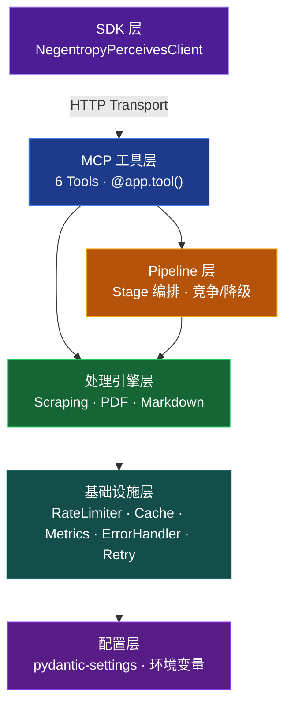

<h1 align="center">Negentropy Perceives</h1>

<p align="center">
  <strong>面向 AI Agent 的全天候感知引擎 · 商业级 MCP Server</strong><br/><br/>
  把网页和 PDF 变成干净的 Markdown，直接投喂大模型。
</p>

<p align="center">
  <a href="#quick-start"></a>
  <a href="https://github.com/ThreeFish-AI/negentropy-perceives/blob/master/LICENSE"></a>
  <a href="https://pypi.org/project/negentropy-perceives/"></a>
  <a href="https://github.com/ThreeFish-AI/negentropy-perceives/stargazers"></a>
  
</p>

<p align="center">
  <b>6 MCP Tools</b> · <b>Pipeline 编排</b> · <b>5 引擎 PDF</b> · <b>LLM 智能编排</b>
</p>

---

## 为什么需要 Negentropy Perceives？

- 🌐 **网页抓取远比想象中复杂** — SPA 动态渲染、反爬机制、广告干扰，AI Agent 面对的真实网页不是 `requests.get` 能搞定的。内置 4 种抓取策略（simple / selenium / stealth\_selenium / stealth\_playwright），12 Stage 流水线自动清洗，所见即所得。
- 📑 **PDF 转换总是丢东西** — 表格错位、公式消失、多栏排版混乱，通用工具处理学术论文和财报常常翻车。5 大专业引擎按降级链自动选择，`smart` 模式甚至能让 LLM 裁决多引擎竞争结果，再难啃的 PDF 也不在话下。
- 🧠 **Agent 需要干净数据，不是 HTML** — 大模型吃 Markdown，但市面上的方案要么只做网页、要么只做 PDF，还需要你自己拼装。6 个 MCP 工具统一覆盖链接提取、页面信息、网页/PDF 转 Markdown，批量处理开箱即用。
- 🏗️ **生产环境不是 Demo** — 裸调 API 遇到限流就崩，遇到超时就挂。指数退避重试、速率限制、内存缓存、代理轮换——这些"脏活"我们已经帮你埋好了，你只管专注业务逻辑。

## 快速上手 (Quick Start)

### 1. 安装

```bash
# 推荐使用 uv（需要 Python 3.13+）
uv add negentropy-perceives
```

### 2. 启动

```bash
negentropy-perceives  # 默认监听 localhost:8081，HTTP 模式
```

### 3. 调用

```python
import asyncio
from negentropy.perceives.sdk import NegentropyPerceivesClient

async def main():
    async with NegentropyPerceivesClient() as client:
        result = await client.convert_webpage_to_markdown(
            url="https://example.com",
        )
        print(result.markdown_content[:200])
        print(f"Word count: {result.word_count}")

asyncio.run(main())
```

> 首次启动时会自动生成配置文件至 `~/.negentropy/perceives.config.yaml`，支持环境变量、YAML、CLI 参数三种配置方式。

## 核心能力

### 工具总览

| 工具 | 功能 | 适用场景 |
| :--- | :--- | :--- |
| `extract_links` | 提取网页链接，支持域名过滤 | 站点地图、链接审计 |
| `get_page_info` | 获取页面元数据（状态码、内容类型等） | 预检目标页面 |
| `convert_webpage_to_markdown` | 网页转 Markdown | 单页内容提取 |
| `batch_convert_webpages_to_markdown` | 批量网页转 Markdown | 知识库构建、站点归档 |
| `convert_pdf_to_markdown` | PDF 转 Markdown | 学术论文、财报处理 |
| `batch_convert_pdfs_to_markdown` | 批量 PDF 转 Markdown | 文档批量数字化 |

### Web 抓取策略

| 方法 | 说明 |
| :--- | :--- |
| `auto` | 智能选择（推荐） |
| `simple` | HTTP 请求，适合静态页面 |
| `selenium` | 浏览器渲染，支持 JS 动态页面 |
| `stealth_selenium` | 隐身 Selenium，绕过反爬 |
| `stealth_playwright` | 隐身 Playwright，轻量反检测 |

### PDF 引擎

| 引擎 | 特长 | GPU 加速 |
| :--- | :--- | :--- |
| Docling | AI 布局分析、表格识别 | CUDA / MPS / XPU |
| MinerU | 深度学习结构分析，LaTeX 公式 | CUDA / MLX |
| Marker | 学术文档，Nougat 模型 | CUDA |
| PyMuPDF | 快速文本提取 | — |
| PyPDF | 基础降级兜底 | — |

> `auto` 模式按 Docling → MinerU → Marker → PyMuPDF → PyPDF 降级链自动选择。`smart` 模式启用 LLM 编排多引擎并行竞争并择优融合。

## 架构全景图



5 层正交架构：SDK → MCP 工具 → Pipeline 编排 → 处理引擎 → 基础设施，配置层贯穿全局。PDF Pipeline 10 Stage + WebPage Pipeline 12 Stage，支持降级和竞争两种执行模式。

## 接入 MCP Client

在 Claude Desktop 的 `claude_desktop_config.json` 中添加：

```json
{
  "mcpServers": {
    "negentropy-perceives": {
      "command": "uv",
      "args": [
        "run",
        "--with",
        "git+https://github.com/ThreeFish-AI/data-negentropy.perceives.git@v0.2.0a1",
        "negentropy-perceives"
      ]
    }
  }
}
```

> 支持三种传输模式：STDIO（本地开发）、HTTP（生产推荐）、SSE（兼容模式）。完整配置参见 [用户指南](./docs/user-guide.md#mcp-server-配置)。

## 文档导航

| 文档 | 内容 | 适合谁 |
| :--- | :--- | :--- |
| [用户指南](./docs/user-guide.md) | 6 个工具参数详解、MCP Server 配置、SDK 接口、高级场景 | 所有用户 |
| [架构设计](./docs/framework.md) | 5 层架构、Pipeline 编排、引擎降级链、Smart 模式 | 架构师 / 贡献者 |
| [开发指南](./docs/development.md) | 环境搭建、测试体系、CI/CD、PR 规范 | 开发者 |
| [更新日志](CHANGELOG.md) | 版本历史与变更记录 | 所有人 |

## 社区与贡献

欢迎贡献代码或提出建议：

1. 贡献前请先阅读 [开发指南](./docs/development.md)
2. 提交 [Issue](https://github.com/ThreeFish-AI/negentropy-perceives/issues) 或 [Pull Request](https://github.com/ThreeFish-AI/negentropy-perceives/pulls)

## 许可证

[MIT](LICENSE) License, © 2026 [ThreeFish-AI](https://github.com/ThreeFish-AI)

> [!WARNING]
> 请遵守目标网站的服务条款（TOS），合理控制请求频率。本工具仅供合法合规的数据获取场景使用。
