<h1 align="center">Negentropy Perceives</h1>

<p align="center">
  <strong>商业级 MCP Server</strong> — 给 AI Agent 装上一双能看懂网页和 PDF 的眼睛，而且这双眼睛会隐身。
</p>

<p align="center">
  <a href="#快速开始"></a>
  <a href="https://github.com/ThreeFish-AI/negentropy-perceives/blob/master/LICENSE"></a>
  <a href="https://pypi.org/project/negentropy-perceives/"></a>
  <a href="https://github.com/ThreeFish-AI/negentropy-perceives/stargazers"></a>
</p>

<p align="center">
  <b>14 个专业工具</b> · <b>5 引擎 PDF 处理</b> · <b>反检测抓取</b> · <b>LLM 智能编排</b>
</p>

<br />

## ✨ 为什么选择 Negentropy Perceives？

| 🧠 Smart 模式                                                                                                                                           | 🥷 反检测抓取                                                                                                                                          | ⚡ 五引擎降级                                                                                                                                              |
| :------------------------------------------------------------------------------------------------------------------------------------------------------ | :----------------------------------------------------------------------------------------------------------------------------------------------------- | :--------------------------------------------------------------------------------------------------------------------------------------------------------- |
| **LLM 编排多引擎并行处理**<br/>自动分析文档特征 → 并行调度 Docling / PyMuPDF → 择优融合最佳输出。学术论文、财报、技术手册，一个 `method="smart"` 搞定。 | **Selenium + Playwright 双引擎隐身**<br/>随机 UA 轮换、浏览器指纹隐藏、人类行为模拟（鼠标轨迹、滚动延迟）。绕过 Cloudflare、reCAPTCHA 等主流反爬系统。 | **Docling → MinerU → Marker → PyMuPDF → PyPDF**<br/>自动降级链确保零宕机。未安装的引擎自动跳过，最小依赖集即可运行。GPU 加速（CUDA / MPS / XPU）可选开启。 |

<details>
<summary>📖 更多企业级特性</summary>

- 🔒 **合规优先**: 内置 `check_robots_txt` 工具，抓取前自动检查爬虫规则
- 🚀 **并发批处理**: `scrape_multiple_webpages` / `batch_convert_pdfs_to_markdown` 支持 asyncio 并发
- 📊 **可观测性**: 内置请求计量、执行计时、错误分类 (`get_server_metrics`)
- 🔄 **弹性保障**: 指数退避重试、频率限速、内存缓存三层防护
- 🎯 **结构化提取**: CSS 选择器映射 + 6 种数据类型模板（contact / social / content / products / addresses）
- 🖼️ **深度内容提取**: 表格识别、LaTeX 公式保持、图像 base64 嵌入
- ⚙️ **YAML 四层配置**: 内置默认 → 用户 YAML → 环境变量 → `-c` 显式(最高)，优先级清晰

</details>

## 🚀 快速开始

### 安装

```bash
uv add negentropy-perceives
```

> 需要 [uv](https://docs.astral.sh/uv/) 包管理器和 **Python >= 3.13**。

### Hello World

```python
from negentropy.perceives.sdk import NegentropyPerceivesClient

async with NegentropyPerceivesClient() as client:
    markdown = await client.convert_webpage_to_markdown("https://example.com")
```

### 启动 MCP Server

```bash
negentropy-perceives   # 默认 STDIO 模式，通过环境变量切换 HTTP / SSE
```

<details>
<summary>⌨️ 更多示例：PDF 转换 · CSS 选择器提取 · 反检测抓取</summary>

#### PDF 转 Markdown

```python
async with NegentropyPerceivesClient() as client:
    result = await client.call_tool("convert_pdf_to_markdown", {
        "pdf_source": "report.pdf",
        "method": "smart",           # auto / pymupdf / pypdf / docling / smart
        "page_range": "1-10",
    })
```

#### CSS 选择器精准提取

```python
async with NegentropyPerceivesClient() as client:
    result = await client.scrape_webpage(
        url="https://shop.example.com/product/123",
        extract_config={
            "title":  {"selector": "h1",              "attr": "text"},
            "price":  {"selector": ".price",          "attr": "text"},
            "images": {"selector": ".gallery img",    "attr": "src", "multiple": True},
        },
    )
```

#### 反检测抓取

```python
async with NegentropyPerceivesClient() as client:
    result = await client.call_tool("scrape_with_stealth", {
        "url": "https://protected-site.com",
        "method": "selenium",         # selenium / playwright
        "scroll_page": True,
    })
```

完整 API 参考与高级用法详见 [用户指南](docs/user-guide.md)。

</details>

## 🛠️ 工具全景 (14 个专业 MCP 工具)

### 🕷️ 网页抓取 (10 工具)

| 工具                                 | 一句话         | 核心能力                                          |
| :----------------------------------- | :------------- | :------------------------------------------------ |
| `scrape_webpage`                     | 单页抓取       | auto / simple / selenium 方法自动选择             |
| `scrape_multiple_webpages`           | 批量并发       | asyncio.gather 并发处理 URL 列表                  |
| `scrape_with_stealth`                | **反检测隐身** | Selenium / Playwright + UA 轮换 + 行为模拟        |
| `fill_and_submit_form`               | 表单自动化     | 自动填写 + 提交，支持所有表单元素                 |
| `extract_links`                      | 链接提取       | 域名过滤、内外链分类                              |
| `extract_structured_data`            | 结构化数据     | contact / social / content / products / addresses |
| `get_page_info`                      | 页面侦察       | 标题、状态码、元数据一键获取                      |
| `check_robots_txt`                   | 合规检查       | robots.txt 解析 + 爬取权限判断                    |
| `convert_webpage_to_markdown`        | **页面 → MD**  | 主内容提取 + 格式化选项 + 图片嵌入                |
| `batch_convert_webpages_to_markdown` | 批量转 MD      | 多 URL 并发转换                                   |

### 📄 PDF 处理 (2 工具)

| 工具                             | 一句话       | 核心能力                                           |
| :------------------------------- | :----------- | :------------------------------------------------- |
| `convert_pdf_to_markdown`        | **PDF → MD** | 5 引擎降级链 + 图像 / 表格 / 公式提取 + Smart 模式 |
| `batch_convert_pdfs_to_markdown` | 批量 PDF     | 多文档并发 + 统计摘要                              |

<details>
<summary>🔧 PDF 引擎降级链详情</summary>

```
Docling (MIT, 最佳整体质量)
  └─→ MinerU (Apache 2.0, 最佳 LaTeX 公式)
       └─→ Marker (GPL-3.0, 最高准确率 95.67%)
            └─→ PyMuPDF (快速纯文本)
                 └─→ PyPDF (基础兜底)
```

各引擎均为**可选依赖** — 未安装时自动跳过，确保最小依赖集下仍可运行。

**Smart 模式** (`method="smart"`): LLM 三阶段编排 — 分析文档特征 → 并行调度多引擎 → 择优融合输出。需安装 `litellm` 并配置 API Key。

</details>

### 📡 服务管理 (2 工具)

| 工具                 | 功能                           |
| :------------------- | :----------------------------- |
| `get_server_metrics` | 请求统计、性能指标、缓存命中率 |
| `clear_cache`        | 一键清空内存缓存               |

### 🔄 传输模式

| 模式             | 适用场景                     |   推荐度   |
| :--------------- | :--------------------------- | :--------: |
| **STDIO** (默认) | 本地开发、Claude Desktop     |   ⭐⭐⭐   |
| **HTTP**         | 生产环境、远程访问、多客户端 | ⭐⭐⭐⭐⭐ |
| **SSE**          | 遗留系统兼容                 |    ⭐⭐    |

> 详细配置（host / port / CORS / 认证）参见 [用户指南 > MCP Server 配置](docs/user-guide.md#mcp-server-配置)。

## 🏗️ 架构一览

### 工具协同流水线

```mermaid
graph TD
    %% ─── 数据提取层 ───
    subgraph EXTRACT["数据提取 · Extraction"]
        T7["check_robots_txt<br/>爬虫合规检查"]
        T5["get_page_info<br/>页面元数据"]
        T4["extract_links<br/>链接提取"]
        T6["extract_structured_data<br/>结构化数据"]
    end

    subgraph SCRAPE["网页抓取 · Web Scraping"]
        T1["scrape_webpage<br/>单页抓取"]
        T2["scrape_multiple_webpages<br/>批量并发"]
        T3["scrape_with_stealth<br/>反检测抓取"]
    end

    subgraph FORM["表单交互 · Form"]
        T8["fill_and_submit_form<br/>表单自动化"]
    end

    %% ─── 内容转换层 ───
    subgraph MD["Markdown 转换"]
        T9["convert_webpage_to_markdown<br/>页面 → MD"]
        T10["batch_convert_webpages_to_markdown<br/>批量转换"]
    end

    subgraph PDF["PDF 转换"]
        T11["convert_pdf_to_markdown<br/>PDF → MD"]
        T12["batch_convert_pdfs_to_markdown<br/>批量转换"]
    end

    %% ─── 生产协同链路 ───
    T7 -->|"合规准入"| T1
    T7 -->|"合规准入"| T3
    T5 -->|"站点侦察"| T4
    T4 -->|"URL 清单"| T2
    T1 -->|"原始内容"| T6
    T3 -->|"隐身内容"| T9
    T2 -->|"批量内容"| T10
    T8 -->|"表单响应"| T6

    %% ─── 知识汇聚 ───
    T10 --> KB(["Knowledge · Fact"])
    T11 --> KB
    T12 --> KB
```



**典型协同场景**：

| 场景         | 工具链路                                                                                              |
| :----------- | :---------------------------------------------------------------------------------------------------- |
| 合规优先抓取 | `check_robots_txt` → `scrape_webpage` → `extract_structured_data`                                     |
| 隐身采集     | `check_robots_txt` → `scrape_with_stealth` → `convert_webpage_to_markdown`                            |
| 深度站点探索 | `get_page_info` → `extract_links` → `scrape_multiple_webpages` → `batch_convert_webpages_to_markdown` |
| 表单数据采集 | `fill_and_submit_form` → `extract_structured_data`                                                    |

> 完整架构设计（5 层分解、模块依赖、数据流）详见 [架构设计](docs/framework.md)。

## 🎯 典型场景

<details>
<summary>📰 新闻监控 & 知识归档</summary>

批量抓取多个新闻源 → 提取标题 / 正文 / 时间戳 → 转为 Markdown 归档：

```python
# 批量抓取结构化内容
result = await client.call_tool("scrape_multiple_webpages", {
    "urls": ["https://news.ycombinator.com", "https://techcrunch.com"],
    "extract_config": {"headlines": {"selector": "h1, h2", "multiple": True}},
})

# 批量转为 Markdown 归档
await client.call_tool("batch_convert_webpages_to_markdown", {
    "urls": ["https://news.ycombinator.com", "https://techcrunch.com"],
    "extract_main_content": True,
})
```

</details>

<details>
<summary>🎓 学术论文智能处理</summary>

利用 Smart 模式自动处理含公式、表格、代码、图像的复杂学术 PDF：

```python
result = await client.call_tool("convert_pdf_to_markdown", {
    "pdf_source": "arxiv_paper.pdf",
    "method": "smart",              # LLM 编排多引擎
})
# 返回包含 LaTeX 公式、Markdown 表格、代码块的高质量输出
```

</details>

<details>
<summary>🛒 电商数据结构化采集</summary>

CSS 选择器映射 → 产品列表抓取 → 详情页批量深入：

```python
products = await client.scrape_webpage(
    url="https://shop.example.com/products",
    extract_config={
        "names":   {"selector": ".product-name", "multiple": True},
        "prices":  {"selector": ".price",       "multiple": True},
        "links":   {"selector": ".product-card a[href]", "attr": "href", "multiple": True},
    },
)
```

</details>

## 📚 文档导航

| 文档                                                             | 目标读者        | 内容概要                             |
| :--------------------------------------------------------------- | :-------------- | :----------------------------------- |
| [用户指南](docs/user-guide.md)                                   | 所有用户        | MCP 配置、14 工具详解、API 参考、FAQ |
| [架构设计](docs/framework.md)                                    | 架构师 / 贡献者 | 5 层架构、引擎设计、模块依赖         |
| [开发指南](docs/development.md)                                  | 开发者 / QA     | 环境搭建、测试、编码规范、发布流程   |
| [用户指南 > MCP Server 配置](docs/user-guide.md#mcp-server-配置) | 运维 / 开发者   | YAML 三层配置、环境变量速查          |
| [版本里程](CHANGELOG.md)                                         | 所有用户        | 版本历史与变更记录                   |

## 🤝 参与贡献

欢迎通过 [Issue](https://github.com/ThreeFish-AI/negentropy-perceives/issues) 反馈问题，或提交 [Pull Request](https://github.com/ThreeFish-AI/negentropy-perceives/pulls) 改进项目。

贡献前请阅读 [开发指南](docs/development.md) 了解代码规范与提交流程。

## 📄 许可证

[MIT](LICENSE) © 2025 [ThreeFish-AI](https://github.com/ThreeFish-AI)

---

> ⚠️ **伦理提醒**: 技术本身是中立的，但使用者的选择定义了它的价值。请负责任地使用本工具——遵守网站 `robots.txt` 规则、尊重知识产权、合理控制请求频率。
