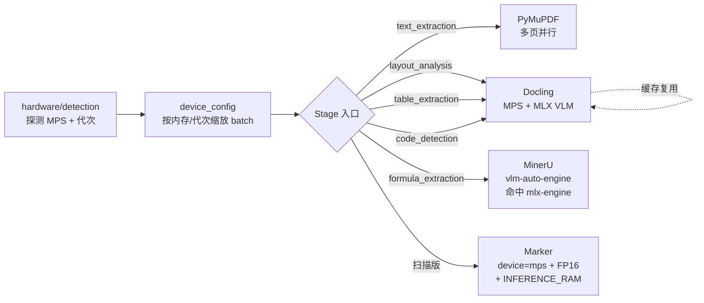
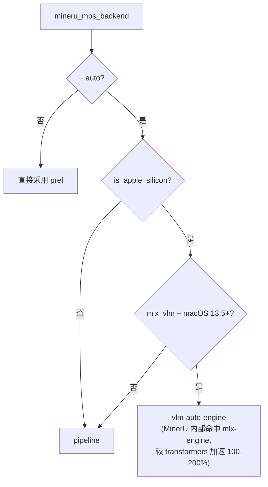

# Apple Silicon PDF Pipeline 调优指南

本文档汇总 `parse_pdf_to_markdown` 在 Apple M 系列芯片上的所有调优点：
设备探测 → 各引擎 MPS 策略 → 批处理 / 并行 / 量化。所有调优均循证：
来自 Docling、MinerU、Marker、PyTorch MPS 官方文档与 benchmark。

> **TL;DR**：项目已默认开启「设备感知 + 代次感知 + MLX 优先 + 多页并行」组合拳。
> 用户侧通常只需保留默认即可获得最佳吞吐；本文档解释每一步的来源与可调旋钮。

## 整体架构



## 1. 设备探测

`hardware/detection.py` 中：

- `detect_device()` 优先返回 `MPS`（在 Apple Silicon 上）
- `parse_apple_chip_generation("Apple M3 Max") == 3`
- `HardwareInfo.chip_generation` 用于 batch 缩放

> ⚠️ MPS 探测会触发一次 `torch.zeros(1, device="mps")` 首次接触；
> 主进程预热完成后会设置 `NEGENTROPY_MPS_READY=1` 避免子进程重复探测。

## 2. Batch Size 按内存 + 代次缩放

`device_config._compute_gpu_batch_sizes(memory_gb, device_type, chip_generation)`：

| 统一内存 (估算)   | M1/M2 baseline | M3 (× 1.25) | M4+ (× 1.5) |
|-------------------|---------------:|------------:|------------:|
| < 12GB            | 8              | 10          | 12          |
| 12-24GB           | 12             | 15          | 18          |
| 24-48GB           | 16             | 20          | 24          |
| ≥ 48GB            | 32             | 40          | 48          |

`table_batch_size = max(4, batch // 2)`（TableFormer 模型单样本显存占用大，
更保守以避免 OOM）。

### 调优旋钮

| 配置项                                   | 默认 | 说明                                         |
|------------------------------------------|------|----------------------------------------------|
| `accelerator_ocr_batch_size`             | 0    | 0 = 自动按 _compute_gpu_batch_sizes，>0 覆盖 |
| `accelerator_layout_batch_size`          | 0    | 同上                                         |
| `accelerator_table_batch_size`           | 0    | 同上                                         |

## 3. Docling：MPS + MLX VLM

- `_apply_mps_constraints` 检测到 mlx_vlm 可用时**保留** formula enrichment，
  通过 `CodeFormulaVlmOptions.from_preset("granite_docling", engine=MLX)` 在
  Apple Silicon 上跑 Granite Docling code/formula 模型；
- mlx_vlm 不可用时**主动禁用** formula enrichment，避免 Docling 把整个 pipeline
  退回 CPU；
- macOS 原生 OCR (`OcrMacOptions`) 在 `device=mps` 时自动启用；
- 跨 Stage `_ConvertCache` 由 `build_docling_init_kwargs()` 统一参数签名触发。

### 调优旋钮

| 配置项                              | 默认           | 说明                                 |
|-------------------------------------|----------------|--------------------------------------|
| `pdf_docling_force_cpu`             | `false`        | 紧急回退 CPU 排障                     |
| `pdf_docling_mps_enrichment`        | `granite_mlx`  | `disable` 关闭 code/formula MLX 路径  |

## 4. MinerU：mlx-engine 优先

`MinerUEngine._resolve_device` 决策树：



### 调优旋钮

| 配置项                  | 默认           | 说明                                                       |
|-------------------------|----------------|------------------------------------------------------------|
| `mineru_mps_backend`    | `auto`         | `vlm-auto-engine` 强制 VLM；`pipeline` 强制 CPU pipeline    |
| `mineru_device`         | `auto`         | 也可直接指定 mps/cuda/cpu                                   |
| `mineru_backend`        | `auto`         | 直接指定 CLI backend（绕过自动检测）                        |

## 5. Marker：MPS + FP16 + INFERENCE_RAM

> Marker GPL-3.0，默认行为保守：`TORCH_DEVICE=cpu` 维持稳定。用户显式 opt-in 后启用：

| 配置项                          | 默认    | 说明                                                                 |
|---------------------------------|---------|----------------------------------------------------------------------|
| `marker_torch_device`           | `None`  | 设 `"mps"` 显式 opt-in（Marker 上游警告 text detection 在 MPS 可能不可靠）|
| `marker_half_precision`         | `False` | `True` 时 monkey-patch `MODEL_DTYPE=torch.float16`                    |
| `marker_inference_ram_gb`       | `0`     | 透传 `INFERENCE_RAM`，建议设为统一内存的 ~50%                          |
| `marker_num_workers`            | `0`     | 透传 `NUM_WORKERS`，受 `INFERENCE_RAM / VRAM_PER_TASK` 约束             |

启用前建议在样本扫描 PDF 上跑 `scripts/benchmark/parse_pdf_bench.py`
对比 CPU vs MPS+FP16 的输出质量与耗时。

## 6. PyMuPDF：多页并行

`FitzTextExtractor` 在 `page_count >= 10` 时自动分片：

- 每 chunk 独立 `fitz.open()`（Document 非线程安全）
- `asyncio.to_thread + asyncio.gather` 调度到默认线程池
- chunk_size 自动 = `max(1, min(8, cpu // 2))`（E-core 不参与）

### 调优旋钮

| 配置项                          | 默认 | 说明                                                  |
|---------------------------------|------|-------------------------------------------------------|
| `pdf_pymupdf_parallel_pages`    | `0`  | 0 = 自动；>0 显式覆盖 chunk_size                       |

## 7. 引擎隔离与预热

`pdf_engine_isolation=process`（默认）：每个引擎在独立 worker 子进程，
取消即可强杀，避免 GPU 内存泄漏。

`pdf_engine_warmup_enabled=true`（默认）：preprocessing + quick_scan 阶段
（~200ms）并行触发 docling/mineru/marker spawn + torch import + MPS first-touch，
把 ~10s 冷启动移出 layout_analysis 关键路径。

## 调优 Cheatsheet

```bash
# 1. 默认配置（推荐起点）：
uv run perceives parse-pdf path/to.pdf

# 2. 想强制 CPU 排障：
NEGENTROPY_PERCEIVES_PDF_DOCLING_FORCE_CPU=1 \
NEGENTROPY_PERCEIVES_MINERU_MPS_BACKEND=pipeline \
  uv run perceives parse-pdf path/to.pdf

# 3. 想 opt-in Marker MPS + FP16（扫描版 PDF）：
NEGENTROPY_PERCEIVES_MARKER_TORCH_DEVICE=mps \
NEGENTROPY_PERCEIVES_MARKER_HALF_PRECISION=true \
NEGENTROPY_PERCEIVES_MARKER_INFERENCE_RAM_GB=18 \
  uv run perceives parse-pdf path/to.pdf

# 4. 跑基准测试，记录设备 + 各 stage 耗时：
uv run python scripts/benchmark/parse_pdf_bench.py path/to.pdf \
  --output benchmarks/results/m3max_pr1to3.json
```

## 关联代码

- 设备探测：[`pdf/hardware/detection.py`](../../src/negentropy/perceives/pdf/hardware/detection.py)
- Batch 缩放：[`pdf/hardware/device_config.py`](../../src/negentropy/perceives/pdf/hardware/device_config.py)
- Docling 引擎：[`pdf/engines/docling.py`](../../src/negentropy/perceives/pdf/engines/docling.py)
- MinerU 引擎：[`pdf/engines/mineru.py`](../../src/negentropy/perceives/pdf/engines/mineru.py)
- Marker 引擎：[`pdf/engines/marker.py`](../../src/negentropy/perceives/pdf/engines/marker.py)
- PyMuPDF 并行：[`pipeline/stages/pdf/text_extraction.py`](../../src/negentropy/perceives/pipeline/stages/pdf/text_extraction.py)
- 基准脚本：[`scripts/benchmark/parse_pdf_bench.py`](../../scripts/benchmark/parse_pdf_bench.py)

## 参考文献 (IEEE)

[1] OpenDataLab. "MinerU Changelog: vlm-mlx-engine 100-200% speedup vs transformers."
    https://opendatalab.github.io/MinerU/reference/changelog/, accessed 2026-05.

[2] VikParuchuri. "marker README: TORCH_DEVICE / INFERENCE_RAM / NUM_WORKERS."
    https://github.com/VikParuchuri/marker, accessed 2026-05.

[3] Docling. "GPU and Hardware Acceleration: MPS 14x faster than CPU."
    https://docling-project.github.io/docling/usage/gpu/, accessed 2026-05.

[4] Docling. "Accelerator Options: increase batch size for MPS throughput."
    https://docling-project.github.io/docling/examples/run_with_accelerator/,
    accessed 2026-05.

[5] PyTorch. "MPS Backend Documentation."
    https://docs.pytorch.org/docs/stable/mps.html, accessed 2026-05.

[6] Apple. "Apple Silicon Unified Memory Architecture (M1/M2/M3/M4 family
    overview)." https://www.apple.com/mac/, accessed 2026-05.
