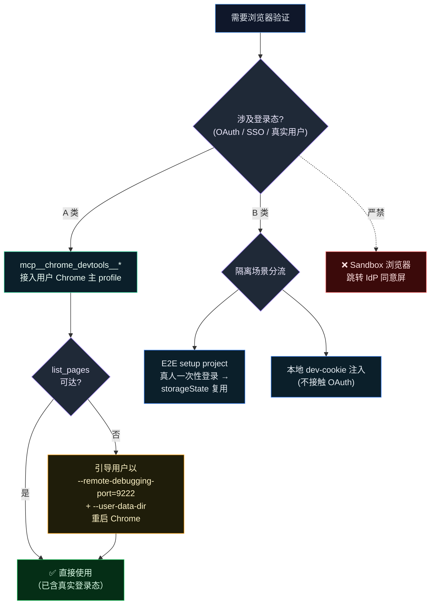
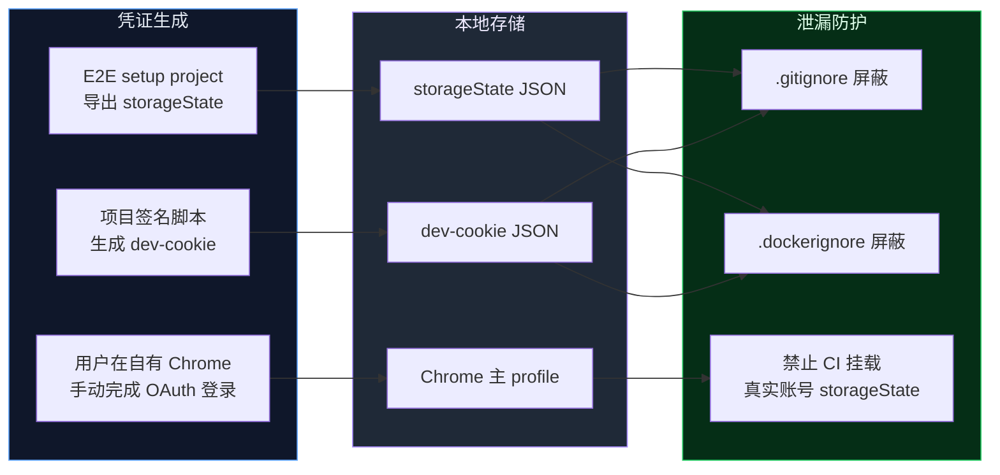

# 浏览器验证协议 (Browser Validation Protocol)

> **文档定位**：本文是 AI Agent 浏览器验证策略的**唯一详尽来源 (Single Source of Truth)**。[AGENTS.md › Browser Validation Protocol](../../AGENTS.md) 中仅保留摘要级约束，协议实体以本文为准。

---

## 1. 概述

### 1.1 适用范围

本协议规范 AI Agent（Claude Code、Codex、Antigravity 等）在以下浏览器操作场景中的行为准则：

- **即时验证**：Agent 在开发过程中对 UI 功能、页面渲染、网络请求的实时校验；
- **E2E 回归测试**：通过 Playwright 等框架执行端到端自动化测试；
- **OAuth / SSO 链路验证**：涉及第三方 OAuth（如 Google OAuth）或内部 SSO 的认证流程检测。

### 1.2 核心不变量 (Invariant)

> **唯一信任源：真实用户登录态。**
>
> Agent **不得**自行完成、绕过或模拟任何 OAuth / SSO 认证流程。所有登录态均来源于用户已认证的浏览器主 profile，登录动作由用户在自有浏览器内手动完成。

### 1.3 术语约定

| 术语               | 定义                                                                                                    |
| ------------------ | ------------------------------------------------------------------------------------------------------- |
| **主 profile**     | 用户日常使用的 Chrome profile，包含已登录的 IdP 账号、扩展、书签等完整用户数据                          |
| **Sandbox 浏览器** | 无用户数据的隔离浏览器实例（如 Playwright 默认 `chromium.launch()` 或新建空白 Chrome profile）          |
| **A 类场景**       | 依赖真实用户登录态的验证场景（OAuth / SSO / IdP 服务交互），**必须**通过 Chrome DevTools 协议执行       |
| **B 类场景**       | 不依赖第三方 OAuth 的本地隔离场景（dev-cookie 注入、`storageState` 复用），可通过 Playwright 等框架执行 |
| **IdP**            | Identity Provider，身份提供商（如 Google、GitHub、Okta 等），负责签发认证凭证                           |

---

## 2. 问题域

当项目采用第三方 OAuth / SSO 认证流时，Agent 在 Sandbox 浏览器中访问受保护页面会被 IdP 重定向至其登录端点。由于 Sandbox 浏览器不持有任何有效会话，认证流程会被同意屏、风控策略或多因素验证拦截<sup>[[3]](#ref3)</sup>，导致验证链路中断。

以下绕过手段均**不可行**且**被明确禁止**：

| 手段                           | 失败原因                                                                           |
| ------------------------------ | ---------------------------------------------------------------------------------- |
| 自动填充密码 / 验证码          | IdP 风控基于设备指纹、IP、User-Agent 等多维信号检测异常会话<sup>[[2]](#ref2)</sup> |
| 跨 profile 复制 `storageState` | Cookie 与会话令牌绑定 profile 上下文，跨实例注入触发会话无效化                     |
| Agent 代理完成 OAuth 同意屏    | 违反 AI Agent 安全准则中敏感凭证不入 chat 的硬性要求                               |

---

## 3. 设计约束

### 3.1 目标

所有依赖登录态的浏览器验证统一通过 Chrome DevTools 协议（`mcp__chrome_devtools__*`）接入用户**常用 Chrome 主 profile**，复用**真实用户**的已认证会话态。用户仅需在自有浏览器中手动完成一次登录。

### 3.2 非目标

- 不实现密码自动填充 / 验证码自动接收 / CAPTCHA 自动求解；
- 不在 Sandbox / 空白 profile / 模拟身份下处理 OAuth / SSO 登录跳转；
- 不在 CI / 共享环境中长期托管真实账号 `storageState`；
- 不为多账号热切换提前抽象 profile manager（YAGNI）。

---

## 4. 架构决策

### 4.1 驱动选型

**唯一驱动：`mcp__chrome_devtools__*`（Chrome DevTools Protocol）。**

选型依据：

1. macOS 默认配置下 `list_pages` / `navigate_page` 可直接接入用户常用 Chrome 主 profile（含已登录 IdP 账号），零额外配置；
2. 通过 DevTools 协议接管的浏览器实例与用户日常 Chrome 共享设备指纹与登录历史，规避 IdP 风控；
3. 早期曾评估浏览器扩展方案作为首选驱动，实测发现多数 Agent 会话不会自动挂载扩展 MCP，可达性不满足要求，已废弃。

### 4.2 工具职责矩阵

| 维度         | `mcp__chrome_devtools__*`（**唯一驱动**）                                                                  | `mcp__playwright__*`（**仅限 B 类场景**）                                        |
| ------------ | ---------------------------------------------------------------------------------------------------------- | -------------------------------------------------------------------------------- |
| 浏览器实例   | 用户常用 Chrome（DevTools 协议接管真实 profile）                                                           | Playwright 自启动 Chromium（独立 Sandbox）                                       |
| 登录态来源   | 用户原生主 profile；macOS 默认直连，其他平台以 `--remote-debugging-port=9222` + `--user-data-dir` 显式接入 | 默认空 profile，需 `storageState` / `userDataDir` 注入                           |
| OAuth 兼容性 | ✅ 高（同设备指纹 / 同登录历史）                                                                           | ❌ 禁止（触发 IdP 风控拦截）                                                     |
| 适用场景     | A 类：Agent 即时验证、OAuth/SSO 链路、IdP 服务交互、性能审计                                               | B 类：① E2E setup project 人工登录后 `storageState` 复用；② 本地 dev-cookie 注入 |
| 凭证安全语义 | 用户全程在自有浏览器内完成敏感操作，不持久化任何凭证副本                                                   | `storageState` / `userDataDir` 仅落本地，须 `.gitignore` 保护                    |

### 4.3 场景路由决策



---

## 5. 安全模型

### 5.1 禁止行为 (Forbidden Actions)

| 编号 | 禁止行为                                                     | 违反原则         |
| ---- | ------------------------------------------------------------ | ---------------- |
| F-1  | 在 Sandbox 浏览器中跳转 IdP 同意屏                           | 核心不变量 §1.2  |
| F-2  | 以模拟用户或第三方账号替代真实用户完成登录态验证             | 核心不变量 §1.2  |
| F-3  | 要求用户在 chat 中粘贴密码、Cookie 或一次性验证码            | 敏感信息保护准则 |
| F-4  | 读取、复制或传输用户密码 / 验证码 / Refresh Token            | 敏感信息保护准则 |
| F-5  | 将 `storageState` / `cookies` / `userDataDir` 提交至版本控制 | 凭证泄漏防护     |

### 5.2 凭证生命周期管理



### 5.3 事件响应

若怀疑会话凭证泄漏：

1. 立即通过 IdP 的设备管理页面撤销相关会话（如 [Google 设备管理](https://myaccount.google.com/device-activity)）；
2. 删除本地所有 `storageState` 与 `userDataDir` 产物；
3. 重新执行 §6 连通性自检流程。

---

## 6. 运维规程：连通性自检

每次会话**首次**需要登录态浏览前，Agent **必须**按以下顺序执行两步自检。任一步骤失败应**立即中止**并向用户报告现象，**禁止**以"换 Sandbox 重试"等方式暗箱降级。

### Step 1 — 驱动接入与登录态验证

```ts
// 1) 确认已接入用户常用 Chrome 主 profile
mcp__chrome_devtools__list_pages();

// 2) 验证 IdP 登录态可读（以 Google 为例）
mcp__chrome_devtools__new_page({ url: "https://myaccount.google.com" });
mcp__chrome_devtools__take_snapshot();
```

**验收条件**：

- `list_pages` 返回用户已打开的真实页面（非空列表，证明接入的是主 profile）；
- Accessibility 快照中包含用户账号标识（如邮箱地址）。

**异常处理**：

| 现象                            | 处置                                                                                                                                   |
| ------------------------------- | -------------------------------------------------------------------------------------------------------------------------------------- |
| `list_pages` 报"无法连接"       | 引导用户退出 Chrome（macOS: ⌘Q）后以 `--remote-debugging-port=9222 --user-data-dir="<用户主 profile 路径>"` 重启，**禁止**改用 Sandbox |
| 接入成功但 IdP 账号页未识别用户 | 引导用户在该 Chrome 中手动登录目标账号（Agent 不接触密码 / 验证码）                                                                    |

> [!NOTE]
> macOS 下 Chrome 主 profile 默认路径为 `$HOME/Library/Application Support/Google/Chrome`，其他平台请参阅 [Chromium 用户数据目录文档](https://chromium.googlesource.com/chromium/src/+/HEAD/docs/user_data_dir.md)。

### Step 2 — 项目 OAuth 链路打通

```ts
// 替换为项目实际的 OAuth 登录入口
mcp__chrome_devtools__new_page({
  url: "http://localhost:<PORT>/<AUTH_LOGIN_PATH>",
});
```

**前置条件**：本地 dev server（前端 + 后端）已启动。

**验收条件**：无需重新输入密码，自动回跳应用首页并完成会话写入。

**异常处理**：检查 `.env` 中 OAuth callback URL 配置是否与当前运行端口一致。

> [!IMPORTANT]
> Step 1 与 Step 2 之间应保持 **≥ 3 秒**间隔，避免短时高频跳转触发 IdP CAPTCHA 验证。

---

## 7. E2E 测试集成

### 7.1 会话复用工作流

```mermaid
sequenceDiagram
  participant Dev as 开发者
  participant PW as Playwright Runner
  participant Browser as Headed Chromium
  participant FS as 本地文件系统

  rect rgb(15, 23, 42)
    Note over Dev,FS: Phase 1 — 一次性登录（有头模式）
    Dev->>PW: pnpm exec playwright test --project=setup
    PW->>Browser: 启动有头浏览器
    Browser-->>Dev: 弹出 IdP 登录窗口
    Dev->>Browser: 手动完成 OAuth 登录
    Browser-->>PW: page.context().storageState()
    PW->>FS: 写入 .auth/user.json
  end

  rect rgb(5, 46, 22)
    Note over Dev,FS: Phase 2 — 测试执行（无头模式）
    Dev->>PW: pnpm exec playwright test
    PW->>Browser: 启动新 context（headless）
    PW->>Browser: 注入 storageState
    Browser->>Browser: 以已登录态访问应用
  end
```

Playwright E2E 测试通过 `setup` project 实现一次性人工登录后的会话复用<sup>[[1]](#ref1)</sup>：



### 7.2 会话失效与刷新

| 触发条件                        | 应对措施                                                                  |
| ------------------------------- | ------------------------------------------------------------------------- |
| IdP 会话过期                    | 删除 `storageState` 文件后重跑 `playwright test --project=setup --headed` |
| 后端会话存储重建                | 同上                                                                      |
| Cookie 域 / `SameSite` 属性变更 | 同上；建议 setup project 末尾增加 URL 断言确认登录成功（见 §9 R-2）       |

### 7.3 CI 环境注意事项

依赖真实登录态的 `*.authed.spec.ts` 本质为**集成测试**，需外部后端服务与有效认证密钥。CI 环境中建议：

- 通过环境变量开关（如 `AUTH_SECRET`）控制 authed project 的注册，缺失时自动跳过；
- 认证辅助模块**不内联** secret（防止入库），env 缺失时 fail-fast 并指向本文档；
- 不依赖后端的 mocked spec 始终全跑，确保 CI 覆盖率。

---

## 8. Dev-Cookie 旁路方案

适用于**不经第三方 OAuth** 的本地 Agent 开发场景，通过项目自签 cookie 直接获取业务页面访问权限。

### 8.1 工作原理

项目提供签名脚本，基于共享密钥（如 `AUTH_TOKEN_SECRET`）生成合法的会话 cookie。该 cookie 与 OAuth 颁发的 cookie 格式相同，后端 token 解码逻辑不区分来源，因此可在本地开发中绕过 OAuth 流程。

### 8.2 注入方式

**方式 A — MCP 运行时注入**（适用于 Agent 即时验证）：

```js
// 1. 导航至应用同源页面（建立 cookie 作用域）
await browser_navigate({ url: "http://localhost:<PORT>/" });

// 2. 注入 dev-cookie
await browser_evaluate({
  function: `() => {
    document.cookie = "<COOKIE_NAME>=<TOKEN>; path=/; SameSite=Lax";
    return document.cookie.includes("<COOKIE_NAME>");
  }`,
});

// 3. 导航至目标页面
await browser_navigate({ url: "http://localhost:<PORT>/<TARGET_PATH>" });
```

**方式 B — storageState 持久化**（推荐用于 spec 复用）：

```bash
# 1. 生成 storageState 文件
node <path/to/sign-script> --storage-state <path/to/.auth/dev-admin.json>

# 2. 以 storageState 运行测试
PLAYWRIGHT_STORAGE_STATE=<path/to/.auth/dev-admin.json> \
pnpm exec playwright test <your.authed.spec.ts>
```

### 8.3 注意事项

| 项目                       | 说明                                                                                          |
| -------------------------- | --------------------------------------------------------------------------------------------- |
| `localhost` vs `127.0.0.1` | 若 dev server 仅监听 `localhost`（IPv6），浏览器导航**必须**使用 `localhost` 而非 `127.0.0.1` |
| `httpOnly` 属性            | 通过 `document.cookie` 注入的 cookie 为非 httpOnly，但浏览器仍随后续同源请求发送              |
| Cookie 持久性              | MCP 浏览器 context 在导航间保持 cookie，但 context 关闭后丢失                                 |

---

## 9. 风险矩阵

| 编号 | 风险                | 影响                                           | 概率 | 对策                                                                        |
| ---- | ------------------- | ---------------------------------------------- | ---- | --------------------------------------------------------------------------- |
| R-1  | IdP 风控误报        | 短时高频跳转触发 CAPTCHA / 邮箱验证            | 中   | 自检各步骤间保持 ≥ 3s 间隔；避免自动化循环中重复触发 OAuth                  |
| R-2  | `storageState` 漂移 | Cookie 域 / `SameSite` 变更后旧 state 静默失效 | 低   | setup project 末尾增加 URL 断言确认登录成功（如排除 `/auth/login` 路径）    |
| R-3  | 多账号干扰          | 浏览器同时登录多个 IdP 账号致 OAuth 选择器弹出 | 低   | 自检失败时将账号选择器纳入指引，由用户显式选择目标账号                      |
| R-4  | 凭证泄漏            | `storageState` 文件意外提交至版本控制          | 低   | `.gitignore` + `.dockerignore` 双重屏蔽；CI 禁止挂载真实账号 `storageState` |

---

## 附录. 协议演进记录

| 日期       | 变更                                                                          |
| ---------- | ----------------------------------------------------------------------------- |
| 2026-05-06 | 废弃浏览器扩展首选方案，统一收敛至 `mcp__chrome_devtools__*` 唯一驱动         |
| 2026-05-15 | 文档结构重组：引入术语约定、安全模型、风险矩阵；将项目特化案例移至附录        |
| 2026-05-15 | 协议泛化：移除项目特化描述，使协议可通用于所有需要浏览器验证的 Agent 行为规范 |

---

## References (IEEE)

<a id="ref1"></a>[1] Microsoft, "Authentication," _Playwright Documentation_, 2025. [Online]. Available: https://playwright.dev/docs/auth.

<a id="ref2"></a>[2] OWASP Foundation, "Session Management Cheat Sheet," _OWASP Cheat Sheet Series_, 2024. [Online]. Available: https://cheatsheetseries.owasp.org/cheatsheets/Session_Management_Cheat_Sheet.html.

<a id="ref3"></a>[3] D. Hardt, "The OAuth 2.0 Authorization Framework," _IETF RFC 6749_, Oct. 2012, doi: 10.17487/RFC6749.
