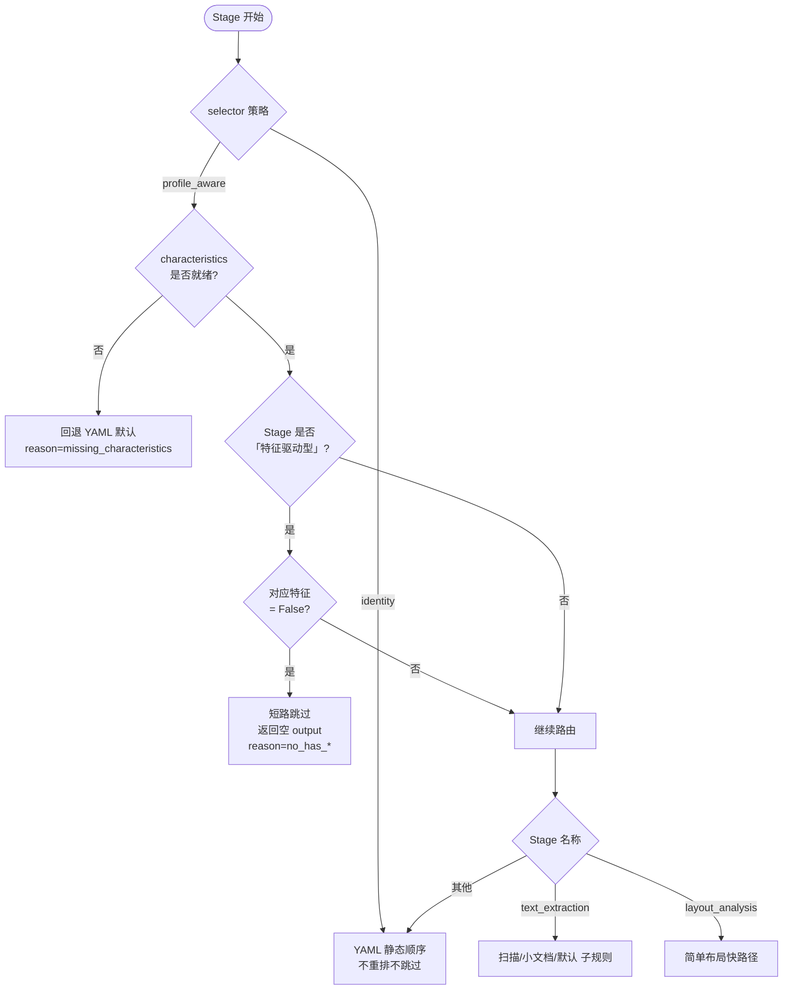
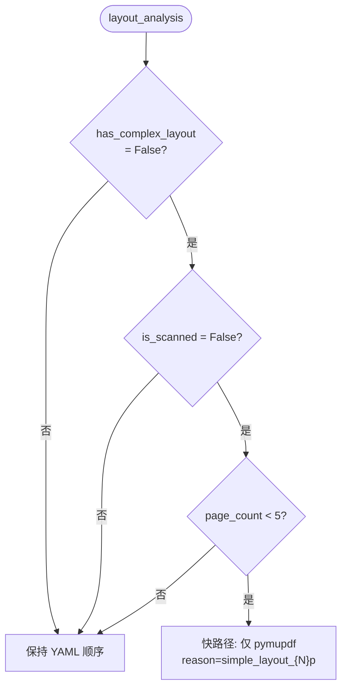

# PDF 引擎选择决策图

本文档可视化 `parse_pdf_to_markdown` Pipeline 在 **Adaptive Engine Selection**
（PR #163, PR2）下，各 Stage 的运行时引擎路由策略。决策结果会写入
`StageResult.metadata.selector_decision`，便于审计与调优。

> **TL;DR**：`quick_scan` 产出的 `DocumentCharacteristics`（`is_scanned` /
> `has_tables` / `has_formulas` / `page_count` 等）从「死字段」变成「路由信号」。
> 对没必要跑的 Stage 短路，对扫描版 PDF 用 marker / docling，对小文档用
> PyMuPDF 快路径，省下 docling 10s 冷启动。

## 决策入口



## text_extraction 子规则

```mermaid
flowchart TD
    A([text_extraction]) --> B{is_scanned?}
    B -- 是 --> C["重排: marker → docling → opendataloader<br/>→ pymupdf → pypdf"]
    B -- 否 --> D{page_count < 5?}
    D -- 是 --> E["快路径: 仅 pymupdf<br/>跳过 docling 10s 冷启动"]
    D -- 否 --> F[保持 YAML 顺序]
    C --> G[reason=scanned]
    E --> H[reason=small_doc_{N}p]
    F --> I[reason=default]
```

## layout_analysis 子规则



## 特征驱动型 Stage 跳过表

| Stage              | 关键特征字段        | 跳过条件              | 短路输出                                       |
|--------------------|---------------------|-----------------------|------------------------------------------------|
| `table_extraction`   | `has_tables`        | `False`               | `TableExtractionOutput(tables=[], total_count=0)` |
| `formula_extraction` | `has_formulas`      | `False`               | `FormulaExtractionOutput(formulas=[], ...)`    |
| `code_detection`     | `has_code_blocks`   | `False`               | `CodeDetectionOutput(code_blocks=[], ...)`     |
| `image_extraction`   | `has_images`        | `False`               | `ImageExtractionOutput(images=[], total_count=0)` |

跳过时 `StageResult.engine_used = "skipped:profile:no_has_*"`，且
`metadata.selector_skipped = True`。

## 配置开关

| 配置项                              | 默认值          | 说明                                                       |
|-------------------------------------|-----------------|------------------------------------------------------------|
| `pipeline_engine_selector`          | `profile_aware` | 切到 `identity` 回退 YAML 静态行为                          |
| `docling_enabled` / `mineru_enabled` / `marker_enabled` / `opendataloader_enabled` | `True` | 各引擎全局门控（早于 selector）                              |

环境变量前缀 `NEGENTROPY_PERCEIVES_`，例如：

```bash
NEGENTROPY_PERCEIVES_PIPELINE_ENGINE_SELECTOR=identity uv run perceives parse-pdf ...
```

## 关联代码

- 策略实现：[`src/negentropy/perceives/pipeline/engine_selector.py`](../../src/negentropy/perceives/pipeline/engine_selector.py)
- 编排接入：[`src/negentropy/perceives/pipeline/orchestrator.py`](../../src/negentropy/perceives/pipeline/orchestrator.py)
- 工厂入口：[`pipeline.engine_selector.build_selector`](../../src/negentropy/perceives/pipeline/engine_selector.py)
- 配置项：[`src/negentropy/perceives/config.py`](../../src/negentropy/perceives/config.py) `NegentropyPerceivesSettings`
- 测试：
  - `tests/unit/test_engine_selector.py`（22 case）
  - `tests/unit/test_orchestrator_with_selector.py`（5 case）

## 调优要点

1. **加新的跳过特征**：扩展 `ProfileAwareSelector.SKIPPABLE_STAGES_BY_FEATURE` 字典即可。
2. **加新的重排规则**：在 `_select_<stage_name>` 内追加分支，并配套单测。
3. **回退验证**：将 `pipeline_engine_selector=identity` 后跑 benchmark，
   确认本策略带来的收益（耗时差异 / engine_used 差异）。
