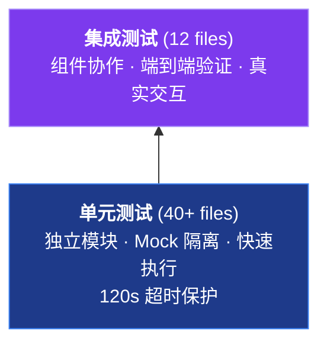
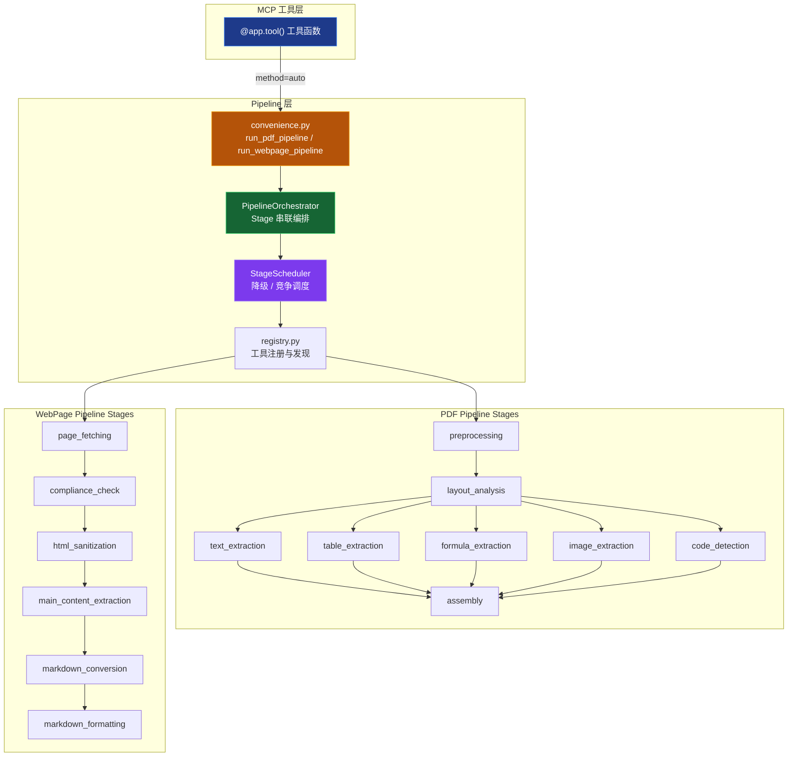
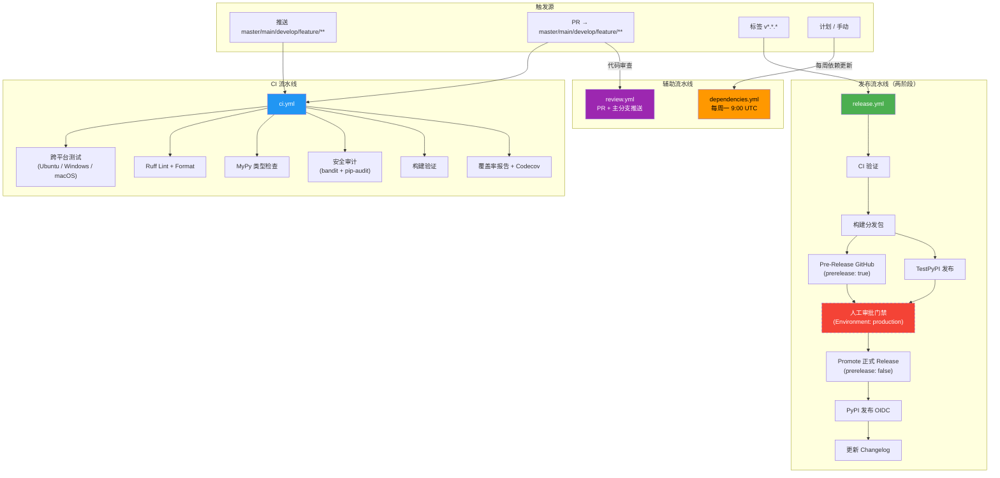

Negentropy Perceives 采用现代化 Python 开发工具链，基于 [uv](https://docs.astral.sh/uv/) 包管理器构建高效的开发环境。本文档提供开发环境配置、项目结构总览、测试体系、MCP 工具开发规范、Pipeline 编排框架、CI/CD 工作流与编码最佳实践。

## 环境配置

### 系统要求

- **Python**: 3.13+
- **操作系统**: Windows 10+, macOS 10.15+, Ubuntu 18.04+
- **内存**: 最少 4GB RAM
- **存储**: 最少 10GB 可用空间

### 快速开始

```bash
# 使用提供的脚本快速设置（推荐）
./scripts/dev/setup.sh

# 验证环境设置
uv --version
python --version
```

### 详细环境配置

```bash
# 安装 uv（如果未安装）
curl -LsSf https://astral.sh/uv/install.sh | sh

# 克隆项目
git clone <repository-url>
cd negentropy-perceives

# 同步依赖（项目运行时固定 Python 3.13）
uv sync --python 3.13

# 安装开发依赖
uv sync --python 3.13 --group dev

# 启用非 MLX 的 PDF 引擎集合（Docling / MinerU / Marker / PyMuPDF）
uv sync --python 3.13 --extra all-engines

# 或按需单独启用
uv sync --python 3.13 --extra mineru
uv sync --python 3.13 --extra marker

# Apple Silicon 上启用 Docling code/formula 的 Granite Docling + MLX 路径
# 注意：docling-mlx 与 marker/all-engines 互斥（transformers 主版本冲突）
uv sync --python 3.13 --extra docling-mlx

# 初始化用户配置（首次运行时自动生成，也可手动执行）
uv run negentropy-perceives --init-config

# 安装 Playwright 浏览器依赖
uv run playwright install chromium
```

> **引擎可用性**：`docling_enabled` / `mineru_enabled` / `marker_enabled` 默认均为 `true`，
> 实际是否参与调度由运行时 `is_available()` 检测（包是否可 import）决定——未安装的引擎
> 会被自动跳过，PDF 管线首次调用时会打印 `[PDF engines]` 汇总一次，方便确认生效状态。
>
> **Apple Silicon GPU**：Docling 默认 `CodeFormulaV2` 在 MPS 下会进入不支持 MPS 的
> Transformers code/formula 路径并回退 CPU。需要保留 code/formula enrichment 的 GPU
> 处理时，使用 `--extra docling-mlx`；若必须同时启用 Marker，请在配置中设置
> `pdf.docling_mps_enrichment: disable`，让代码/公式能力交给其它引擎或后处理兜底。

#### 模型预热（推荐）

安装完 PDF 引擎后，**强烈建议**在首次使用前执行一次模型预热，避免用户首个
MCP 请求被 ~1.35GB Marker Layout 模型下载阻塞而触发 `Stage 'layout_analysis'
工具 'marker' 超时 (120s)`：

```bash
# 预下载 Docling + Marker + MinerU 所需的全部模型到本地缓存（幂等）
uv run --python 3.13 perceives prefetch-models

# 仅预热部分引擎
uv run --python 3.13 perceives prefetch-models --engines docling,marker

# 指定 HuggingFace 缓存目录（CI / 共享缓存场景）
uv run --python 3.13 perceives prefetch-models --hf-home /shared/hf-cache
```

命令会对未安装的引擎输出 `skipped` 并给出 extras 安装提示，不会中断其它引擎；
任一引擎 error 退出码为 1，全部 ok/skipped 退出码为 0。

## 项目结构

```
negentropy-perceives/
├── src/negentropy/perceives/                    # 核心包
│   ├── __init__.py              # 版本信息（动态读取 pyproject.toml）
│   ├── __main__.py              # python -m 入口
│   ├── _logging.py              # 日志配置
│   ├── config.py                # 配置系统 + 配置验证（NegentropyPerceivesSettings, ConfigValidator）
│   ├── schemas.py               # 响应模型 + 数据传输对象（Pydantic BaseModel）
│   ├── sdk.py                   # Python SDK 封装（NegentropyPerceivesClient）
│   │
│   ├── apps/                    # 应用入口子包
│   │   └── app.py               # MCP 服务器入口（main()）
│   │
│   ├── scraping/                # 网页抓取引擎子包
│   │   ├── engine.py            # 核心抓取引擎（WebScraper, HttpScraper, SeleniumScraper）
│   │   ├── anti_detection.py    # 反检测隐身抓取（AntiDetectionScraper）
│   │   ├── browser.py           # 浏览器工具（selenium_session, playwright_session, stealth_*, chrome_options）
│   │   ├── form_handler.py      # 表单处理（FormHandler）
│   │   └── content_extraction/  # 内容提取（selectors.py, pages.py）
│   │
│   ├── pdf/                     # PDF 处理引擎子包
│   │   ├── processor.py         # 核心 PDF 处理器（多引擎调度）
│   │   ├── enhanced.py          # 增强 PDF 处理器（PyMuPDF）
│   │   ├── docling_engine.py    # Docling 引擎（GPU 加速）
│   │   ├── marker_engine.py     # Marker 引擎（Nougat 模型，学术文档）
│   │   ├── mineru_engine.py     # MineRU 引擎（深度学习文档结构分析）
│   │   ├── llm_orchestrator.py  # LLM 编排器（smart 模式多引擎融合）
│   │   ├── llm_client.py        # LLM 客户端（LiteLLM）
│   │   ├── math_formula.py      # 数学公式处理
│   │   ├── device_config.py     # 设备配置（GPU/CPU 调度）
│   │   ├── hardware.py          # 硬件检测（MPS/CUDA/XPU）
│   │   ├── figure_text_filter.py # 图文过滤
│   │   ├── _imports.py          # 内部导入管理
│   │   └── _sources.py          # 内部数据源管理
│   │
│   ├── markdown/                # Markdown 转换子包
│   │   ├── converter.py         # Markdown 转换器核心
│   │   ├── formatter.py         # 格式化器（数学公式保护）
│   │   ├── html_preprocessor.py # HTML 预处理
│   │   ├── algorithm_detector.py # 算法检测
│   │   ├── formula_placeholder_resolver.py # 公式占位符解析
│   │   ├── image_embedder.py    # 图片嵌入
│   │   └── image_ref_normalizer.py # 图片引用规范化
│   │
│   ├── pipeline/                # Pipeline 编排框架（详见 Pipeline 编排框架 章节）
│   │   ├── base.py              # Stage / StageResult / StageTool 基类
│   │   ├── competitive.py       # CompetitiveStage（多工具并行竞争）
│   │   ├── orchestrator.py      # PipelineOrchestrator（Stage 串联编排）
│   │   ├── scheduler.py         # StageScheduler（降级 / 竞争模式调度）
│   │   ├── registry.py          # 工具注册与发现（register_tool / get_tool）
│   │   ├── models.py            # Pipeline 数据模型（PDF / WebPage 通用）
│   │   ├── convenience.py       # 高级便捷 API（run_pdf_pipeline / run_webpage_pipeline）
│   │   ├── pdf_stages/          # PDF Pipeline Stages（10 个 Stage）
│   │   │   ├── preprocessing.py   # 预处理（PDF 加载 + 文档特征检测）
│   │   │   ├── layout_analysis.py # 版面分析与阅读顺序
│   │   │   ├── text_extraction.py # 文本提取
│   │   │   ├── table_extraction.py # 表格提取
│   │   │   ├── formula_extraction.py # 数学公式提取
│   │   │   ├── image_extraction.py  # 图片提取
│   │   │   ├── code_detection.py    # 代码块检测
│   │   │   ├── asset_bundling.py    # 资源打包
│   │   │   ├── assembly.py          # 内容组装（Markdown 输出）
│   │   │   └── quick_scan.py        # 快速扫描
│   │   └── webpage_stages/      # WebPage Pipeline Stages（9 个 Stage）
│   │       ├── page_fetching.py          # 页面获取
│   │       ├── anti_detection.py         # 反检测
│   │       ├── compliance_check.py       # 合规检查（robots.txt）
│   │       ├── html_sanitization.py      # HTML 清洗
│   │       ├── main_content_extraction.py # 主内容提取
│   │       ├── markdown_conversion.py    # Markdown 转换
│   │       ├── markdown_formatting.py    # Markdown 格式化
│   │       ├── rich_elements.py          # 富元素处理（图片、表格等）
│   │       └── asset_bundling.py         # 资源打包
│   │
│   ├── tools/                   # MCP 工具注册子包（3 模块 · 6 个 tool）
│   │   ├── __init__.py          # 包初始化 + 触发注册
│   │   ├── _registry.py         # FastMCP app 实例 + 共享服务 + 辅助函数导出
│   │   ├── _observability.py    # 可观测性辅助（elapsed_ms）
│   │   ├── _support.py          # 共享类型（ScrapeMethod, PDFMethod, PDFOutputFormat）+ 校验函数
│   │   ├── extraction.py        # 数据提取工具（discover_links, inspect_page）
│   │   ├── markdown.py          # Markdown 转换工具（parse_webpage_to_markdown, parse_webpages_to_markdown）
│   │   └── pdf.py               # PDF 处理工具（parse_pdf_to_markdown, parse_pdfs_to_markdown）
│   │
│   ├── infra/                   # 基础设施层
│   │   ├── parsing.py           # 解析工具（TextCleaner, URLValidator, extract_*）
│   │   └── resilience.py        # 弹性策略（RateLimiter, RetryManager）
│   │
│   └── examples/                # 示例与模板（随包分发）
│       ├── configs/
│       │   └── extraction_configs.py  # 领域提取配置模板
│       ├── mcp/
│       │   └── basic_usage.py         # MCP 工具调用示例
│       └── sdk/
│           └── python_sdk_usage.py    # Python SDK 集成示例
│
├── tests/                        # 测试套件（详见 [测试](#测试) 章节）
│   ├── conftest.py               # 全局共享 Fixture
│   ├── unit/                     # 单元测试（40+ files）
│   ├── integration/              # 集成测试（12 files + tooling.py helper）
│   │   └── tooling.py            # 集成测试共享工具（get_tool_map, build_pdf_tool_kwargs）
│   └── reports/                  # 测试报告（.gitignore，运行时生成）
│
├── scripts/                      # 仓库维护脚本
│   ├── dev/
│   │   └── setup.sh              # 环境初始化
│   └── test/
│       └── run-tests.sh          # 测试执行（支持 unit/integration/full/coverage 等模式）
│
├── docs/                         # 项目文档
├── .github/workflows/            # CI/CD 配置（ci/release/dependencies/review）
├── .github/actions/              # 可复用 Composite Action
│   └── setup-python-uv/action.yml
└── pyproject.toml                # 项目配置
```

## 测试

### 测试体系概述

#### 测试金字塔



#### 测试目录结构

```
tests/
├── conftest.py                              # 全局共享 Fixture
├── unit/                                    # 单元测试 (40+ files)
│   ├── conftest.py                          # 120s 超时保护（pytest-timeout signal 模式）
│   ├── doc_contracts.py                     # 文档契约验证
│   ├── test_advanced_features.py            # 高级功能向后兼容
│   ├── test_algorithm_detector.py           # 算法检测
│   ├── test_anti_detection.py               # 反检测隐身爬取
│   ├── test_app_entrypoint.py               # 应用入口
│   ├── test_browser_utils.py                # 浏览器工具
│   ├── test_config.py                       # 配置系统
│   ├── test_content_extraction.py           # 内容提取
│   ├── test_dependency_integrity.py         # 跨模块依赖完整性
│   ├── test_device_config.py                # GPU 设备配置
│   ├── test_docling_engine.py               # Docling 引擎
│   ├── test_docs_configuration.py           # 文档一致性（配置相关）
│   ├── test_docs_user_guide.py              # 文档一致性（用户指南相关）
│   ├── test_enhanced_pdf_processor.py       # PDF 增强处理
│   ├── test_examples.py                     # 示例代码验证
│   ├── test_figure_text_filter.py           # 图文过滤
│   ├── test_form_handler.py                 # 表单交互
│   ├── test_formatter_math_protection.py    # 格式化数学公式保护
│   ├── test_formula_placeholder_resolver.py # 公式占位符解析
│   ├── test_github_workflows.py             # CI/CD 工作流验证
│   ├── test_html_math_preservation.py       # HTML 数学公式保留
│   ├── test_image_ref_normalizer.py         # 图片引用规范化
│   ├── test_infra_package.py                # 基础设施包
│   ├── test_llm_client.py                   # LLM 客户端
│   ├── test_llm_orchestrator.py             # LLM 编排器
│   ├── test_logging_config.py               # 日志配置
│   ├── test_markdown_converter.py           # Markdown 转换
│   ├── test_marker_engine.py                # Marker 引擎
│   ├── test_math_formula.py                 # 数学公式处理
│   ├── test_mcp_tools_unit.py               # MCP 工具单元测试
│   ├── test_mineru_engine.py                # MineRU 引擎
│   ├── test_paragraph_separation.py         # 段落分隔
│   ├── test_pdf_processor.py                # PDF 基础处理
│   ├── test_pdf_table_extraction.py         # PDF 表格提取
│   ├── test_pyproject_metadata.py           # pyproject.toml 元数据验证
│   ├── test_schemas.py                      # 响应模型
│   ├── test_scraper.py                      # 网页抓取引擎
│   ├── test_scraping_package.py             # 抓取包完整性
│   ├── test_scripts.py                      # 脚本文件验证
│   ├── test_sdk.py                          # Python SDK
│   ├── test_tool_registry.py                # 工具注册表
│   └── test_utils.py                        # 工具类
├── integration/                             # 集成测试 (12 files)
│   ├── conftest.py                          # 集成测试专用 Fixture（含 GPU 感知）
│   ├── tooling.py                           # 集成测试共享工具（get_tool_map, build_pdf_tool_kwargs）
│   ├── test_comprehensive_integration.py    # 综合集成 + 性能负载
│   ├── test_cross_tool_integration.py       # 跨工具协作
│   ├── test_docling_pdf_integration.py      # Docling PDF GPU 加速集成
│   ├── test_e2e_data_validation.py          # 数据有效性验证
│   ├── test_e2e_document_pipeline.py        # 文档处理管道
│   ├── test_e2e_error_resilience.py         # 错误恢复能力
│   ├── test_e2e_performance.py              # 性能基准
│   ├── test_langchain_blog_conversion.py    # Langchain 博客转换
│   ├── test_llm_pdf_integration.py          # LLM 编排 PDF 集成
│   ├── test_mcp_tools.py                    # MCP 工具端到端
│   ├── test_pdf_formula_regression.py       # PDF 公式回归测试
│   └── test_pdf_integration.py              # PDF 处理集成
```

> `tests/reports/` 由测试脚本运行时动态生成（已 `.gitignore`），不纳入版本控制。

#### 模块覆盖矩阵

| 模块分层       | 覆盖模块                                                               | 单元测试 | 集成测试 |
| -------------- | ---------------------------------------------------------------------- | -------- | -------- |
| **MCP 工具层** | 6 个 `@app.tool()` 注册工具（`tools/` 3 模块）                       | ✅       | ✅       |
| **Pipeline 层** | `pipeline/` 编排框架 + PDF/WebPage Stages                            | ✅       | —        |
| **核心引擎**   | `scraping`、`anti_detection`、`markdown_converter`                      | ✅       | ✅       |
| **PDF 引擎**   | `docling`、`marker`、`mineru`、`llm_orchestrator`、`enhanced`         | ✅       | ✅       |
| **数据层**     | `schemas`、`config`、`form_handler`                                      | ✅       | ✅       |
| **基础设施**   | `resilience`（RateLimiter, RetryManager）、`parsing`（TextCleaner, URLValidator） | ✅       | —        |
| **SDK**        | `sdk.py`（NegentropyPerceivesClient）                                   | ✅       | —        |

### 测试执行

#### 快速开始

项目提供测试运行脚本 [`scripts/test/run-tests.sh`](../scripts/test/run-tests.sh)：

```bash
./scripts/test/run-tests.sh              # 完整测试套件（默认）
./scripts/test/run-tests.sh unit         # 单元测试
./scripts/test/run-tests.sh integration  # 集成测试
./scripts/test/run-tests.sh quick        # 快速测试（排除慢速测试）
./scripts/test/run-tests.sh performance  # 性能测试
./scripts/test/run-tests.sh coverage     # 仅生成覆盖率报告
./scripts/test/run-tests.sh clean        # 清理测试结果
```

#### pytest 常用命令

```bash
# 按范围
uv run pytest                                    # 所有测试
uv run pytest tests/unit/                        # 单元测试目录
uv run pytest tests/integration/                 # 集成测试目录
uv run pytest tests/unit/test_config.py          # 特定文件

# 按粒度
uv run pytest tests/unit/test_config.py::TestNegentropyPerceivesSettings           # 测试类
uv run pytest tests/unit/test_config.py::TestNegentropyPerceivesSettings::test_xxx # 测试方法

# 执行控制
uv run pytest -x                     # 首次失败即停
uv run pytest --lf                   # 只跑上次失败的
uv run pytest --ff                   # 优先跑失败的
uv run pytest -n auto                # 自动并行（需 pytest-xdist）
uv run pytest --durations=10         # 最慢 10 个测试
uv run pytest -m "not slow"          # 排除慢速测试

# GPU 加速测试：-m requires_gpu
# LLM 编排测试：-m requires_llm
# 列出不执行：--co -m requires_gpu
```

#### 测试配置

所有 pytest 和覆盖率配置集中在 [`pyproject.toml`](../pyproject.toml) 中维护：

- **`[tool.pytest.ini_options]`**：测试发现规则、`addopts` 默认参数、标记定义、异步模式
- **`[tool.coverage.*]`**：覆盖率源、分支覆盖、排除规则、报告输出路径

> `addopts` 已配置自动生成 HTML、XML、JSON 覆盖率报告与测试报告，无需手动指定 `--cov-report` 或 `--html` 参数。

### Fixture 体系

#### 全局 Fixture（[`tests/conftest.py`](../tests/conftest.py)）

| Fixture                       | 作用域   | 说明                                          |
| ----------------------------- | -------- | --------------------------------------------- |
| `test_config`                 | function | 安全的 `NegentropyPerceivesSettings` 测试实例 |
| `mock_web_scraper`            | function | `WebScraper` Mock（`spec=` 类型约束）         |
| `mock_anti_detection_scraper` | function | `AntiDetectionScraper` Mock                   |
| `mock_form_handler`           | function | `FormHandler` Mock                            |
| `sample_html`                 | function | 标准 HTML 测试内容（含表单、列表、链接）      |
| `sample_extraction_config`    | function | CSS 选择器提取配置样本                        |
| `sample_scrape_result`        | function | 完整爬取结果数据结构                          |
| `temp_cache_dir`              | function | `tempfile.TemporaryDirectory` 临时缓存目录    |
| `mock_http_response`          | function | Mock HTTP 响应（200、text/html）              |

#### 集成测试 Fixture（[`tests/integration/conftest.py`](../tests/integration/conftest.py)）

| Fixture                       | 作用域   | 说明                                                   |
| ----------------------------- | -------- | ------------------------------------------------------ |
| `pdf_processor`               | function | 真实 PDF 处理器实例                                    |
| `e2e_tools`                   | function | MCP 工具映射（通过 `tooling.get_tool_map()` 获取）     |
| `detected_gpu_device`         | session  | GPU 硬件检测结果（MPS/CUDA/XPU）                       |
| `gpu_docling_engine`          | session  | GPU 绑定的 DoclingEngine 实例                          |
| `warm_docling_converter`      | session  | 预热 Docling Converter（触发模型加载，返回耗时秒数）   |
| `shared_docling_result_ce`    | session  | CE_PDF 的 Docling GPU 转换结果（session 内共享）       |
| `shared_docling_result_arxiv` | session  | arXiv PDF 前 8 页的 Docling GPU 转换结果（session 内共享） |

集成测试还使用 [`tests/integration/tooling.py`](../tests/integration/tooling.py) 提供的共享工具函数：
- **`get_tool_map()`**：返回 MCP 工具名称到工具对象的映射
- **`select_tools()`**：从完整工具映射中选择指定工具
- **`build_pdf_tool_kwargs()`**：构造 PDF 工具调用参数（含默认值覆盖）

#### Fixture 约定

- 新增全局 fixture 添加到 [`tests/conftest.py`](../tests/conftest.py)；集成测试专用 fixture 添加到 [`tests/integration/conftest.py`](../tests/integration/conftest.py)
- Mock 对象统一使用 `Mock(spec=TargetClass)` 模式确保接口约束
- 异步 fixture 使用 `@pytest_asyncio.fixture` 装饰器
- 单元测试默认 120 秒超时保护（[`tests/unit/conftest.py`](../tests/unit/conftest.py)，通过 `pytest-timeout` signal 模式实现）

### 质量门禁

| 指标           | 目标值   |
| -------------- | -------- |
| 单元测试通过率 | > 99%    |
| 集成测试通过率 | > 95%    |
| 代码覆盖率     | > 95%    |
| 测试执行时间   | < 5 分钟 |

覆盖率报告自动上传至 Codecov，具体配置参见 [`ci.yml`](../.github/workflows/ci.yml) 中的 `coverage` job。CI/CD 工作流的完整文档参见 [CI/CD 与版本管理](#cicd-与版本管理)。

## MCP 工具开发

### 分包注册架构

项目采用**分包注册模式**组织 MCP 工具，核心链路如下：

```
tools/_registry.py          定义 FastMCP app 实例 + 共享服务
       ↓                       （web_scraper, markdown_converter, create_pdf_processor 工厂）
tools/_support.py           共享类型别名（ScrapeMethod, PDFMethod, PDFOutputFormat）+ 校验函数
tools/_observability.py     导出 elapsed_ms 计时工具
       ↓
tools/extraction.py         用 @app.tool() 注册 2 个工具（discover_links, inspect_page）
tools/markdown.py           用 @app.tool() 注册 2 个工具（parse_webpage_to_markdown, parse_webpages_to_markdown）
tools/pdf.py                用 @app.tool() 注册 2 个工具（parse_pdf_to_markdown, parse_pdfs_to_markdown）
       ↓                       （6 个 tool 分布于 3 个模块）
tools/__init__.py           导入各子模块 + _registry 公共 API，触发装饰器注册
       ↓
apps/app.py                 应用入口 main()，从 tools 导入 app 实例
```

[`_registry.py`](../src/negentropy/perceives/tools/_registry.py) 是中枢，提供 `app` 实例和共享服务（`web_scraper`、`markdown_converter`、`create_pdf_processor` 工厂函数），以及通用辅助函数（`validate_url`、`validate_page_range`、`normalize_extract_config`、`elapsed_ms`）。[`_support.py`](../src/negentropy/perceives/tools/_support.py) 定义共享类型枚举（`ScrapeMethod`、`PDFMethod`、`PDFOutputFormat`）与输入校验函数，[`_observability.py`](../src/negentropy/perceives/tools/_observability.py) 提供计时能力。

### MCP 工具清单

| 模块              | 工具名称                                | 职责                                         |
| ----------------- | --------------------------------------- | -------------------------------------------- |
| `extraction.py`   | `discover_links`                        | 提取网页链接，支持域名过滤和内外链分类       |
| `extraction.py`   | `inspect_page`                          | 获取页面元数据（标题、描述、状态码等）       |
| `markdown.py`     | `parse_webpage_to_markdown`             | 网页 → Markdown 转换（支持 Pipeline 自动降级）|
| `markdown.py`     | `parse_webpages_to_markdown`            | 批量网页 → Markdown 转换                     |
| `pdf.py`          | `parse_pdf_to_markdown`                 | PDF → Markdown 转换（支持 Pipeline 自动降级）|
| `pdf.py`          | `parse_pdfs_to_markdown`                | 批量 PDF → Markdown 转换                     |

### Pipeline 集成

`parse_webpage_to_markdown` 和 `parse_pdf_to_markdown` 在 `method="auto"` 时会自动尝试 Pipeline 路径：

1. **Pipeline 路径**：通过 `run_webpage_pipeline()` / `run_pdf_pipeline()` 执行 Stage 化管线处理
2. **传统路径**：若 Pipeline 不可用或执行失败，自动降级到传统的 `web_scraper + markdown_converter` / `PDFProcessor` 路径

这种"优雅给自己留后路"的降级策略，确保了 Pipeline 框架不会成为单点故障——Pipeline 不是躺平，是优雅地给自己留后路。

### 开发新工具步骤

以 [`parse_pdf_to_markdown`](../src/negentropy/perceives/tools/pdf.py) 为例：

#### 1. 定义响应模型

在 [`schemas.py`](../src/negentropy/perceives/schemas.py) 中添加 Pydantic 响应模型：

```python
class PDFResponse(BaseModel):
    """Response model for PDF conversion."""
    success: bool = Field(..., description="操作是否成功")
    pdf_source: str = Field(..., description="PDF 源路径或 URL")
    method: str = Field(..., description="使用的处理方法")
    output_format: str = Field(default="markdown", description="输出格式")
    content: Optional[str] = Field(default=None, description="转换后的内容")
    # ... 其他字段
```

#### 2. 实现工具函数

在 `tools/` 下对应模块中实现，通过 `@app.tool()` 注册：

```python
from ..schemas import PDFResponse
from ._registry import app, create_pdf_processor, PDFMethod, validate_page_range

@app.tool()
async def parse_pdf_to_markdown(
    pdf_source: Annotated[str, Field(..., description="PDF 源路径或 URL")],
    method: Annotated[PDFMethod, Field(default="auto", description="处理方法")],
    # ... 更多参数
) -> PDFResponse:
    """Convert a PDF document to Markdown format."""
    # 参数校验
    page_range_tuple, page_range_error = validate_page_range(page_range)
    if page_range_error:
        return PDFResponse(success=False, ..., error=page_range_error)

    # Pipeline 路径（auto 模式优先尝试）
    if method == "auto":
        try:
            from ..pipeline import run_pdf_pipeline
            result = await run_pdf_pipeline(source=pdf_source, ...)
            if result.success:
                return PDFResponse(success=True, ..., content=result.markdown)
        except Exception:
            pass  # 降级到传统路径

    # 传统路径
    pdf_processor = create_pdf_processor()
    result = await pdf_processor.process_pdf(pdf_source=pdf_source, method=method, ...)
    return PDFResponse(success=result.get("success", False), ...)
```

#### 3. 注册触发

在 [`tools/__init__.py`](../src/negentropy/perceives/tools/__init__.py) 中导入新模块：

```python
from . import pdf  # noqa: F401  # 触发 @app.tool() 注册
```

工具函数统一通过 `tools/` 包导入，无需额外 re-export。

### 参数设计模式

推荐使用 **Annotated Field 模式**，直接在函数签名中定义参数描述。以 [`tools/markdown.py`](../src/negentropy/perceives/tools/markdown.py) 中的 `parse_webpage_to_markdown` 为例：

```python
@app.tool()
async def parse_webpage_to_markdown(
    url: Annotated[str, Field(..., description="目标网页URL，必须包含协议前缀")],
    method: Annotated[ScrapeMethod, Field(default="auto", description="抓取方法")],
    extract_main_content: Annotated[bool, Field(default=True, description="是否仅提取主要内容")],
    # ...
) -> MarkdownResponse:
```

**优势**：参数透明可见、描述清晰、MCP Client 兼容性好、减少样板代码。

### 开发最佳实践

- **错误处理**：验证输入参数，使用 `_registry.py` 中的 `validate_url()` 和 `_support.py` 中的校验函数，返回结构化错误信息
- **性能优化**：使用异步编程（`async/await`），利用 `infra/resilience.py` 限速、`_observability.py` 计时
- **Pipeline 优先**：新工具在 `auto` 模式下应优先尝试 Pipeline 路径，失败后降级到传统路径
- **架构参考**：系统性能设计详见 [架构设计](./framework.md)

## Pipeline 编排框架

Pipeline 框架是 Negentropy Perceives 的核心编排引擎，将文档处理流程拆解为**可组合、可竞争**的 Stage。它不是简单的管道——它是一个懂得"择优录用"的智能调度系统。

### 核心组件

| 组件                      | 文件                  | 职责                                             |
| ------------------------- | --------------------- | ------------------------------------------------ |
| `Stage`                   | `pipeline/base.py`    | Stage 基类，定义统一的 `execute()` 接口          |
| `StageResult`             | `pipeline/base.py`    | Stage 执行结果的统一包装（success/output/error） |
| `StageTool`               | `pipeline/base.py`    | Stage 工具协议（鸭子类型接口）                   |
| `CompetitiveStage`        | `pipeline/competitive.py` | 多工具并行竞争 Stage（择优录用）             |
| `StageScheduler`          | `pipeline/scheduler.py`   | Stage 调度器（降级 / 竞争模式）               |
| `PipelineOrchestrator`    | `pipeline/orchestrator.py` | Pipeline 编排器（串联多个 Stage）             |
| `register_tool` / `get_tool` | `pipeline/registry.py` | 工具注册与发现                               |
| `run_pdf_pipeline` / `run_webpage_pipeline` | `pipeline/convenience.py` | 高级便捷 API，供 MCP 工具层直接调用 |

### 架构流程



### 调度策略

- **降级模式**：按优先级依次尝试工具，首个成功即返回——经典的"能用就行"策略
- **竞争模式**（`CompetitiveStage`）：多个工具并行执行，择优选用结果——"赛马机制"，用算力换质量
- **并行组**：独立的 Stage 可配置为并行执行（如 PDF Pipeline 中 text/table/formula/image/code extraction 并行处理）

### 配置驱动

Pipeline 由 `config.yaml` 或环境变量驱动：

- **Stage 配置**：定义 Stage 列表、每个 Stage 的引擎选择和参数
- **引擎门控**：通过 `docling_enabled`、`mineru_enabled`、`marker_enabled` 控制引擎可用性
- **默认配置**：`pipeline.defaults` 提供全局默认值

详见 [用户指南 > MCP Server 配置](./user-guide.md#mcp-server-配置)。

## 编码规范

遵循 PEP 8 和 PEP 257 标准。代码质量工具的使用详见 [用户指南 > 开发者命令速查](./user-guide.md#开发者命令速查)。

### 代码质量保障

| 工具      | 用途          | 配置位置                       |
| --------- | ------------- | ------------------------------ |
| Ruff      | Lint + Format | `pyproject.toml` `[tool.ruff]` |
| MyPy      | 静态类型检查  | `pyproject.toml` `[tool.mypy]` |
| Bandit    | 安全扫描      | CI `security` job              |
| pip-audit | 依赖漏洞扫描  | CI `security` job              |

### 测试编码规范

#### 命名约定

```python
# 文件：test_<模块名>.py，镜像 src/negentropy/perceives/ 下的源码模块
# 类：Test<功能区域>
# 方法：test_<行为>_<条件>

class TestWebScraper:
    def test_scrape_url_success(self): ...
    def test_scrape_url_invalid_url_raises(self): ...
```

#### AAA 模式

所有测试遵循 Arrange-Act-Assert 三段式：

```python
def test_extract_data():
    # Arrange
    config = NegentropyPerceivesSettings(enable_javascript=False)
    # Act
    result = negentropy.perceives.process(config)
    # Assert
    assert result["success"] is True
```

#### 项目特有约定

- **异步测试**：`asyncio_mode = "auto"` 已在 `pyproject.toml` 中配置，异步测试函数**无需**手动添加 `@pytest.mark.asyncio` 装饰器
- **Mock 规范**：使用 `Mock(spec=TargetClass)` 而非裸 `Mock()`，确保 Mock 对象遵循目标类接口
- **测试组织**：测试文件与 `src/negentropy/perceives/` 下的源码模块一一镜像
- **测试标记**：七种标记已在 [`pyproject.toml`](../pyproject.toml) 中定义：
  - `unit` / `integration` / `slow` — 测试分类
  - `requires_network` / `requires_browser` — 环境依赖
  - `requires_gpu` — GPU 加速依赖（MPS/CUDA/XPU）
  - `requires_llm` — LLM API 依赖（smart 模式、LLM 编排）

## CI/CD 与版本管理

### 架构概览



### CI — [`ci.yml`](../.github/workflows/ci.yml)

**触发条件：** 推送到 master/main/develop/feature 分支、PR → master/main/develop/feature、`workflow_call`、手动触发

| Job        | 职责                                         |
| ---------- | -------------------------------------------- |
| `test`     | 在 Ubuntu / Windows / macOS 上运行 pytest    |
| `lint`     | ruff lint + format check + mypy 类型检查     |
| `security` | bandit 静态安全扫描 + pip-audit 依赖漏洞扫描 |
| `build`    | 构建 wheel 并验证安装                        |
| `coverage` | 覆盖率报告 + Codecov 上传                    |

支持 `workflow_call`，可被 release.yml 作为验证步骤调用。

### 发布 — [`release.yml`](../.github/workflows/release.yml)（两阶段流程）

**触发条件：** `v*.*.*` 标签推送、Release published（fallback）、手动触发（需指定 version）

**整体流程：** Pre-Release（预发布）→ 人工审批 → Release（正式发布）

| Job                  | 职责                                         | 阶段    | 触发条件                                             |
| -------------------- | -------------------------------------------- | ------- | ---------------------------------------------------- |
| `validate`           | 调用 ci.yml 执行完整验证                     | 共享    | 始终                                                 |
| `build`              | 构建分发包 + twine check                     | 共享    | 始终                                                 |
| `pre-release-github` | 创建 prerelease Release + 上传 assets        | Phase 1 | 标签推送                                             |
| `testpypi`           | 发布到 TestPyPI（OIDC）                      | Phase 1 | 标签推送 / 手动                                      |
| `approval`           | 人工审批门禁（Environment Protection Rules） | Gate    | 标签推送（需 pre-release + testpypi 完成）           |
| `promote-release`    | 将 prerelease 提升为正式 Release             | Phase 2 | 审批通过                                             |
| `pypi`               | 发布到 PyPI（OIDC 可信发布）                 | Phase 2 | promote-release 成功 / release published（fallback） |
| `changelog-update`   | 发布后更新 CHANGELOG                         | Phase 2 | PyPI 发布成功 / release published（fallback）        |

### 依赖管理 — [`dependencies.yml`](../.github/workflows/dependencies.yml)

**触发条件：** 每周一 9:00 UTC、手动触发

| Job      | 职责                                 |
| -------- | ------------------------------------ |
| `update` | `uv lock --upgrade` → 测试 → 创建 PR |

### 代码审查 — [`review.yml`](../.github/workflows/review.yml)

**触发条件：** PR opened/synchronize/reopened、推送到 master/main、手动触发

| Job           | 职责                                               |
| ------------- | -------------------------------------------------- |
| `pr-review`   | 审查 PR 变更文件，发布 PR 评论                     |
| `push-review` | 审查推送到主分支的变更，发布 commit 评论或告警摘要 |

**实现方式：**

- 基于官方 `anthropics/claude-code-action@v1`
- PR 审查启用 `track_progress` 与 sticky comment
- 审查异常采用"告警但不中断"策略，避免辅助流程将主交付链路打红

### 可复用组件

#### Composite Action: [`setup-python-uv`](../.github/actions/setup-python-uv/action.yml)

所有工作流共享的 Python 环境初始化 action。

| 参数             | 默认值 | 说明             |
| ---------------- | ------ | ---------------- |
| `python-version` | `3.13` | Python 版本      |
| `install-dev`    | `true` | 是否安装开发依赖 |
| `enable-cache`   | `true` | 是否启用 uv 缓存 |

### 环境配置

> 版本创建与发布操作步骤详见 [发布流程](#发布流程两阶段pre-release--release)。

**仓库密钥：**

| Secret               | 用途     | 必需          |
| -------------------- | -------- | ------------- |
| `ANTHROPIC_API_KEY`  | 代码审查 | 仅 review.yml |
| `ANTHROPIC_BASE_URL` | API 端点 | 可选          |

**关键 Action 版本：**

| Action                              | 版本  | 用途             |
| ----------------------------------- | ----- | ---------------- |
| `actions/checkout`                  | v6    | 代码检出         |
| `astral-sh/setup-uv`                | v7    | uv 安装          |
| `actions/upload-artifact`           | v7    | 产物上传         |
| `actions/download-artifact`         | v8    | 产物下载         |
| `codecov/codecov-action`            | v5    | 覆盖率上传       |
| `peter-evans/create-pull-request`   | v8    | 依赖 PR 创建     |
| `softprops/action-gh-release`       | v2    | GitHub Release   |
| `pypa/gh-action-pypi-publish`       | v1    | PyPI/TestPyPI 发布 |
| `anthropics/claude-code-action`     | v1    | 代码审查         |

**PyPI 可信发布：**

1. PyPI 账户 → 发布 → 添加待发布者
2. 填写：所有者、仓库名、工作流 `release.yml`、环境 `pypi`

**GitHub 环境：**

| Environment      | 用途                               | Protection Rules                   |
| ---------------- | ---------------------------------- | ---------------------------------- |
| `pypi`           | 生产环境 PyPI 发布                 | （可选配置 reviewers）             |
| `testpypi`       | TestPyPI 预发布                    | （可选）                           |
| **`production`** | **Pre-Release → Release 审批门禁** | **Required Reviewers（必须配置）** |

> **production 环境配置（首次发布前必须完成）：**
>
> 1. 进入仓库 Settings → Environments → New environment
> 2. 名称填 `production`，URL 填 `https://pypi.org/p/negentropy-perceives`
> 3. 在 Protection rules 中添加 Required reviewers（至少 1 位维护者）
> 4. 可选：设置等待超时时间（建议 72 小时）、限制 deployment branches

### 发布流程（两阶段：Pre-Release → Release）

> 本节描述手动执行版本发布的完整操作步骤。自动化发布由 [`release.yml`](../.github/workflows/release.yml) 在标签推送时自动触发，采用 **Pre-Release → 人工审批 → Release** 两阶段模式。

#### 前置条件

1. 所有 CI 检查通过（test, lint, security, build）
2. CHANGELOG.md 已更新，包含当前版本的变更记录
3. 版本号遵循 [语义化版本](https://semver.org/lang/zh-CN/) 规范
4. GitHub 仓库已配置 `production` 环境（Settings → Environments）并设置 Required Reviewers

#### Phase 1: Pre-Release（预发布）

```bash
# 1. 更新版本号（pyproject.toml 中的 version 字段）
# 2. 更新 CHANGELOG.md
# 3. 创建 git tag 并推送
git tag v<VERSION>
git push origin v<VERSION>
# → 自动触发 release.yml Phase 1:
#   CI 验证 → 构建 → Pre-Release GitHub (prerelease=true) → TestPyPI 发布
# → 暂停在人工审批门禁
```

**Phase 1 完成后，在 GitHub Actions 页面会看到 workflow 暂停在 `approval` job，等待人工审批。**

#### 人工验证与审批

```bash
# 4. 在 TestPyPI 上验证预发布版本
pip install --index-url https://test.pypi.org/simple/ negentropy-perceives==<VERSION>

# 5. 运行冒烟测试确认功能正常
uv run negentropy-perceives --help

# 6. 在 GitHub Releases 页面检查 Pre-Release 内容和 release notes

# 7. 在 GitHub Actions 页面审批 production 环境
#    Settings → Environments → production → Approve
```

**审批前检查清单：**

- [ ] Pre-Release 在 GitHub Releases 页面显示正确
- [ ] 从 TestPyPI 安装并通过冒烟测试
- [ ] Release notes 准确无误
- [ ] CI 日志无关键错误

#### Phase 2: Release（正式发布）

```bash
# 审批通过后自动执行 release.yml Phase 2:
#   Promote 正式 Release (prerelease=false) → PyPI 发布 (OIDC) → 更新 CHANGELOG
```

**无需额外操作——审批通过后全流程自动完成。**

#### 版本号查询

```bash
uv run python -c "from negentropy.perceives import __version__; print(__version__)"
```

## 调试与故障排除

### 日志调试

```python
import logging

logging.basicConfig(level=logging.INFO)
logger = logging.getLogger(__name__)

class NegentropyPerceivesService:
    async def process_content(self, url: str):
        logger.info(f"Starting extraction for URL: {url}")
        # ...
        logger.info("Extraction completed successfully")
```

### 测试调试

#### 环境准备

```bash
uv sync --group dev                                    # 安装开发依赖
export NEGENTROPY_PERCEIVES_ENABLE_JAVASCRIPT=false           # 禁用 JS 渲染
export NEGENTROPY_PERCEIVES_CONCURRENT_REQUESTS=1             # 单请求模式
export NEGENTROPY_PERCEIVES_BROWSER_TIMEOUT=10                # 浏览器超时
```

#### 调试命令

```bash
uv run pytest -v -s                  # 详细输出 + 显示 print
uv run pytest --tb=long              # 完整错误栈
uv run pytest --pdb                  # 失败时进入 PDB 调试器
uv run pytest --durations=0          # 所有测试执行时间
```

### 常见问题速查

| 问题类型   | 症状                         | 解决方案                                                                                           |
| ---------- | ---------------------------- | -------------------------------------------------------------------------------------------------- |
| **浏览器** | Selenium/Playwright 测试失败 | `export NEGENTROPY_PERCEIVES_ENABLE_JAVASCRIPT=false` 或 `uv run pytest -k "not requires_browser"` |
| **网络**   | 请求超时或连接失败           | `uv run pytest -k "not requires_network"` 或 `uv run pytest --timeout=30`                          |
| **异步**   | 异步测试挂起或超时           | 确认 `asyncio_mode = "auto"` 已配置；加 `--timeout=60`                                             |
| **资源**   | 内存不足或执行缓慢           | `uv run pytest -n 1` 串行执行；`rm -rf .pytest_cache/` 清理缓存                                    |
| **CI/CD**  | 构建失败                     | 检查 CI 日志中的测试/lint 失败                                                |
| **CI/CD**  | 发布失败                     | 验证 PyPI 可信发布配置与环境设置                                              |
| **CI/CD**  | 代码审查未执行               | 验证 `ANTHROPIC_API_KEY` 已配置                                               |
| **CI/CD**  | 审批门禁报错                 | 确认仓库 Settings → Environments → production 已创建并配置 Required Reviewers |
| **CI/CD**  | Pre-Release 后 workflow 停滞 | 正常行为——需在 GitHub Actions 页面手动审批 production 环境                    |

更多调试命令详见 [用户指南 > 开发者命令速查](./user-guide.md#开发者命令速查)。

## 开发资源

### 技术文档

- [uv 官方文档](https://docs.astral.sh/uv/)
- [pytest 文档](https://docs.pytest.org/)
- [Ruff 文档](https://docs.astral.sh/ruff/)
- [MyPy 文档](https://mypy.readthedocs.io/)
- [GitHub Actions 文档](https://docs.github.com/zh/actions)
- [PyPI Trusted Publishers](https://docs.pypi.org/trusted-publishers/)

### 工具推荐

- **IDE**: PyCharm, VS Code
- **API 测试**: Postman, Insomnia

## 相关文档

| 文档                                                          | 说明                         |
| ------------------------------------------------------------- | ---------------------------- |
| [架构设计](./framework.md)                                    | 系统架构、设计模式、性能策略 |
| [用户指南 > MCP Server 配置](./user-guide.md#mcp-server-配置) | 环境变量、配置模板           |
| [用户指南](./user-guide.md)                                   | 使用指南、API 参考与命令速查 |
