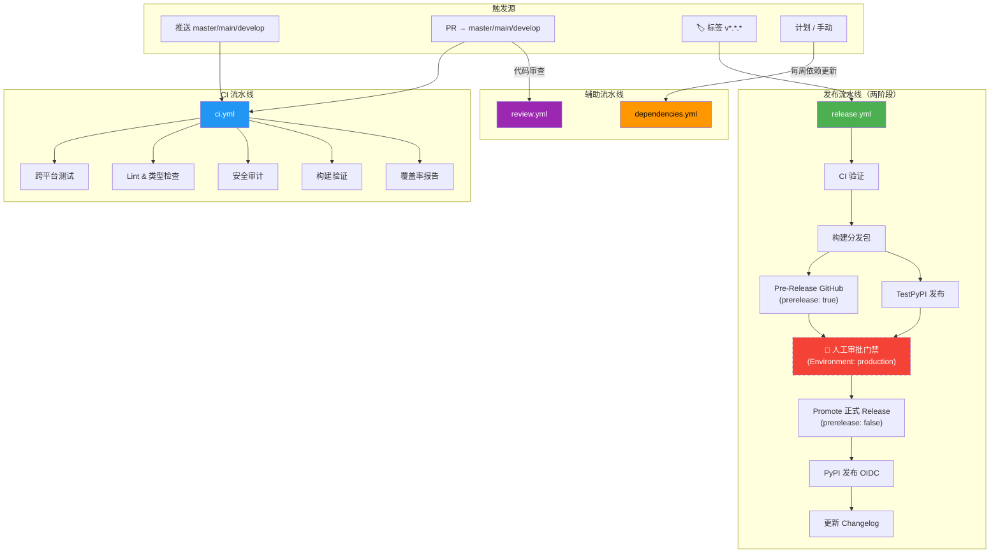

Negentropy Perceives 采用现代化的 Python 开发工具链，基于 [uv](https://docs.astral.sh/uv/) 包管理器构建高效的开发环境。本文档提供开发环境配置、项目结构总览、MCP 工具开发规范、CI/CD 工作流与编码最佳实践。

## 环境配置

### 系统要求

- **Python**: 3.13+
- **操作系统**: Windows 10+, macOS 10.15+, Ubuntu 18.04+
- **内存**: 最少 4GB RAM
- **存储**: 最少 10GB 可用空间

### 快速开始

```bash
# 使用提供的脚本快速设置（推荐）
./scripts/dev/setup.sh

# 验证环境设置
uv --version
python --version
```

### 详细环境配置

```bash
# 安装 uv（如果未安装）
curl -LsSf https://astral.sh/uv/install.sh | sh

# 克隆项目
git clone <repository-url>
cd negentropy-perceives

# 同步依赖
uv sync

# 安装开发依赖
uv sync --group dev

# 设置环境变量
# 初始化用户配置（首次运行时自动生成，也可手动执行）
uv run negentropy-perceives --init-config

# 安装 Playwright 浏览器依赖
uv run playwright install chromium
```

## 项目结构

```
negentropy-perceives/
├── src/negentropy/perceives/                    # 核心包
│   ├── __init__.py              # 版本信息（动态读取 pyproject.toml）
│   ├── __main__.py              # python -m 入口
│   ├── _logging.py              # 日志配置
│   ├── config.py                # 配置系统 + 配置验证（NegentropyPerceivesSettings, ConfigValidator）
│   ├── schemas.py               # 响应模型 + 数据传输对象（Pydantic BaseModel）
│   ├── sdk.py                   # Python SDK 封装（NegentropyPerceivesClient）
│   │
│   ├── apps/                    # 应用入口子包
│   │   └── app.py               # MCP 服务器入口（main()）
│   │
│   ├── scraping/                # 网页抓取引擎子包
│   │   ├── engine.py            # 核心抓取引擎（WebScraper）
│   │   ├── anti_detection.py    # 反检测隐身抓取（AntiDetectionScraper）
│   │   ├── browser.py           # 浏览器工具
│   │   ├── form_handler.py      # 表单处理
│   │   └── content_extraction/  # 内容提取（selectors.py, pages.py）
│   │
│   ├── pdf/                     # PDF 处理引擎子包（5 级降级链）
│   │   ├── processor.py         # 核心 PDF 处理器（多引擎调度）
│   │   ├── enhanced.py          # 增强 PDF 处理器（PyMuPDF）
│   │   ├── docling_engine.py    # Docling 引擎（GPU 加速）
│   │   ├── marker_engine.py     # Marker 引擎
│   │   ├── mineru_engine.py     # MineRU 引擎
│   │   ├── llm_orchestrator.py  # LLM 编排器
│   │   ├── llm_client.py        # LLM 客户端
│   │   ├── math_formula.py      # 数学公式处理
│   │   ├── device_config.py     # 设备配置
│   │   ├── hardware.py          # 硬件检测
│   │   ├── figure_text_filter.py # 图文过滤
│   │   ├── _imports.py / _sources.py  # 内部导入管理
│   │
│   ├── markdown/                # Markdown 转换子包
│   │   ├── converter.py         # Markdown 转换器核心
│   │   ├── formatter.py         # 格式化器
│   │   ├── html_preprocessor.py # HTML 预处理
│   │   ├── algorithm_detector.py # 算法检测
│   │   ├── formula_placeholder_resolver.py # 公式占位符解析
│   │   ├── image_embedder.py    # 图片嵌入
│   │   └── image_ref_normalizer.py # 图片引用规范化
│   │
│   ├── tools/                   # MCP 工具注册子包（12 个 tool）
│   │   ├── __init__.py          # 包初始化 + 触发注册
│   │   ├── _registry.py         # FastMCP app 实例 + 共享服务 + 辅助函数导出
│   │   ├── _observability.py    # 可观测性辅助（elapsed_ms 等）
│   │   ├── _support.py          # 支撑工具（validate_url, 类型别名等）
│   │   ├── extraction.py        # 数据提取工具（4 个 tool）
│   │   ├── form.py              # 表单交互工具（1 个 tool）
│   │   ├── markdown.py          # Markdown 转换工具（2 个 tool）
│   │   ├── pdf.py               # PDF 处理工具（2 个 tool）
│   │   ├── scraping.py          # 网页抓取工具（2 个 tool）
│   │   └── stealth.py           # 隐身抓取工具（1 个 tool）
│   │
│   ├── infra/                   # 基础设施层
│   │   ├── parsing.py           # 解析工具
│   │   └── resilience.py        # 弹性策略（重试、限速等）
│   │
│   └── examples/                # 示例与模板（随包分发）
│       ├── configs/
│       │   └── extraction_configs.py  # 领域提取配置模板
│       ├── mcp/
│       │   └── basic_usage.py         # MCP 工具调用示例
│       └── sdk/
│           └── python_sdk_usage.py    # Python SDK 集成示例
│
├── tests/                        # 测试套件
│   ├── conftest.py               # 共享 Fixtures
│   ├── unit/                     # 单元测试
│   └── integration/              # 集成测试
│
├── scripts/                      # 仓库维护脚本
│   ├── dev/
│   │   └── setup.sh              # 环境初始化
│   └── test/
│       └── run-tests.sh          # 测试执行（支持 unit/integration/full/coverage 等模式）
│
├── docs/                         # 项目文档
├── .github/workflows/            # CI/CD 配置（ci/release/dependencies/review）
├── .github/actions/              # 可复用 Composite Action
│   └── setup-python-uv/action.yml
└── pyproject.toml                # 项目配置
```

## MCP 工具开发

### 分包注册架构

项目采用**分包注册模式**组织 MCP 工具，核心链路如下：

```
tools/_registry.py          定义 FastMCP app 实例 + 共享服务
       ↓                       （web_scraper, anti_detection_scraper,
tools/_support.py                markdown_converter, create_pdf_processor 工厂）
tools/_observability.py      导出 validate_url、elapsed_ms 等辅助函数
       ↓
tools/extraction.py 等       用 @app.tool() 装饰器注册工具函数
       ↓                       （12 个 tool 分布于 6 个模块）
tools/__init__.py           导入各子模块 + _registry 公共 API，触发装饰器注册
       ↓
apps/app.py                 应用入口 main()，从 tools 导入 app 实例
```

`_registry.py` 是中枢，提供 `app` 实例和共享服务，以及通用辅助函数。`_support.py` 导出类型别名和输入验证工具，`_observability.py` 提供计时和指标收集能力。

### 开发新工具步骤

以 `check_robots_txt`（[tools/extraction.py](../src/negentropy/perceives/tools/extraction.py)）为例：

#### 1. 定义响应模型

在 [schemas.py](../src/negentropy/perceives/schemas.py) 中添加 Pydantic 响应模型：

```python
class RobotsResponse(BaseModel):
    """Response model for robots.txt check."""
    success: bool = Field(..., description="操作是否成功")
    url: str = Field(..., description="检查的URL")
    robots_txt_url: str = Field(..., description="robots.txt文件URL")
    robots_content: Optional[str] = Field(default=None, description="robots.txt内容")
    is_allowed: bool = Field(..., description="是否允许抓取")
    user_agent: str = Field(..., description="使用的User-Agent")
    error: Optional[str] = Field(default=None, description="错误信息（如果有）")
```

#### 2. 实现工具函数

在 `tools/` 下对应模块中实现，通过 `@app.tool()` 注册：

```python
from ..schemas import RobotsResponse
from ._registry import app, web_scraper

@app.tool()
async def check_robots_txt(url: str) -> RobotsResponse:
    """Check the robots.txt file for a domain to understand crawling permissions."""
    try:
        parsed = urlparse(url)
        if not parsed.scheme or not parsed.netloc:
            raise ValueError("Invalid URL format")

        robots_url = f"{parsed.scheme}://{parsed.netloc}/robots.txt"
        result = await web_scraper.simple_scraper.scrape(robots_url, extract_config={})

        if "error" in result:
            return RobotsResponse(success=False, url=url, robots_txt_url=robots_url,
                                  is_allowed=False, user_agent="*",
                                  error=f"Could not fetch robots.txt: {result['error']}")

        robots_content = result.get("content", {}).get("text", "")
        return RobotsResponse(success=True, url=url, robots_txt_url=robots_url,
                              robots_content=robots_content, is_allowed=True, user_agent="*")
    except Exception as e:
        return RobotsResponse(success=False, url=url, robots_txt_url="",
                              is_allowed=False, user_agent="*", error=str(e))
```

#### 3. 注册触发

在 [tools/\_\_init\_\_.py](../src/negentropy/perceives/tools/__init__.py) 中导入新模块：

```python
from . import extraction  # noqa: F401  # 触发 @app.tool() 注册
```

工具函数统一通过 `tools/` 包导入，无需额外 re-export。

### 参数设计模式

推荐使用 **Annotated Field 模式**，直接在函数签名中定义参数描述，无需额外的请求模型类。以 [tools/scraping.py](../src/negentropy/perceives/tools/scraping.py) 中的 `scrape_webpage` 为例：

```python
@app.tool()
async def scrape_webpage(
    url: Annotated[str, Field(..., description="目标网页 URL，必须包含协议前缀（http://或https://）")],
    method: Annotated[str, Field(default="auto", description="抓取方法：auto/simple/scrapy/selenium")],
    extract_config: Annotated[Optional[Dict[str, Any]], Field(default=None, description="数据提取配置字典")],
    wait_for_element: Annotated[Optional[str], Field(default=None, description="等待元素的 CSS 选择器")],
) -> ScrapeResponse:
```

**优势**：参数透明可见、描述清晰、MCP Client 兼容性好、减少样板代码。

### 开发最佳实践

- **错误处理**：验证输入参数，使用 `_registry.py` 中的 `validate_url()` 和 `_support.py` 中的辅助函数，返回结构化错误信息
- **性能优化**：使用异步编程（`async/await`），利用 `infra/resilience.py` 限速、`_observability.py` 计时装饰器
- **架构参考**：系统性能设计详见 [架构设计](./framework.md)

## 编码规范

遵循 PEP 8 和 PEP 257 标准。代码质量工具的使用详见 [用户指南 > 开发者命令速查](./user-guide.md#开发者命令速查)。

### 类型注解与文档字符串

所有函数和方法应有类型注解和 Google 风格的文档字符串：

```python
from typing import Dict, List, Optional, Any

async def scrape_webpage(
    url: str,
    method: str = "auto",
    extract_config: Optional[Dict[str, Any]] = None,
) -> ScrapeResponse:
    """抓取网页数据

    Args:
        url: 要抓取的URL
        method: 抓取方法 (auto/simple/scrapy/selenium)
        extract_config: 数据提取配置

    Returns:
        抓取响应对象

    Raises:
        ValueError: URL格式错误
    """
    pass
```

### 代码质量保障

项目使用以下工具链保障代码质量，详见 [用户指南 > 代码质量检查](./user-guide.md#代码质量检查)：

| 工具 | 用途 | 配置位置 |
|------|------|---------|
| Ruff | Lint + Format | `pyproject.toml` `[tool.ruff]` |
| MyPy | 静态类型检查 | `pyproject.toml` `[tool.mypy]` |
| Bandit | 安全扫描 | CI `security` job |
| pip-audit | 依赖漏洞扫描 | CI `security` job |

## CI/CD 与版本管理

### 架构概览



### 🔄 CI — [`ci.yml`](../.github/workflows/ci.yml)

**触发条件：** 推送到 master/main/develop、PR → master/main/develop、`workflow_call`、手动触发

| Job | 职责 |
|-----|------|
| `test` | 在 Ubuntu / Windows / macOS 上运行 pytest |
| `lint` | ruff lint + format check + mypy 类型检查 |
| `security` | bandit 静态安全扫描 + pip-audit 依赖漏洞扫描 |
| `build` | 构建 wheel 并验证安装 |
| `coverage` | 覆盖率报告 + Codecov 上传 |

支持 `workflow_call`，可被 release.yml 作为验证步骤调用。

### 🚀 发布 — [`release.yml`](../.github/workflows/release.yml)（两阶段流程）

**触发条件：** `v*.*.*` 标签推送、Release published（fallback）、手动触发（需指定 version）

**整体流程：** Pre-Release（预发布）→ 人工审批 → Release（正式发布）

| Job | 职责 | 阶段 | 触发条件 |
|-----|------|------|----------|
| `validate` | 调用 ci.yml 执行完整验证 | 共享 | 始终 |
| `build` | 构建分发包 + twine check | 共享 | 始终 |
| `pre-release-github` | 创建 prerelease Release + 上传 assets | Phase 1 | 标签推送 |
| `testpypi` | 发布到 TestPyPI | Phase 1 | 标签推送 / 手动 |
| `approval` | 人工审批门禁（Environment Protection Rules） | Gate | 标签推送（需 pre-release + testpypi 完成） |
| `promote-release` | 将 prerelease 提升为正式 Release | Phase 2 | 审批通过 |
| `pypi` | 发布到 PyPI（OIDC 可信发布） | Phase 2 | promote-release 成功 / release published（fallback） |
| `changelog-update` | 发布后更新 CHANGELOG | Phase 2 | PyPI 发布成功 / release published（fallback） |

### 📋 依赖管理 — [`dependencies.yml`](../.github/workflows/dependencies.yml)

**触发条件：** 每周一 9:00 UTC、手动触发

| Job | 职责 |
|-----|------|
| `update` | `uv lock --upgrade` → 测试 → 创建 PR |

### 🤖 代码审查 — [`review.yml`](../.github/workflows/review.yml)

**触发条件：** PR opened/synchronize/reopened、推送到 master/main、手动触发

| Job | 职责 |
|-----|------|
| `pr-review` | 审查 PR 变更文件，发布 PR 评论 |
| `push-review` | 审查推送到主分支的变更，发布 commit 评论或告警摘要 |

**实现方式：**
- 基于官方 `anthropics/claude-code-action@v1`
- PR 审查启用 `track_progress` 与 sticky comment
- 审查异常采用"告警但不中断"策略，避免辅助流程将主交付链路打红

### 可复用组件

#### Composite Action: [`setup-python-uv`](../.github/actions/setup-python-uv/action.yml)

所有工作流共享的 Python 环境初始化 action。

| 参数 | 默认值 | 说明 |
|------|--------|------|
| `python-version` | `3.13` | Python 版本 |
| `install-dev` | `true` | 是否安装开发依赖 |
| `enable-cache` | `true` | 是否启用 uv 缓存 |

### 环境配置

> 版本创建与发布操作步骤详见 [发布流程](#发布流程)。

**仓库密钥：**

| Secret | 用途 | 必需 |
|--------|------|------|
| `ANTHROPIC_API_KEY` | 代码审查 | 仅 review.yml |
| `ANTHROPIC_BASE_URL` | API 端点 | 可选 |

**关键 Action 版本：**

- `actions/checkout@v6`
- `astral-sh/setup-uv@v7`
- `actions/setup-node@v6`
- `actions/github-script@v8`
- `actions/upload-artifact@v7`
- `actions/download-artifact@v8`
- `codecov/codecov-action@v5`
- `peter-evans/create-pull-request@v8`
- `anthropics/claude-code-action@v1`

**PyPI 可信发布：**

1. PyPI 账户 → 发布 → 添加待发布者
2. 填写：所有者、仓库名、工作流 `release.yml`、环境 `pypi`

**GitHub 环境：**

| Environment | 用途 | Protection Rules |
|-------------|------|------------------|
| `pypi` | 生产环境 PyPI 发布 | （可选配置 reviewers） |
| `testpypi` | TestPyPI 预发布 | （可选） |
| **`production`** | **Pre-Release → Release 审批门禁** | **Required Reviewers（必须配置）** |

> **⚠️ production 环境配置（首次发布前必须完成）：**
> 1. 进入仓库 Settings → Environments → New environment
> 2. 名称填 `production`，URL 填 `https://pypi.org/p/negentropy-perceives`
> 3. 在 Protection rules 中添加 Required reviewers（至少 1 位维护者）
> 4. 可选：设置等待超时时间（建议 72 小时）、限制 deployment branches

### 发布流程（两阶段：Pre-Release → Release）

> 本节描述手动执行版本发布的完整操作步骤。自动化发布由 [`release.yml`](../.github/workflows/release.yml) 在标签推送时自动触发，采用 **Pre-Release → 人工审批 → Release** 两阶段模式。

#### 前置条件

1. 所有 CI 检查通过（test, lint, security, build）
2. CHANGELOG.md 已更新，包含当前版本的变更记录
3. 版本号遵循 [语义化版本](https://semver.org/lang/zh-CN/) 规范
4. GitHub 仓库已配置 `production` 环境（Settings → Environments）并设置 Required Reviewers

#### Phase 1: Pre-Release（预发布）

```bash
# 1. 更新版本号（pyproject.toml 中的 version 字段）
# 2. 更新 CHANGELOG.md
# 3. 创建 git tag 并推送
git tag v<VERSION>
git push origin v<VERSION>
# → 自动触发 release.yml Phase 1:
#   CI 验证 → 构建 → Pre-Release GitHub (prerelease=true) → TestPyPI 发布
# → 暂停在人工审批门禁
```

**Phase 1 完成后，在 GitHub Actions 页面会看到 workflow 暂停在 `approval` job，等待人工审批。**

#### 人工验证与审批

```bash
# 4. 在 TestPyPI 上验证预发布版本
pip install --index-url https://test.pypi.org/simple/ negentropy-perceives==<VERSION>

# 5. 运行冒烟测试确认功能正常
uv run negentropy-perceives --help

# 6. 在 GitHub Releases 页面检查 Pre-Release 内容和 release notes

# 7. 在 GitHub Actions 页面审批 production 环境
#    Settings → Environments → production → Approve
```

**审批前检查清单：**
- [ ] Pre-Release 在 GitHub Releases 页面显示正确
- [ ] 从 TestPyPI 安装并通过冒烟测试
- [ ] Release notes 准确无误
- [ ] CI 日志无关键错误

#### Phase 2: Release（正式发布）

```bash
# 审批通过后自动执行 release.yml Phase 2:
#   Promote 正式 Release (prerelease=false) → PyPI 发布 (OIDC) → 更新 CHANGELOG
```

**无需额外操作——审批通过后全流程自动完成。**

#### 版本号查询

```bash
uv run python -c "from negentropy.perceives import __version__; print(__version__)"
```

更多构建与发布命令详见 [发布流程](#发布流程)。

## 调试与故障排除

### 日志调试

```python
import logging

logging.basicConfig(level=logging.INFO)
logger = logging.getLogger(__name__)

class NegentropyPerceivesService:
    async def process_content(self, url: str):
        logger.info(f"Starting extraction for URL: {url}")
        # ...
        logger.info("Extraction completed successfully")
```

### 异步调试

```python
import asyncio

async def debug_async_function():
    """调试异步函数"""
    try:
        result = await some_async_operation()
        print(f"Result: {result}")
    except Exception as e:
        print(f"Error: {e}")
        raise

asyncio.run(debug_async_function())
```

### 浏览器调试

```python
@pytest.mark.requires_browser
async def test_with_browser_debugging():
    """启用浏览器调试的测试"""
    from negentropy.perceives.scraping import AntiDetectionScraper

    scraper = AntiDetectionScraper()
    options = {
        "headless": False,
        "devtools": True,
        "slow_mo": 1000  # 慢速执行
    }
    # ...
```

### 常见问题解决

#### 浏览器驱动问题

```bash
# 重新安装 Playwright
uv run playwright install --force

# 或使用系统浏览器
export PLAYWRIGHT_BROWSERS_PATH=/usr/bin
```

#### 测试超时问题

```bash
# 增加超时时间或跳过慢速测试
uv run pytest -m "not slow" --timeout=300
```

#### 类型检查错误

```bash
# 逐步修复类型问题
uv run mypy src/negentropy/perceives/ --ignore-missing-imports

# 或使用宽松模式
uv run mypy src/negentropy/perceives/ --disable-error-code=var-annotated
```

#### CI/CD 相关

| 问题 | 解决方案 |
|------|---------|
| 构建失败 | 检查 CI 日志中的测试/lint 失败 |
| 发布失败 | 验证 PyPI 可信发布配置与环境设置 |
| 依赖 PR 创建失败 | 检查 Actions 权限（Settings → Actions → Workflow permissions） |
| 代码审查未执行 | 验证 `ANTHROPIC_API_KEY` 已配置 |
| 代码审查告警但未阻塞 | 查看 `review.yml` 中 Claude 步骤日志，通常是模型限流、超时或外部服务异常 |
| 覆盖率下降 | 为新代码添加测试 |
| 审批门禁报错 | 确认仓库 Settings → Environments → production 已创建并配置 Required Reviewers |
| Pre-Release 后 workflow 停滞 | 正常行为——需在 GitHub Actions 页面手动审批 production 环境 |
| PyPI 发布失败（Phase 2） | Pre-Release 已转为正式 Release；可手动 re-run pypi job 或联系 PyPI support |

更多调试命令详见 [用户指南 > 开发者命令速查](./user-guide.md#开发者命令速查)，测试故障排除详见 [测试指南](./testing.md#故障排除)。

## 开发资源

### 技术文档

- [uv 官方文档](https://docs.astral.sh/uv/)
- [pytest 文档](https://docs.pytest.org/)
- [Ruff 文档](https://docs.astral.sh/ruff/)
- [MyPy 文档](https://mypy.readthedocs.io/)
- [GitHub Actions 文档](https://docs.github.com/zh/actions)
- [PyPI Trusted Publishers](https://docs.pypi.org/trusted-publishers/)

### 工具推荐

- **IDE**: PyCharm, VS Code
- **API 测试**: Postman, Insomnia

## 相关文档

| 文档 | 说明 |
|------|------|
| [架构设计](./framework.md) | 系统架构、设计模式、性能策略 |
| [测试指南](./testing.md) | 测试架构、执行方法、质量保障 |
| [配置系统](./configuration.md) | 环境变量、配置模板 |
| [用户指南](./user-guide.md) | 使用指南与命令速查 |
| [用户指南](./user-guide.md) | 完整使用指南、API 参考 |
