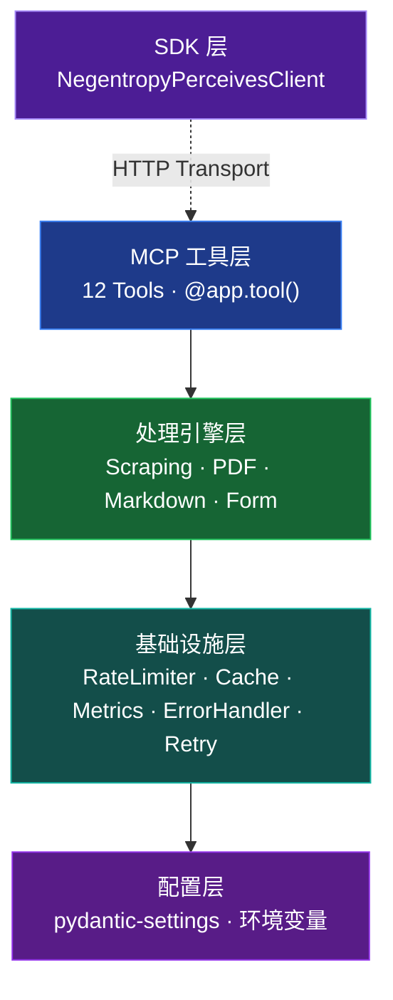
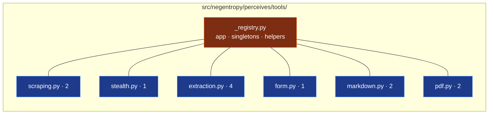
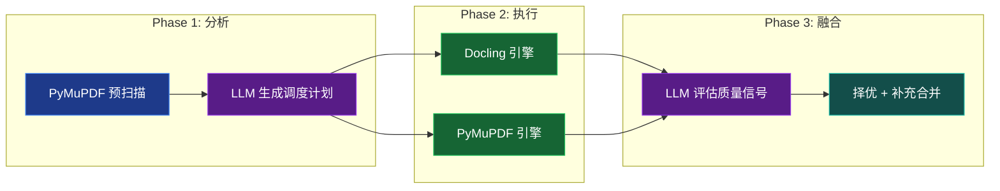
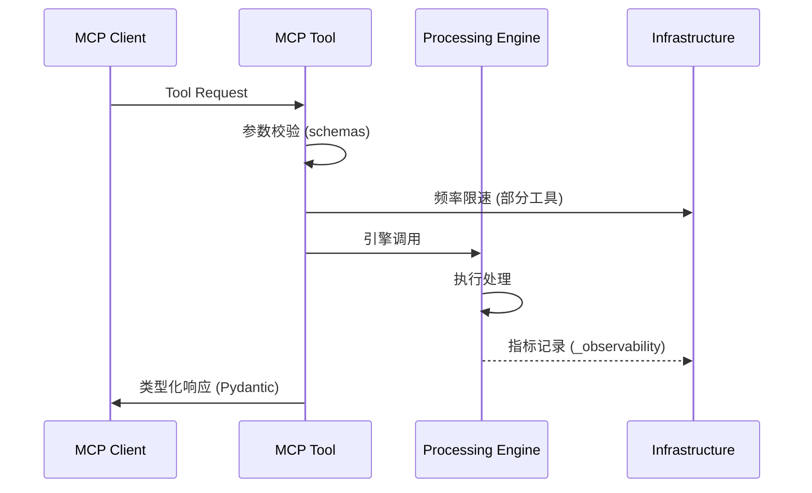
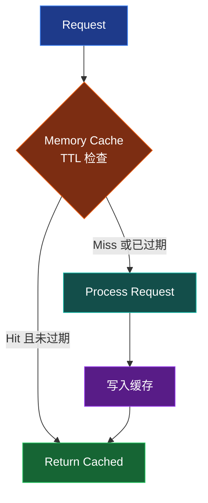

## 项目概述

Negentropy Perceives 是基于 [FastMCP](https://github.com/jlowin/fastmcp) 框架构建的数据提取与转换 MCP Server，提供 **12 个 MCP 工具**，集成双引擎网页抓取、多引擎 PDF 处理（5 级降级链）和 Markdown 转换能力。系统对外暴露 Python SDK（[`sdk.py`](../src/negentropy/perceives/sdk.py)），支持 STDIO / HTTP / SSE 三种传输模式。

### 设计原则

- **分层解耦**：5 层架构（含 SDK 层），各层职责正交，降低模块间耦合
- **延迟加载**：重量级依赖（PyMuPDF、Docling 等）按需导入，降低启动开销
- **可观测性**：内置请求计量、错误分类和执行计时（[`_observability.py`](../src/negentropy/perceives/tools/_observability.py)）
- **弹性设计**：指数退避重试、频率限速和内存缓存
- **策略模式**：抓取方法自动选择、PDF 引擎动态降级链

### 核心架构

## MCP 工具层

### 模块化注册架构

工具层采用领域拆分的模块化设计，所有工具注册于 [`src/negentropy/perceives/tools/`](../src/negentropy/perceives/tools/) 子包：

- **[`_registry.py`](../src/negentropy/perceives/tools/_registry.py)**：中心枢纽，持有 FastMCP `app` 实例、共享服务单例（`web_scraper`、`anti_detection_scraper`、`markdown_converter`）、`create_pdf_processor()` 延迟加载工厂和公共辅助函数
- **[`_support.py`](../src/negentropy/perceives/tools/_support.py)**：共享类型枚举定义（`ScrapeMethod`、`BrowserMethod`、`PDFMethod`、`PDFOutputFormat`、`StructuredDataType`）与参数校验辅助函数
- **[`_observability.py`](../src/negentropy/perceives/tools/_observability.py)**：请求计量与执行计时工具（`elapsed_ms()`）
- **领域模块**：各模块导入 `app` 并通过 `@app.tool()` 装饰器注册工具

### 工具清单（12 个）

| 模块 | 领域 | 工具 | 功能 |
|------|------|------|------|
| [`scraping.py`](../src/negentropy/perceives/tools/scraping.py) | 网页抓取 | `scrape_webpage` | 单页抓取 |
| | | `scrape_multiple_webpages` | 批量并发抓取 |
| [`stealth.py`](../src/negentropy/perceives/tools/stealth.py) | 反检测抓取 | `scrape_with_stealth` | 反检测隐身抓取 |
| [`extraction.py`](../src/negentropy/perceives/tools/extraction.py) | 数据提取 | `extract_links` | 链接提取与分类 |
| | | `get_page_info` | 页面元数据获取 |
| | | `extract_structured_data` | 结构化数据提取 |
| | | `check_robots_txt` | robots.txt 合规检查 |
| [`form.py`](../src/negentropy/perceives/tools/form.py) | 表单自动化 | `fill_and_submit_form` | 表单自动填写与提交 |
| [`markdown.py`](../src/negentropy/perceives/tools/markdown.py) | 内容转换 | `convert_webpage_to_markdown` | 网页转 Markdown |
| | | `batch_convert_webpages_to_markdown` | 批量网页转换 |
| [`pdf.py`](../src/negentropy/perceives/tools/pdf.py) | PDF 处理 | `convert_pdf_to_markdown` | PDF 转 Markdown |
| | | `batch_convert_pdfs_to_markdown` | 批量 PDF 转 Markdown |

### 响应模型层

[`src/negentropy/perceives/schemas.py`](../src/negentropy/perceives/schemas.py) 定义 **11 个 Pydantic 响应模型**（`ScrapeResponse`、`BatchScrapeResponse`、`LinkItem`、`LinksResponse`、`PageInfoResponse`、`RobotsResponse`、`StructuredDataResponse`、`MarkdownResponse`、`BatchMarkdownResponse`、`PDFResponse`、`BatchPDFResponse`），构成工具层的 API 契约。

### 传输模式

[`apps/app.py`](../src/negentropy/perceives/apps/app.py) 入口函数 `main()` 支持 **STDIO**（默认）、**HTTP**（可配置 host/port/path/CORS）和 **SSE** 三种传输模式。

## 处理引擎层

### 网页抓取引擎

[`src/negentropy/perceives/scraping/engine.py`](../src/negentropy/perceives/scraping/engine.py) 中的 `WebScraper` 作为门面类，持有两个活跃后端实例并通过方法分发进行路由：

| 后端 | 类 | 技术栈 | 状态 |
|------|------|--------|------|
| HTTP | `HttpScraper` | requests + BeautifulSoup | ✅ 可用 |
| Selenium | `SeleniumScraper` | Chrome WebDriver + headless | ✅ 可用 |
| Scrapy | — | 路由至 HttpScraper | ⚠️ 已禁用（reactor 冲突） |

> 内容提取逻辑独立封装于 [`scraping/content_extraction/`](../src/negentropy/perceives/scraping/content_extraction/) 子目录，提供默认提取、BS4 配置提取和 Selenium 配置提取三种策略。

**自动选择逻辑**（`method="auto"` 时）：若 `settings.enable_javascript` 或 `wait_for_element` 为真则选 Selenium，否则选 HttpScraper。

### 反检测抓取引擎

[`src/negentropy/perceives/scraping/anti_detection.py`](../src/negentropy/perceives/scraping/anti_detection.py) 中的 `AntiDetectionScraper` 提供两种隐身后端：

- **Selenium 隐身**：基于 `undetected-chromedriver`，覆盖 `navigator.webdriver` 属性、伪装插件/语言信息
- **Playwright 隐身**：注入 stealth 脚本，规避 Canvas/WebGL 指纹检测

**行为模拟**：随机延迟（1-3 秒）、鼠标轨迹模拟、页面滚动模拟。支持单个代理配置（`settings.proxy_url`）。内置 `RetryManager` 指数退避重试保障。

### PDF 处理引擎

[`src/negentropy/perceives/pdf/`](../src/negentropy/perceives/pdf/) 子包采用多引擎架构，支持 LLM 智能编排：

- **[`PDFProcessor`](../src/negentropy/perceives/pdf/processor.py)**：主处理器，支持 `auto`/`pymupdf`/`pypdf`/`docling`/`mineru`/`marker`/`smart` 七种方法。`auto` 模式按降级链动态选择首个可用引擎
- **[`DoclingEngine`](../src/negentropy/perceives/pdf/docling_engine.py)**：AI 布局分析引擎，基于 [Docling](https://github.com/DS4SD/docling)，提供 TableFormer 表格结构识别、代码检测和公式提取（可选依赖）
- **[`MinerUEngine`](../src/negentropy/perceives/pdf/mineru_engine.py)**：深度学习文档结构分析引擎，擅长学术论文与多栏排版、公式与表格提取（可选依赖）
- **[`MarkerEngine`](../src/negentropy/perceives/pdf/marker_engine.py)**：基于 Nougat 模型的学术文档转换引擎，保留公式与结构化排版（可选依赖，GPL-3.0 许可证需确认）
- **[`EnhancedPDFProcessor`](../src/negentropy/perceives/pdf/enhanced.py)**：增强处理器，提取图像（保存文件 + base64）、识别表格（管道符/制表符/空格分隔模式匹配）、检测 LaTeX 数学公式
- **[`LLMOrchestrator`](../src/negentropy/perceives/pdf/llm_orchestrator.py)**：LLM 编排中枢（`method="smart"`），三阶段流水线协调多引擎并行处理并择优融合（可选依赖 `litellm`）
- **[`LLMClient`](../src/negentropy/perceives/pdf/llm_client.py)**：LiteLLM 客户端封装，支持 ZhipuAI GLM-5 等模型

#### 引擎降级链

`method="auto"` 时，`PDFProcessor` 按以下优先级动态选择首个可用引擎：

> 各引擎均为可选依赖——未安装时自动跳过，确保系统在最小依赖集下仍可运行。

#### Smart 模式编排流程

`method="smart"` 启用 LLM 编排的三阶段流水线：

**降级保障**：LiteLLM 未安装或 LLM API 失败时，自动降级至 `method="auto"` 原有路径，确保功能可用性。

### Markdown 转换器

[`src/negentropy/perceives/markdown/converter.py`](../src/negentropy/perceives/markdown/converter.py) 中的 `MarkdownConverter` 包装 Microsoft [MarkItDown](https://github.com/microsoft/markitdown) 库，附加预处理和后处理流水线：

- **预处理**：移除导航栏/广告/脚本、解析相对 URL、提取主要内容区域
- **后处理**：表格对齐、代码块语言检测、排版优化、图片 data URI 嵌入
- **批量处理**：通过 `asyncio.gather()` 并发转换

### 表单处理器

[`src/negentropy/perceives/scraping/form_handler.py`](../src/negentropy/perceives/scraping/form_handler.py) 中的 `FormHandler` 支持 Selenium 和 Playwright 双后端（通过 `hasattr(driver_or_page, "fill")` 检测），处理文本输入、下拉选择、复选框/单选框、文件上传和表单提交。

### 请求处理流程

## 基础设施层

### 核心组件

| 组件 | 文件 | 实现方式 |
|------|------|---------|
| `RateLimiter` | [`infra/resilience.py`](../src/negentropy/perceives/infra/resilience.py) | 时间间隔限速器：记录上次请求时间，间隔不足时 `asyncio.sleep` |
| `RetryManager` | [`infra/resilience.py`](../src/negentropy/perceives/infra/resilience.py) | 指数退避重试：`base_delay × backoff_factor^attempt`（全局配置：max=3, factor=2.0） |
| `record_error()` | [`tools/_registry.py`](../src/negentropy/perceives/tools/_registry.py) | 字符串匹配分类器：按关键字匹配为 timeout/connection/not_found/forbidden/anti_bot/unknown |

### 缓存流程

### 错误处理

`record_error()` 通过字符串匹配将异常分类为网络层（timeout/connection）、协议层（not_found/forbidden）、反爬层（anti_bot）和未知错误。`RetryManager` 对所有可重试错误应用统一的指数退避策略（3 次重试，退避因子 2.0）。

## 配置系统

[`src/negentropy/perceives/config.py`](../src/negentropy/perceives/config.py) 基于 `pydantic-settings` 的 `BaseSettings` 实现：

`NegentropyPerceivesSettings` 使用 `NEGENTROPY_PERCEIVES_` 前缀自动映射环境变量，支持 `.env` 文件，实例冻结（immutable）。配置层级（优先级递增）：代码默认值 → `.env` 文件 → 环境变量。

**主要配置组**：服务器、传输（STDIO/HTTP/SSE + host/port/path/CORS）、抓取、限速/重试/缓存、浏览器、User-Agent、代理、日志、LLM 集成、硬件加速（MPS/CUDA/XPU）、PDF 引擎开关（Docling/MinerU/Marker）。详细配置项参见 [配置系统文档](./configuration.md)。

## SDK 层

[`src/negentropy/perceives/sdk.py`](../src/negentropy/perceives/sdk.py) 提供 Python 异步 SDK 门面，允许外部代码以编程方式调用 Negentropy Perceives 服务：

- **`NegentropyPerceivesClient`**：高级异步客户端，基于 FastMCP `StreamableHttpTransport` 封装
- **异常体系**：`NegentropyPerceivesError` → `NegentropyPerceivesConnectionError` / `NegentropyPerceivesToolError`
- **连接管理**：自动维护客户端会话生命周期
- **默认端点**：`http://localhost:8081/mcp`（与服务端 HTTP 默认配置一致）

> SDK 层为可选使用方式——通过 MCP 协议直接调用工具时无需 SDK。

## 工具辅助类

| 模块 | 类/函数 | 功能 |
|------|---------|------|
| [`infra/parsing.py`](../src/negentropy/perceives/infra/parsing.py) | `URLValidator` / `TextCleaner` | URL 校验/规范化、文本清理、邮箱/电话提取 |
| [`config.py`](../src/negentropy/perceives/config.py) | `ConfigValidator` | 提取配置字典校验（已合并至 config 模块） |
| [`scraping/browser.py`](../src/negentropy/perceives/scraping/browser.py) | `build_chrome_options()` | 共享 Chrome 选项构建器（User-Agent、headless、proxy 等统一配置） |

## 公共导入路径

各模块通过规范路径导入（旧路径仍可通过 shim 文件兼容使用）：

| 用途 | 导入路径 |
|------|---------|
| 网页抓取 | `from negentropy.perceives.scraping import WebScraper` |
| 反检测抓取 | `from negentropy.perceives.scraping import AntiDetectionScraper` |
| 表单处理 | `from negentropy.perceives.scraping import FormHandler` |
| 浏览器会话 | `from negentropy.perceives.scraping import selenium_session, playwright_session` |
| PDF 处理 | `from negentropy.perceives.pdf.processor import PDFProcessor` |
| 增强 PDF | `from negentropy.perceives.pdf.enhanced import EnhancedPDFProcessor` |
| Markdown 转换 | `from negentropy.perceives.markdown.converter import MarkdownConverter` |
| 基础设施 | `from negentropy.perceives.infra import rate_limiter, retry_manager` |
| SDK 客户端 | `from negentropy.perceives.sdk import NegentropyPerceivesClient` |

---

本架构文档与代码库保持同步，如发现偏差请以源码为准并及时更新本文档。
