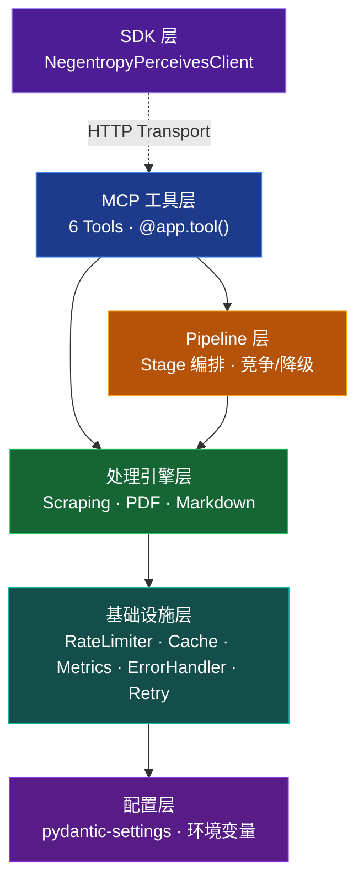
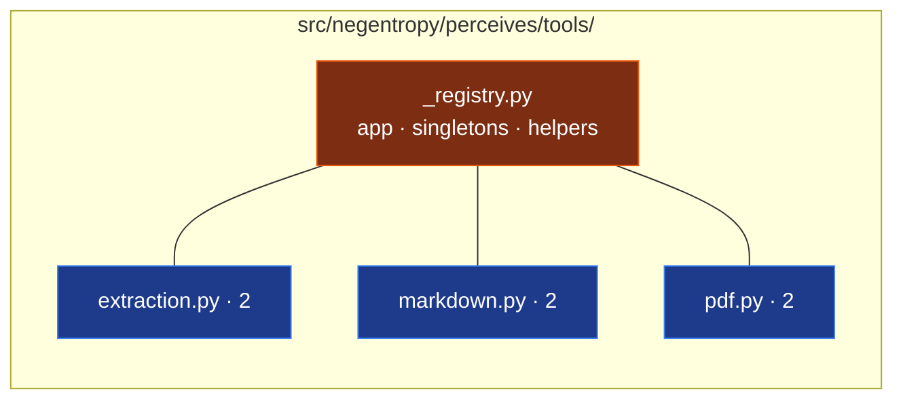
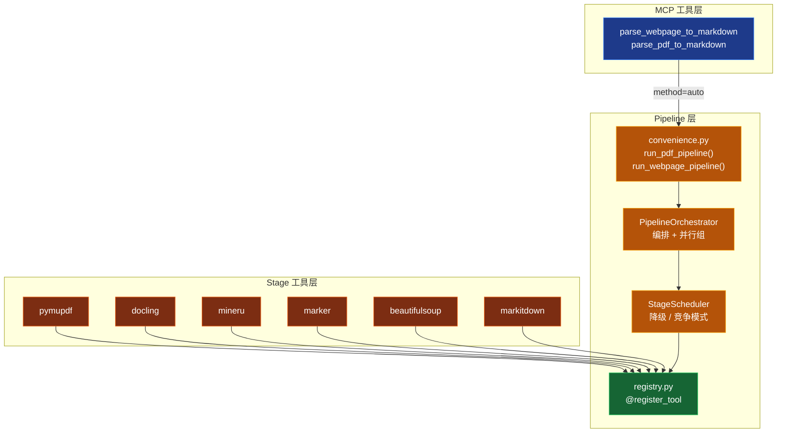
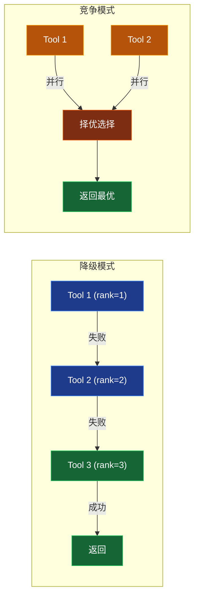
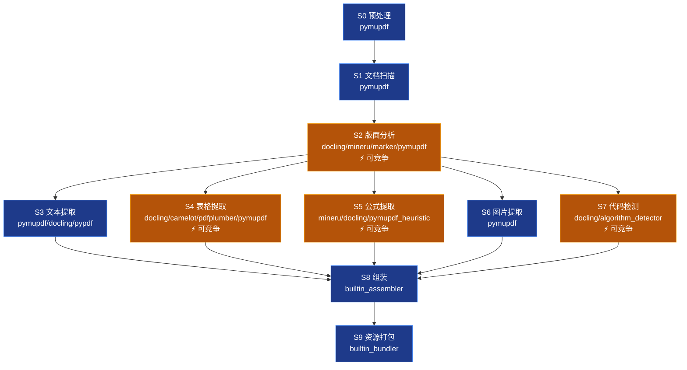
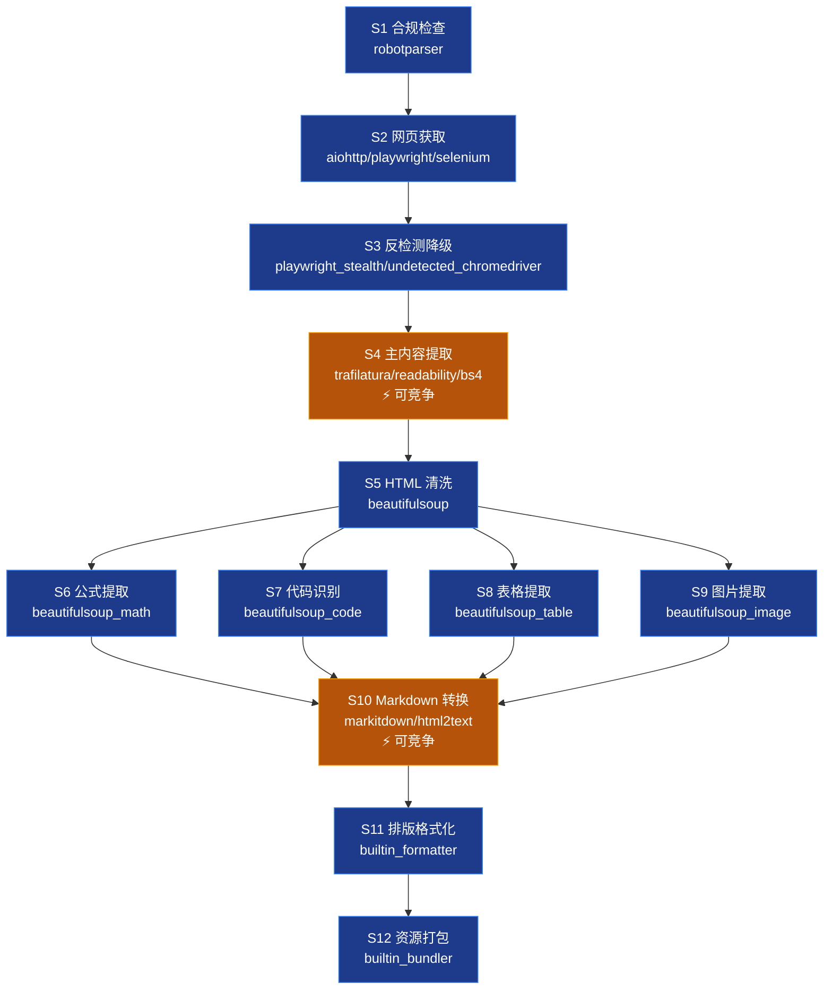
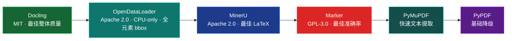
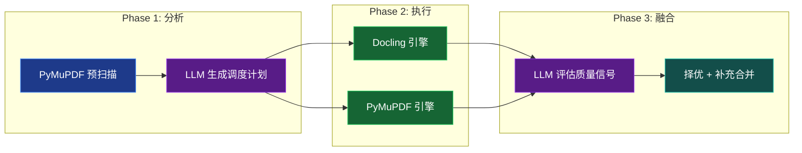
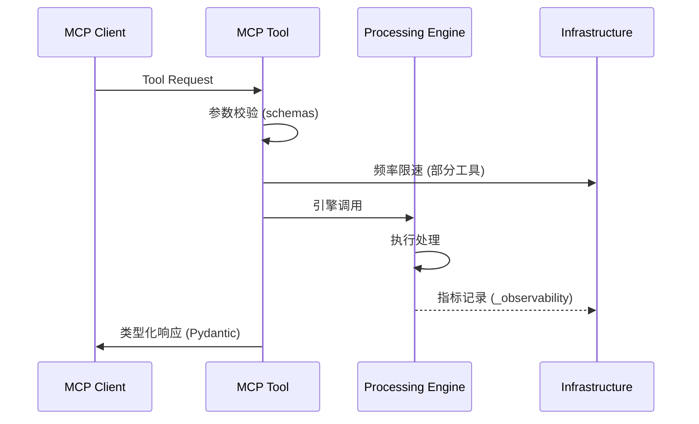
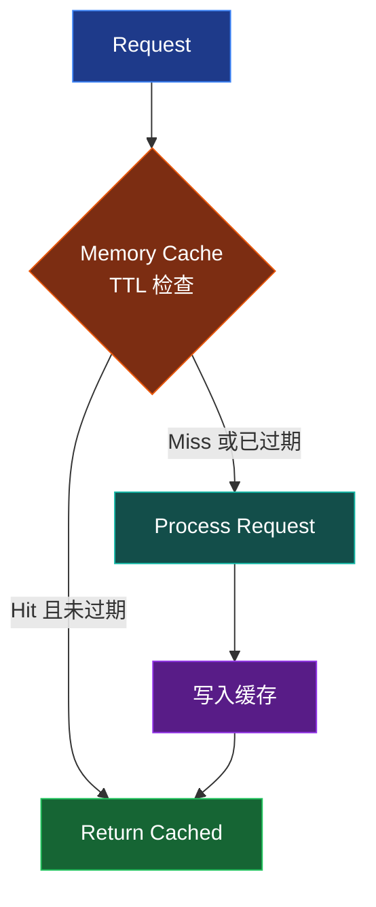

## 项目概述

Negentropy Perceives 是基于 [FastMCP](https://github.com/jlowin/fastmcp) 框架构建的数据提取与转换 MCP Server，提供 **6 个 MCP 工具**，集成双引擎网页抓取、多引擎 PDF 处理（5 级降级链）、Pipeline Stage 编排和 Markdown 转换能力。系统对外暴露 Python SDK（[`sdk.py`](../src/negentropy/perceives/sdk.py)），支持 STDIO / HTTP / SSE 三种传输模式。

### 设计原则

- **分层解耦**：5 层架构（含 SDK 层），各层职责正交，降低模块间耦合
- **延迟加载**：重量级依赖（PyMuPDF、Docling 等）按需导入，降低启动开销
- **可观测性**：内置请求计量、错误分类和执行计时（[`_observability.py`](../src/negentropy/perceives/tools/_observability.py)）
- **弹性设计**：指数退避重试、频率限速和内存缓存
- **策略模式**：抓取方法自动选择、PDF 引擎动态降级链
- **Pipeline 编排**：Stage 化管线框架，支持降级/竞争模式、并行组执行和配置驱动

### 核心架构

## MCP 工具层

### 模块化注册架构

工具层采用领域拆分的模块化设计，所有工具注册于 [`src/negentropy/perceives/tools/`](../src/negentropy/perceives/tools/) 子包：

- **[`_registry.py`](../src/negentropy/perceives/tools/_registry.py)**：中心枢纽，持有 FastMCP `app` 实例、共享服务单例（`web_scraper`、`markdown_converter`）、`create_pdf_processor()` 延迟加载工厂和公共辅助函数
- **[`_support.py`](../src/negentropy/perceives/tools/_support.py)**：共享类型枚举定义（`ScrapeMethod`、`PDFMethod`、`PDFOutputFormat`）与参数校验辅助函数
- **[`_observability.py`](../src/negentropy/perceives/tools/_observability.py)**：请求计量与执行计时工具（`elapsed_ms()`）
- **领域模块**：各模块导入 `app` 并通过 `@app.tool()` 装饰器注册工具

### 工具清单（6 个）

| 模块                                                               | 领域     | 工具                                 | 功能                                             |
| ------------------------------------------------------------------ | -------- | ------------------------------------ | ------------------------------------------------ |
| [`extraction.py`](../src/negentropy/perceives/tools/extraction.py) | 数据提取 | `discover_links`                     | 链接发现与分类                                   |
|                                                                    |          | `inspect_page`                       | 页面元数据检查                                   |
| [`markdown.py`](../src/negentropy/perceives/tools/markdown.py)     | 内容转换 | `parse_webpage_to_markdown`          | 网页转 Markdown（method="auto" 时优先 Pipeline） |
|                                                                    |          | `parse_webpages_to_markdown`         | 批量网页转换                                     |
| [`pdf.py`](../src/negentropy/perceives/tools/pdf.py)               | PDF 处理 | `parse_pdf_to_markdown`              | PDF 转 Markdown（method="auto" 时优先 Pipeline） |
|                                                                    |          | `parse_pdfs_to_markdown`             | 批量 PDF 转 Markdown                             |

### 响应模型层

[`src/negentropy/perceives/schemas.py`](../src/negentropy/perceives/schemas.py) 定义 **6 个 Pydantic 响应模型**（`LinkItem`、`LinksResponse`、`PageInfoResponse`、`MarkdownResponse`、`BatchMarkdownResponse`、`PDFResponse`、`BatchPDFResponse`），构成工具层的 API 契约。

### 传输模式

[`apps/app.py`](../src/negentropy/perceives/apps/app.py) 入口函数 `main()` 支持 **STDIO**（默认）、**HTTP**（可配置 host/port/path/CORS）和 **SSE** 三种传输模式。

## Pipeline 编排层

[`src/negentropy/perceives/pipeline/`](../src/negentropy/perceives/pipeline/) 子包实现了一套通用的 Stage 化管线框架，将文档处理流程拆解为可组合、可竞争的 Stage，通过配置驱动的方式编排执行。

### 核心组件

| 模块                                                                      | 类/函数                                         | 职责                                               |
| ------------------------------------------------------------------------- | ----------------------------------------------- | -------------------------------------------------- |
| [`base.py`](../src/negentropy/perceives/pipeline/base.py)                 | `Stage` / `StageResult` / `StageTool`           | Stage 基类、执行结果包装与工具协议（鸭子类型）     |
| [`competitive.py`](../src/negentropy/perceives/pipeline/competitive.py)   | `CompetitiveStage`                              | 多工具并行竞争 Stage，择优返回最佳结果             |
| [`registry.py`](../src/negentropy/perceives/pipeline/registry.py)         | `@register_tool`                                | 装饰器式全局工具注册表，按名称注册、获取和列举工具 |
| [`scheduler.py`](../src/negentropy/perceives/pipeline/scheduler.py)       | `StageScheduler`                                | Stage 调度器，支持降级模式与竞争模式               |
| [`orchestrator.py`](../src/negentropy/perceives/pipeline/orchestrator.py) | `PipelineOrchestrator`                          | Pipeline 编排器，串联多个 Stage 并支持并行组       |
| [`models.py`](../src/negentropy/perceives/pipeline/models.py)             | 数据模型                                        | 所有 Stage 间传递的 dataclass 定义                 |
| [`convenience.py`](../src/negentropy/perceives/pipeline/convenience.py)   | `run_pdf_pipeline()` / `run_webpage_pipeline()` | 高级便捷 API，屏蔽编排细节                         |

### 架构总览

### 两种执行模式

**降级模式**（`competition_mode=false`）：按工具 rank 顺序逐个尝试，首个可用即用。fallback 路径无 stage 级硬切（仅由顶层 `task_timeout_seconds` 兜底），rank=1 引擎可充分跑满。适用于稳定 Stage（预处理、文本提取、图片提取等），亦为 AI 感知 Stage 的**默认模式**。

**竞争模式**（`competition_mode=true`）：并行执行多个候选工具（上限 `max_concurrent`），从成功结果中择优返回（含 LLM 评审 + rank=1 早胜取消 + 跨 stage docling 缓存）。适用于追求多视图融合或可靠性兜底的高质量场景；资源开销显著高于降级模式。

> **默认行为说明（自 2026-05）**：原本启用竞争模式的 6 个 Stage（PDF S2/S4/S5/S7、WebPage S4/S10）已默认切换为降级模式，仅运行各 Stage 的 rank=1 最佳引擎以减少资源开销。跨 stage docling `_ConvertCache` 在单引擎下仍生效（layout 跑过 docling 后 table/code 命中）。竞争完整能力（`competition:` 子配置、早胜取消、LLM 评审）原样保留，可在 YAML 中将对应 Stage 的 `competition_mode` 改回 `true` 启用。详见 [`docs/issue.md`](issue.md) [2026-05-07] 决策条目。

### PDF Pipeline（S0 - S9）

PDF 转 Markdown 管线包含 10 个 Stage，其中 S3 - S7 为并行组（通过 `asyncio.gather` 并发执行）。`⚡` 标记表示该 Stage 支持竞争模式（默认走降级，仅 rank=1 单跑；用户可改 YAML `competition_mode: true` 启用 `⚡` 多引擎竞争）：

| Stage | 名称     | 描述                                                     | 模式                       |
| ----- | -------- | -------------------------------------------------------- | -------------------------- |
| S0    | 预处理   | PDF 源验证、下载、格式检测与页面范围解析                 | 降级                       |
| S1    | 文档扫描 | 轻量级文档特征分析（页数、表格、公式、图片、布局复杂度） | 降级                       |
| S2    | 版面分析 | 检测文档物理布局结构，确定正确阅读顺序                   | 降级（默认）/ 竞争（opt-in） |
| S3    | 文本提取 | 从各文本区域提取纯文本，保留段落结构与标题层级           | 降级                       |
| S4    | 表格提取 | 结构化表格识别与 Markdown 表格生成                       | 降级（默认）/ 竞争（opt-in） |
| S5    | 公式提取 | 数学公式检测与 LaTeX 转换                                | 降级（默认）/ 竞争（opt-in） |
| S6    | 图片提取 | 图片提取、分类与 caption 生成                            | 降级                       |
| S7    | 代码检测 | 代码块识别与编程语言推断                                 | 降级（默认）/ 竞争（opt-in） |
| S8    | 组装     | 将各 Stage 产出按阅读顺序组装为 Markdown                 | 降级                       |
| S9    | 资源打包 | 整理提取的资源文件，生成最终输出包                       | 降级                       |

### WebPage Pipeline（S1 - S12）

WebPage 转 Markdown 管线包含 12 个 Stage，其中 S6 - S9 为并行组：

| Stage | 名称          | 描述                                             | 模式                       |
| ----- | ------------- | ------------------------------------------------ | -------------------------- |
| S1    | 合规检查      | 检查目标 URL 的 robots.txt 规则与基本合法性      | 降级                       |
| S2    | 网页获取      | HTTP 或浏览器抓取目标网页完整 HTML（三级降级链） | 降级                       |
| S3    | 反检测降级    | 使用隐身浏览器技术绕过反爬检测                   | 降级                       |
| S4    | 主内容提取    | 识别并提取主要文章内容，移除导航栏/广告/侧边栏   | 降级（默认）/ 竞争（opt-in） |
| S5    | HTML 清洗     | 清理残余脚本/样式，保护数学和代码元素            | 降级                       |
| S6    | 公式提取      | 检测并提取页面中的数学公式，转换为 LaTeX         | 降级                       |
| S7    | 代码识别      | 识别 HTML 中的代码块，保留语法高亮信息           | 降级                       |
| S8    | 表格提取      | 提取 HTML 表格结构，生成 Markdown 表格           | 降级                       |
| S9    | 图片提取      | 提取页面图片信息，可选下载并嵌入                 | 降级                       |
| S10   | Markdown 转换 | 将清洗后的 HTML 转换为 Markdown                  | 降级（默认）/ 竞争（opt-in） |
| S11   | 排版格式化    | 排版优化、段落间距归一化、表格对齐               | 降级                       |
| S12   | 资源打包      | 聚合处理结果，构建最终输出                       | 降级                       |

### 配置驱动

Pipeline 的 Stage 配置完全由 [`config.default.yaml`](../src/negentropy/perceives/config.default.yaml) 中的 `pipeline:` 节驱动，支持：

- **Stage 级配置**：每个 Stage 的候选工具列表、rank 排序、`enabled` 开关、`competition_mode` 标志
- **竞争参数**：`max_concurrent`（最大并行数）、`timeout`（单工具超时）、`judge`（LLM 评审配置）
- **全局默认**：`pipeline.defaults` 为所有 Stage 提供竞争参数的默认值
- **引擎级门控**：`docling_enabled`、`mineru_enabled`、`marker_enabled` 统一控制引擎可用性

## 处理引擎层

### 网页抓取引擎

[`src/negentropy/perceives/scraping/engine.py`](../src/negentropy/perceives/scraping/engine.py) 中的 `WebScraper` 作为门面类，持有两个活跃后端实例并通过方法分发进行路由：

| 后端     | 类                | 技术栈                      | 状态                      |
| -------- | ----------------- | --------------------------- | ------------------------- |
| HTTP     | `HttpScraper`     | requests + BeautifulSoup    | ✅ 可用                   |
| Selenium | `SeleniumScraper` | Chrome WebDriver + headless | ✅ 可用                   |
| Scrapy   | —                 | 路由至 HttpScraper          | ⚠️ 已禁用（reactor 冲突） |

> 内容提取逻辑独立封装于 [`scraping/content_extraction/`](../src/negentropy/perceives/scraping/content_extraction/) 子目录，提供默认提取、BS4 配置提取和 Selenium 配置提取三种策略。

**自动选择逻辑**（`method="auto"` 时）：若 `settings.enable_javascript` 或 `wait_for_element` 为真则选 Selenium，否则选 HttpScraper。

### 反检测抓取引擎

[`src/negentropy/perceives/scraping/anti_detection.py`](../src/negentropy/perceives/scraping/anti_detection.py) 中的 `AntiDetectionScraper` 提供两种隐身后端：

- **Selenium 隐身**：基于 `undetected-chromedriver`，覆盖 `navigator.webdriver` 属性、伪装插件/语言信息
- **Playwright 隐身**：注入 stealth 脚本，规避 Canvas/WebGL 指纹检测

**行为模拟**：随机延迟（1-3 秒）、鼠标轨迹模拟、页面滚动模拟。支持单个代理配置（`settings.proxy_url`）。内置 `RetryManager` 指数退避重试保障。

### PDF 处理引擎

[`src/negentropy/perceives/pdf/`](../src/negentropy/perceives/pdf/) 子包采用多引擎架构，支持 LLM 智能编排：

- **[`PDFProcessor`](../src/negentropy/perceives/pdf/processor.py)**：主处理器，支持 `auto`/`pymupdf`/`pypdf`/`docling`/`opendataloader`/`mineru`/`marker`/`smart` 八种方法。`auto` 模式按降级链动态选择首个可用引擎
- **[`DoclingEngine`](../src/negentropy/perceives/pdf/docling_engine.py)**：AI 布局分析引擎，基于 [Docling](https://github.com/DS4SD/docling)，提供 TableFormer 表格结构识别、代码检测和公式提取（可选依赖）
- **[`OpenDataLoaderEngine`](../src/negentropy/perceives/pdf/engines/opendataloader.py)**：CPU-only / 全元素 bounding box 引擎，基于 [OpenDataLoader PDF](https://github.com/opendataloader-project/opendataloader-pdf)，Apache-2.0 许可证，XY-Cut++ 阅读顺序，Tagged PDF 原生结构支持（可选依赖，需 Java 11+）
- **[`MinerUEngine`](../src/negentropy/perceives/pdf/mineru_engine.py)**：深度学习文档结构分析引擎，擅长学术论文与多栏排版、公式与表格提取（可选依赖）
- **[`MarkerEngine`](../src/negentropy/perceives/pdf/marker_engine.py)**：基于 Nougat 模型的学术文档转换引擎，保留公式与结构化排版（可选依赖，GPL-3.0 许可证需确认）
- **[`EnhancedPDFProcessor`](../src/negentropy/perceives/pdf/enhanced.py)**：增强处理器，提取图像（保存文件 + base64）、识别表格（管道符/制表符/空格分隔模式匹配）、检测 LaTeX 数学公式
- **[`LLMOrchestrator`](../src/negentropy/perceives/pdf/llm_orchestrator.py)**：LLM 编排中枢（`method="smart"`），三阶段流水线协调多引擎并行处理并择优融合（可选依赖 `litellm`）
- **[`LLMClient`](../src/negentropy/perceives/pdf/llm_client.py)**：LiteLLM 客户端封装，支持 OpenAI GPT 等模型

#### 引擎降级链

`method="auto"` 时，`PDFProcessor` 按以下优先级动态选择首个可用引擎：

> 各引擎均为可选依赖——未安装时自动跳过，确保系统在最小依赖集下仍可运行。

#### Smart 模式编排流程

`method="smart"` 启用 LLM 编排的三阶段流水线：

**降级保障**：LiteLLM 未安装或 LLM API 失败时，自动降级至 `method="auto"` 原有路径，确保功能可用性。

### Markdown 转换器

[`src/negentropy/perceives/markdown/converter.py`](../src/negentropy/perceives/markdown/converter.py) 中的 `MarkdownConverter` 包装 Microsoft [MarkItDown](https://github.com/microsoft/markitdown) 库，附加预处理和后处理流水线：

- **预处理**：移除导航栏/广告/脚本、解析相对 URL、提取主要内容区域
- **后处理**：表格对齐、代码块语言检测、排版优化、图片 data URI 嵌入
- **批量处理**：通过 `asyncio.gather()` 并发转换

### 表单处理器

[`src/negentropy/perceives/scraping/form_handler.py`](../src/negentropy/perceives/scraping/form_handler.py) 中的 `FormHandler` 支持 Selenium 和 Playwright 双后端（通过 `hasattr(driver_or_page, "fill")` 检测），处理文本输入、下拉选择、复选框/单选框、文件上传和表单提交。

### 请求处理流程

## 基础设施层

### 核心组件

| 组件             | 文件                                                                     | 实现方式                                                                                 |
| ---------------- | ------------------------------------------------------------------------ | ---------------------------------------------------------------------------------------- |
| `RateLimiter`    | [`infra/resilience.py`](../src/negentropy/perceives/infra/resilience.py) | 时间间隔限速器：记录上次请求时间，间隔不足时 `asyncio.sleep`                             |
| `RetryManager`   | [`infra/resilience.py`](../src/negentropy/perceives/infra/resilience.py) | 指数退避重试：`base_delay × backoff_factor^attempt`（全局配置：max=3, factor=2.0）       |
| `record_error()` | [`tools/_registry.py`](../src/negentropy/perceives/tools/_registry.py)   | 字符串匹配分类器：按关键字匹配为 timeout/connection/not_found/forbidden/anti_bot/unknown |

### 缓存流程

### 错误处理

`record_error()` 通过字符串匹配将异常分类为网络层（timeout/connection）、协议层（not_found/forbidden）、反爬层（anti_bot）和未知错误。`RetryManager` 对所有可重试错误应用统一的指数退避策略（3 次重试，退避因子 2.0）。

## 配置系统

[`src/negentropy/perceives/config.py`](../src/negentropy/perceives/config.py) 基于 `pydantic-settings` 的 `BaseSettings` 实现：

`NegentropyPerceivesSettings` 使用 `NEGENTROPY_PERCEIVES_` 前缀自动映射环境变量，实例冻结（immutable）。配置层级（优先级递增）：内置默认(config.default.yaml) → 用户 YAML(~/.negentropy/) → 环境变量 → -c 显式配置(最高)。

**主要配置组**：服务器、传输（STDIO/HTTP/SSE + host/port/path/CORS）、抓取、限速/重试/缓存、浏览器、User-Agent、代理、日志、LLM 集成、硬件加速（MPS/CUDA/XPU）、PDF 引擎开关（Docling/MinerU/Marker）、Pipeline 编排（Stage 配置、竞争模式、默认参数）。详细配置项参见 [用户指南 > MCP Server 配置](./user-guide.md#mcp-server-配置)。

## SDK 层

[`src/negentropy/perceives/sdk.py`](../src/negentropy/perceives/sdk.py) 提供 Python 异步 SDK 门面，允许外部代码以编程方式调用 Negentropy Perceives 服务：

- **`NegentropyPerceivesClient`**：高级异步客户端，基于 FastMCP `StreamableHttpTransport` 封装
- **异常体系**：`NegentropyPerceivesError` → `NegentropyPerceivesConnectionError` / `NegentropyPerceivesToolError`
- **连接管理**：自动维护客户端会话生命周期
- **默认端点**：`http://localhost:2992/mcp`（与服务端 HTTP 默认配置一致）

> SDK 层为可选使用方式——通过 MCP 协议直接调用工具时无需 SDK。

## 工具辅助类

| 模块                                                                     | 类/函数                        | 功能                                                             |
| ------------------------------------------------------------------------ | ------------------------------ | ---------------------------------------------------------------- |
| [`infra/parsing.py`](../src/negentropy/perceives/infra/parsing.py)       | `URLValidator` / `TextCleaner` | URL 校验/规范化、文本清理、邮箱/电话提取                         |
| [`config.py`](../src/negentropy/perceives/config.py)                     | `ConfigValidator`              | 提取配置字典校验（已合并至 config 模块）                         |
| [`scraping/browser.py`](../src/negentropy/perceives/scraping/browser.py) | `build_chrome_options()`       | 共享 Chrome 选项构建器（User-Agent、headless、proxy 等统一配置） |

## 公共导入路径

各模块通过规范路径导入（旧路径仍可通过 shim 文件兼容使用）：

| 用途          | 导入路径                                                                                                 |
| ------------- | -------------------------------------------------------------------------------------------------------- |
| 网页抓取      | `from negentropy.perceives.scraping import WebScraper`                                                   |
| 反检测抓取    | `from negentropy.perceives.scraping import AntiDetectionScraper`                                         |
| 表单处理      | `from negentropy.perceives.scraping import FormHandler`                                                  |
| 浏览器会话    | `from negentropy.perceives.scraping import selenium_session, playwright_session`                         |
| PDF 处理      | `from negentropy.perceives.pdf.processor import PDFProcessor`                                            |
| 增强 PDF      | `from negentropy.perceives.pdf.enhanced import EnhancedPDFProcessor`                                     |
| Markdown 转换 | `from negentropy.perceives.markdown.converter import MarkdownConverter`                                  |
| Pipeline 编排 | `from negentropy.perceives.pipeline import PipelineOrchestrator, run_pdf_pipeline, run_webpage_pipeline` |
| 基础设施      | `from negentropy.perceives.infra import rate_limiter, retry_manager`                                     |
| SDK 客户端    | `from negentropy.perceives.sdk import NegentropyPerceivesClient`                                         |

---

本架构文档与代码库保持同步，如发现偏差请以源码为准并及时更新本文档。
