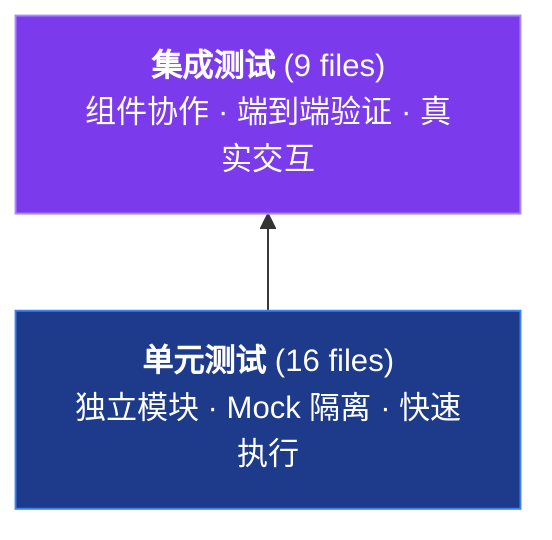

## 🎯 测试体系概述

### 测试金字塔



### 测试目录结构

```
tests/
├── conftest.py                              # 全局共享 Fixture
├── unit/                                    # 单元测试 (16 files)
│   ├── test_advanced_features.py            # 高级功能向后兼容
│   ├── test_anti_detection.py               # 反检测隐身爬取
│   ├── test_browser_utils.py                # 浏览器工具
│   ├── test_config.py                       # 配置系统
│   ├── test_dependency_integrity.py         # 跨模块依赖完整性
│   ├── test_enhanced_pdf_processor.py       # PDF 增强处理
│   ├── test_examples.py                     # 示例代码验证
│   ├── test_form_handler.py                 # 表单交互
│   ├── test_markdown_converter.py           # Markdown 转换
│   ├── test_pdf_processor.py                # PDF 基础处理
│   ├── test_schemas.py                      # 响应模型
│   ├── test_scraper.py                      # 网页抓取引擎
│   ├── test_scripts.py                      # 脚本文件验证
│   ├── test_mcp_tools_unit.py               # MCP 工具单元测试
│   ├── test_tool_registry.py                # 工具注册表
│   └── test_utils.py                        # 工具类
├── integration/                             # 集成测试 (9 files)
│   ├── conftest.py                          # 集成测试专用 Fixture
│   ├── test_comprehensive_integration.py    # 综合集成 + 性能负载
│   ├── test_cross_tool_integration.py       # 跨工具协作
│   ├── test_docling_pdf_integration.py      # Docling PDF GPU 加速集成
│   ├── test_e2e_data_validation.py          # 数据有效性验证
│   ├── test_e2e_document_pipeline.py        # 文档处理管道
│   ├── test_e2e_error_resilience.py         # 错误恢复能力
│   ├── test_e2e_performance.py              # 性能基准
│   ├── test_langchain_blog_conversion.py    # Langchain 博客转换
│   ├── test_mcp_tools.py                    # MCP 工具端到端
│   └── test_pdf_integration.py              # PDF 处理集成
```

> `tests/reports/` 由测试脚本运行时动态生成（已 `.gitignore`），不纳入版本控制。

### 模块覆盖矩阵

| 模块分层 | 覆盖模块 | 单元测试 | 集成测试 |
| -------- | -------- | -------- | -------- |
| **MCP 工具层** | 14 个 `@app.tool()` 注册工具（`tools/` 子包） | ✅ | ✅ |
| **核心引擎** | `scraper`、`anti_detection`、`markdown_converter` | ✅ | ✅ |
| **数据层** | `schemas`、`models`、`config`、`form_handler` | ✅ | ✅ |
| **PDF 处理** | `pdf/processor`、`pdf/enhanced` | ✅ | ✅ |
| **基础设施** | `cache`、`rate_limiter`、`retry`、`error_handler`、`metrics`、`timing` | ✅ | — |
| **工具类** | `browser_utils`、`url_utils`、`text_utils`、`config_validator` | ✅ | — |

---

## 🚀 测试执行

### 快速开始

项目提供测试运行脚本 [`scripts/test/run-tests.sh`](../scripts/test/run-tests.sh)：

```bash
./scripts/test/run-tests.sh              # 完整测试套件（默认）
./scripts/test/run-tests.sh unit         # 单元测试
./scripts/test/run-tests.sh integration  # 集成测试
./scripts/test/run-tests.sh quick        # 快速测试（排除慢速测试）
./scripts/test/run-tests.sh performance  # 性能测试
./scripts/test/run-tests.sh coverage     # 仅生成覆盖率报告
./scripts/test/run-tests.sh clean        # 清理测试结果
```

### pytest 常用命令

```bash
# 按范围
uv run pytest                                    # 所有测试
uv run pytest tests/unit/                        # 单元测试目录
uv run pytest tests/integration/                 # 集成测试目录
uv run pytest tests/unit/test_config.py          # 特定文件

# 按粒度
uv run pytest tests/unit/test_config.py::TestNegentropyPerceivesSettings           # 测试类
uv run pytest tests/unit/test_config.py::TestNegentropyPerceivesSettings::test_xxx # 测试方法

# 执行控制
uv run pytest -x                     # 首次失败即停
uv run pytest --lf                   # 只跑上次失败的
uv run pytest --ff                   # 优先跑失败的
uv run pytest -n auto                # 自动并行（需 pytest-xdist）
uv run pytest --durations=10         # 最慢 10 个测试
uv run pytest -m "not slow"          # 排除慢速测试

# GPU 加速测试（Docling + MPS/CUDA）
uv run pytest -m requires_gpu -v --log-cli-level=INFO     # 仅 GPU 测试
uv run pytest tests/integration/test_docling_pdf_integration.py -v -x  # Docling 完整测试
uv run pytest --co -m requires_gpu                         # 列出 GPU 测试（不执行）
```

### 测试配置

所有 pytest 和覆盖率配置集中在 [`pyproject.toml`](../pyproject.toml) 中维护：

- **`[tool.pytest.ini_options]`**：测试发现规则、`addopts` 默认参数、标记定义、异步模式
- **`[tool.coverage.*]`**：覆盖率源、分支覆盖、排除规则、报告输出路径

> `addopts` 已配置自动生成 HTML、XML、JSON 覆盖率报告与测试报告，无需手动指定 `--cov-report` 或 `--html` 参数。

---

## 🔧 Fixture 体系

### 全局 Fixture（[`tests/conftest.py`](../tests/conftest.py)）

| Fixture | 作用域 | 说明 |
| ------- | ------ | ---- |
| `test_config` | function | 安全的 `NegentropyPerceivesSettings` 测试实例 |
| `mock_web_scraper` | function | `WebScraper` Mock（`spec=` 类型约束） |
| `mock_anti_detection_scraper` | function | `AntiDetectionScraper` Mock |
| `mock_form_handler` | function | `FormHandler` Mock |
| `sample_html` | function | 标准 HTML 测试内容（含表单、列表、链接） |
| `sample_extraction_config` | function | CSS 选择器提取配置样本 |
| `sample_scrape_result` | function | 完整爬取结果数据结构 |
| `temp_cache_dir` | function | `tempfile.TemporaryDirectory` 临时缓存目录 |
| `mock_http_response` | function | Mock HTTP 响应（200、text/html） |

### 集成测试 Fixture（[`tests/integration/conftest.py`](../tests/integration/conftest.py)）

| Fixture | 作用域 | 说明 |
| ------- | ------ | ---- |
| `pdf_processor` | function | `create_pdf_processor()` 真实 PDF 处理器实例 |
| `e2e_tools` | function | MCP 工具名称→工具对象映射字典（`pytest_asyncio.fixture`） |
| `detected_gpu_device` | session | 硬件检测，返回 `DeviceType` 枚举（MPS/CUDA/XPU/CPU） |
| `gpu_docling_engine` | session | 显式绑定 GPU 设备的 `DoclingEngine` 实例 |
| `warm_docling_converter` | session | 预热 Docling Converter（模型加载 ~10-30s，仅一次） |

### Fixture 约定

- 新增全局 fixture 添加到 `tests/conftest.py`；集成测试专用 fixture 添加到 `tests/integration/conftest.py`
- Mock 对象统一使用 `Mock(spec=TargetClass)` 模式确保接口约束
- 异步 fixture 使用 `@pytest_asyncio.fixture` 装饰器

---

## 🚨 调试与故障排除

### 环境准备

```bash
uv sync --group dev                                    # 安装开发依赖
export NEGENTROPY_PERCEIVES_ENABLE_JAVASCRIPT=false           # 禁用 JS 渲染
export NEGENTROPY_PERCEIVES_CONCURRENT_REQUESTS=1             # 单请求模式
export NEGENTROPY_PERCEIVES_BROWSER_TIMEOUT=10                # 浏览器超时
```

### 调试命令

```bash
uv run pytest -v -s                  # 详细输出 + 显示 print
uv run pytest --tb=long              # 完整错误栈
uv run pytest --pdb                  # 失败时进入 PDB 调试器
uv run pytest --durations=0          # 所有测试执行时间
```

在测试代码中设置断点：

```python
def test_debug_example():
    import pdb; pdb.set_trace()  # 断点
    assert True
```

### 常见问题速查

| 问题类型 | 症状 | 解决方案 |
| -------- | ---- | -------- |
| **浏览器** | Selenium/Playwright 测试失败 | `export NEGENTROPY_PERCEIVES_ENABLE_JAVASCRIPT=false` 或 `uv run pytest -k "not requires_browser"` |
| **网络** | 请求超时或连接失败 | `uv run pytest -k "not requires_network"` 或 `uv run pytest --timeout=30` |
| **异步** | 异步测试挂起或超时 | 确认 `asyncio_mode = "auto"` 已配置；加 `--timeout=60` |
| **资源** | 内存不足或执行缓慢 | `uv run pytest -n 1` 串行执行；`rm -rf .pytest_cache/` 清理缓存 |

---

## 🏆 测试设计规范

### 命名约定

```python
# 文件：test_<模块名>.py，镜像 src/negentropy/perceives/ 下的源码模块
# 类：Test<功能区域>
# 方法：test_<行为>_<条件>

class TestWebScraper:
    def test_scrape_url_success(self): ...
    def test_scrape_url_invalid_url_raises(self): ...
```

### AAA 模式

所有测试遵循 Arrange-Act-Assert 三段式：

```python
def test_extract_data():
    # Arrange
    config = NegentropyPerceivesSettings(enable_javascript=False)
    # Act
    result = negentropy.perceives.process(config)
    # Assert
    assert result["success"] is True
```

### 项目特有约定

- **异步测试**：`asyncio_mode = "auto"` 已在 `pyproject.toml` 中配置，异步测试函数**无需**手动添加 `@pytest.mark.asyncio` 装饰器
- **Mock 规范**：使用 `Mock(spec=TargetClass)` 而非裸 `Mock()`，确保 Mock 对象遵循目标类接口
- **测试组织**：测试文件与 `src/negentropy/perceives/` 下的源码模块一一镜像（如 `src/negentropy/perceives/scraper.py` → `tests/unit/test_scraper.py`）
- **测试标记**：六种标记已在 [`pyproject.toml`](../pyproject.toml) 中定义，按需在测试函数上标注：
  - `unit` / `integration` / `slow` — 测试分类
  - `requires_network` / `requires_browser` — 环境依赖
  - `requires_gpu` — GPU 加速依赖（MPS/CUDA/XPU）

---

## 🔄 质量门禁与 CI/CD

### 质量标准

| 指标 | 目标值 |
| ---- | ------ |
| 单元测试通过率 | > 99% |
| 集成测试通过率 | > 95% |
| 代码覆盖率 | > 95% |
| 测试执行时间 | < 5 分钟 |

### CI 集成

CI/CD 工作流的完整文档参见 [开发指南 > CI/CD 与版本管理](./development.md#ci-cd-与版本管理)。

覆盖率报告自动上传至 Codecov，具体配置参见 [`ci.yml`](../.github/workflows/ci.yml) 中的 `coverage` 步骤。
