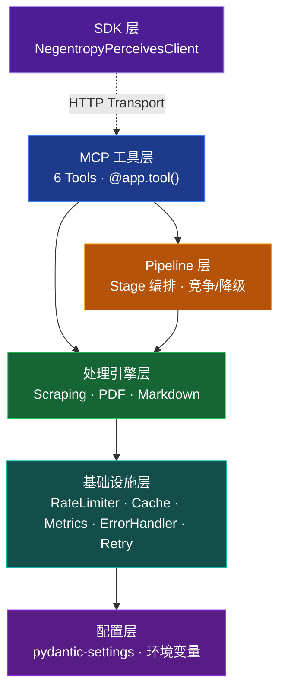

[English](../../README.md) | [简体中文](./README.md)

<h1 align="center">Negentropy Perceives</h1>

<p align="center">
  <strong>面向 AI Agent 的全天候感知引擎 · 商业级 MCP Server</strong><br/><br/>
  把网页和 PDF 变成干净的 Markdown 原浆，直接投喂大模型。
</p>

<p align="center">
  <a href="#quick-start"></a>
  <a href="https://github.com/ThreeFish-AI/negentropy-perceives/blob/master/LICENSE"></a>
  <a href="https://pypi.org/project/negentropy-perceives/"></a>
  <a href="https://github.com/ThreeFish-AI/negentropy-perceives/stargazers"></a>
  
</p>

<p align="center">
  <b>6 MCP Tools</b> · <b>Pipeline 编排</b> · <b>5 引擎 PDF</b> · <b>LLM 智能评估</b>
</p>

---

## ✨ 为什么需要 Negentropy Perceives？

当下的各种 AI 智能体项目中，信息感知这类“脏活累活”往往最容易随着时间推移变得极其丑陋且脆弱。基于**正交分解与熵减 (Negentropy)** 的底层工程哲学，我们替你彻底封锁了底层网络通信与格式解构的混沌，只向你的沙箱池中注入无可争议的确定性：

- 🕵️ **Web Page 转 Markdown**: 面对重度渲染的 SPA 和严防死守的反扒策略？引擎内置 5 级防线穿透机制（从极速并发到无头隐身浏览器轮换）。所见即所得，各类瀑布流如同探囊取物。
- 📑 **PDF 转 Markdown**: 不要再妥协于错位的表格或丢失的符号。独创“引擎打擂”机制，启动 `Smart` 模式即可召唤 LLM 亲自督战，裁判调度 Docling、PyMuPDF 等 7 大专业引擎并发解构，精准萃取 LaTeX 公式、复杂表格矩阵甚至深层版面特征。
- 🦾 **积木重载**: 摒弃玩具级的粗暴封装。内核植入指数量级退避重试网络、多重限速熔断防御，以及激进的内存预载机制 (Cache)。依托全双工 `asyncio` 跑满机器单节点极限吞吐量。
- 🔌 **原生 MCP 接驳**: 坚决拥抱标准 Model Context Protocol 协议规范。依托 HTTP / STDIO / SSE 标准传输模式，抛弃冗杂代码胶水，一键免密注入 Claude Desktop 或 Cursor 环境。

---

## 快速上手 (Quick Start)

### 1. 毫秒级装载

```bash
# 推荐使用 uv（需要 Python 3.13+）
uv add negentropy-perceives
```

### 2. 轰鸣启动引擎

```bash
uv run negentropy-perceives  # 默认监听 localhost:2992，HTTP 模式
```

> 💡 **进阶锦囊**: 首次启动时，Negentropy Percevies 会自动生成的配置至 `~/.negentropy/perceives.config.yaml`。里面潜藏着各类高阶玩法的解锁机关。

### 3. 见证感知力

```python
import asyncio
from negentropy.perceives.sdk import NegentropyPerceivesClient

async def perceive_world():
    async with NegentropyPerceivesClient() as client:
        result = await client.parse_webpage_to_markdown(
            url="https://zh.wikipedia.org/wiki/熵",
        )
        print("====== 萃取原浆 ======")
        print(result.markdown_content[:250], "......\n")
        print(f"📊 从噪音中汲取纯净字词: {result.word_count}")

asyncio.run(perceive_world())
```

### 4. 接入 MCP Client

在 Claude Desktop 的 `claude_desktop_config.json` 中添加：

```json
{
  "mcpServers": {
    "negentropy-perceives": {
      "type": "http",
      "url": "http://localhost:2992/mcp"
    }
  }
}
```

> 支持三种传输模式：STDIO（本地开发）、HTTP（生产推荐）、SSE（兼容模式）。完整配置参见 [用户指南](../user-guide.md#mcp-server-配置)。

---

## 核心能力

### 工具总览

<center>

| 工具                         | 功能                                 | 适用场景             |
| :--------------------------- | :----------------------------------- | :------------------- |
| `discover_links`             | 发现网页链接，支持域名过滤           | 站点地图、链接审计   |
| `inspect_page`               | 检查页面元数据（状态码、内容类型等） | 预检目标页面         |
| `parse_webpage_to_markdown`  | 网页转 Markdown                      | 单页内容提取         |
| `parse_webpages_to_markdown` | 批量网页转 Markdown                  | 知识库构建、站点归档 |
| `parse_pdf_to_markdown`      | PDF 转 Markdown                      | 学术论文、财报处理   |
| `parse_pdfs_to_markdown`     | 批量 PDF 转 Markdown                 | 文档批量数字化       |

</center>

> [!WARNING]
>
> 请遵守目标网站的服务条款（TOS），合理控制请求频率。本工具仅供合法合规的数据获取场景使用。

### Web 抓取策略

<center>

| 方法                 | 说明                         |
| :------------------- | :--------------------------- |
| `auto`               | 智能选择（推荐）             |
| `simple`             | HTTP 请求，适合静态页面      |
| `selenium`           | 浏览器渲染，支持 JS 动态页面 |
| `stealth_selenium`   | 隐身 Selenium，绕过反爬      |
| `stealth_playwright` | 隐身 Playwright，轻量反检测  |

</center>

### PDF 引擎

<center>

| 引擎    | 特长                         | GPU 加速         |
| :------ | :--------------------------- | :--------------- |
| Docling | AI 布局分析、表格识别        | CUDA / MPS / XPU |
| MinerU  | 深度学习结构分析，LaTeX 公式 | CUDA / MLX       |
| Marker  | 学术文档，Nougat 模型        | CUDA             |
| PyMuPDF | 快速文本提取                 | —                |
| PyPDF   | 基础降级兜底                 | —                |

</center>

> `auto` 模式按 Docling → MinerU → Marker → PyMuPDF → PyPDF 降级链自动选择。`smart` 模式启用 LLM 编排多引擎并行竞争并择优融合。

---

## 架构全景图



5 层正交架构：SDK → MCP 工具 → Pipeline 编排 → 处理引擎 → 基础设施，配置层贯穿全局。PDF Pipeline 10 Stage + WebPage Pipeline 12 Stage，支持降级和竞争两种执行模式。

---

## 文档导航

<center>

| 文档                           | 内容                                                  | 适合谁          |
| :----------------------------- | :---------------------------------------------------- | :-------------- |
| [用户指南](../user-guide.md)   | 6 个工具参数详解、MCP Server 配置、SDK 接口、高级场景 | 所有用户        |
| [架构设计](../framework.md)    | 5 层架构、Pipeline 编排、引擎降级链、Smart 模式       | 架构师 / 贡献者 |
| [开发指南](../development.md)  | 环境搭建、测试体系、CI/CD、PR 规范                    | 开发者          |
| [更新日志](../../CHANGELOG.md) | 版本历史与变更记录                                    | 所有人          |

</center>

---

## 社区与贡献

万维网页与海量非结构化文本的另一面是噪音深渊，唯有持续的代码演进方可稳步前行。若您手中正握有将混沌拉回秩序的灵感，请务必不吝赐教：

1. 动键盘前，烦请顺路翻转一页 [开发指南](../development.md)
2. 将您的重磅想法掷向 [Issue](https://github.com/ThreeFish-AI/negentropy-perceives/issues) 或直接提送带有改变战局力量的 [Pull Request](https://github.com/ThreeFish-AI/negentropy-perceives/pulls)

---

<p align="center">
  <a href="../../LICENSE">MIT</a> License, © 2026 <a href="https://github.com/ThreeFish-AI">ThreeFish-AI</a>
</p>
